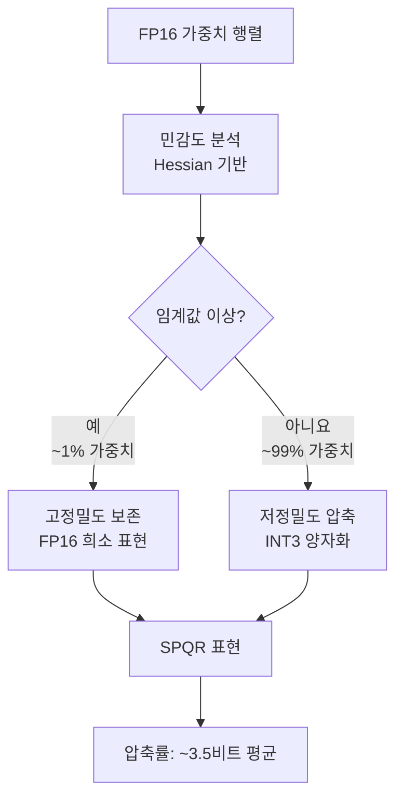
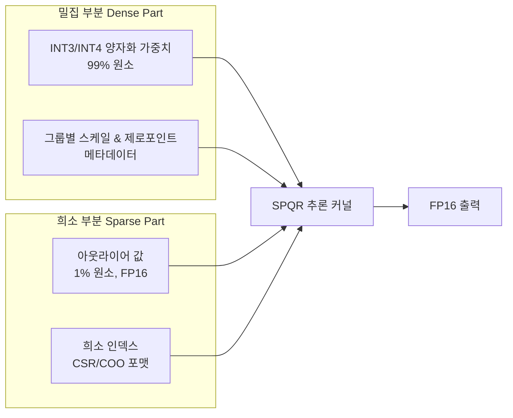
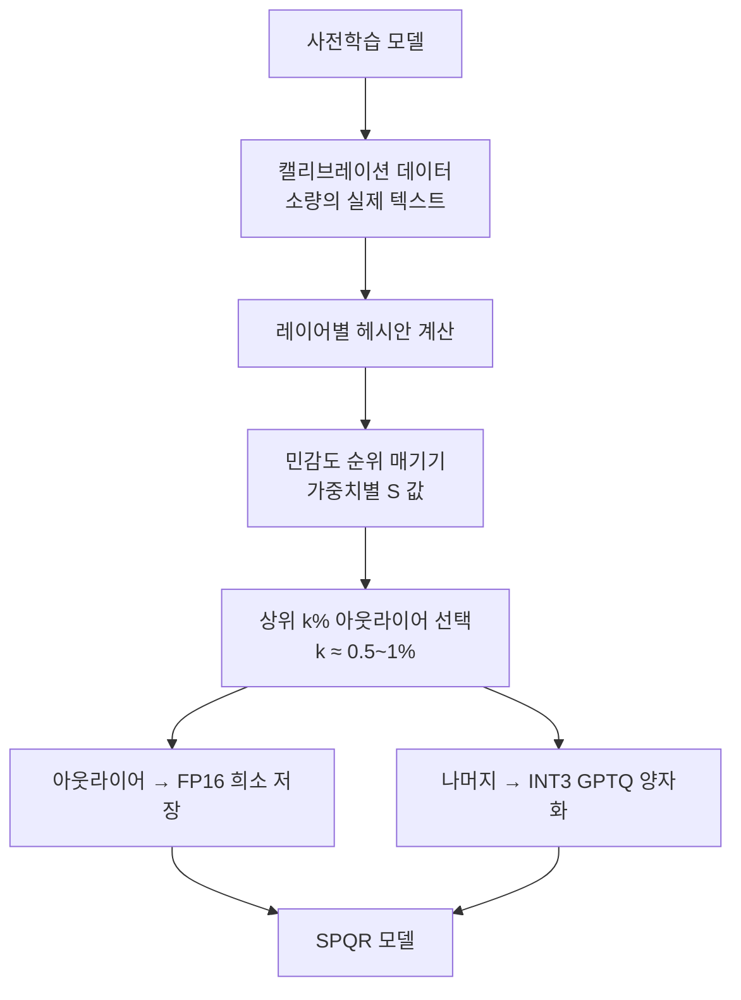

# SPQR - 희소-양자화 표현

## 개요

SPQR(Sparse-Quantized Representation)은 LLM 가중치 압축을 위한 혼합 정밀도 방식으로, **약 1%의 민감한 아웃라이어 가중치는 고정밀도(FP16)로, 나머지 99%는 저정밀도(INT3/INT4)로 표현**하는 전략이다. 이를 통해 3비트 양자화 수준의 메모리 절약을 달성하면서 FP16 대비 손실이 거의 없는(near-lossless) 정확도를 유지한다.

2023년 Dettmers 등이 발표한 논문에서 제안되었으며, BitSparse Representation의 일종으로 볼 수 있다.

## 핵심 아이디어: 아웃라이어의 불균일한 영향

LLM 가중치에서 소수의 극단적 값이 모델 출력에 불균형하게 큰 영향을 미친다. 이를 실험적으로 검증하면 다음과 같다.



**민감도 측정 방식**

가중치 $w_i$의 민감도(sensitivity)는 해당 가중치를 제거했을 때 모델 출력 손실의 변화량으로 측정한다.

$$S(w_i) = (w_i)^2 \cdot [H^{-1}]_{ii}$$

여기서 $H$는 헤시안 행렬(Hessian matrix)이다. GPTQ와 동일한 OBD(Optimal Brain Damage) 프레임워크를 활용하지만, 양자화 결정 대신 희소-밀집 분할 결정에 사용한다.

## 표현 구조



**저장 구조 상세**

- 밀집 텐서: INT3로 그룹 양자화 (그룹 크기 16 권장)
- 희소 인덱스: 8비트 또는 16비트 인덱스 포맷
- FP16 아웃라이어 값: 원래 정밀도 그대로 보존
- 그룹 메타데이터: 스케일(FP16), 제로포인트(INT8) 각 그룹당 저장

평균 비트폭 계산:
$$\bar{b} = 0.99 \times 3 + 0.01 \times 16 + \text{오버헤드} \approx 3.5\text{비트}$$

## 양자화 절차



**레이어별 처리 순서**

GPTQ와 마찬가지로 레이어를 순차적으로 처리하며, 이전 레이어의 양자화 오류를 다음 레이어 보정에 반영한다. 하나의 행렬을 처리할 때 각 열(column)을 순서대로 처리하면서 남은 가중치를 업데이트하는 greedy approach를 사용한다.

```python
# SPQR 양자화 개념적 코드
import torch
from spqr import SPQRQuantizer

quantizer = SPQRQuantizer(
    int_bits=3,          # 밀집 부분 비트폭
    group_size=16,        # 그룹 크기
    outlier_fraction=0.01, # 아웃라이어 비율 1%
    sensitivity_metric="hessian",  # 민감도 측정 방식
)

# 캘리브레이션 데이터로 민감도 분석
model_spqr = quantizer.quantize(
    model,
    calibration_data=calibration_loader,
    device="cuda"
)

# 저장 및 로드
model_spqr.save_pretrained("./llama-7b-spqr")
```

## 성능 특성

### 메모리 효율 (Llama-7B 기준)

| 방법 | 평균 비트폭 | GPU 메모리 | PPL |
|------|-----------|------------|-----|
| FP16 | 16 | 14GB | 5.47 |
| GPTQ W4 | 4 | 4.0GB | 5.68 |
| **SPQR W3+1%FP16** | **~3.5** | **3.8GB** | **5.49** |
| GPTQ W3 | 3 | 3.2GB | 6.24 |

- GPTQ W3 대비 PPL 차이: 5.49 vs 6.24 (SPQR이 훨씬 우수)
- FP16 대비 PPL 차이: 0.02 수준 (사실상 무손실)
- 메모리는 FP16의 약 27% 수준

### 추론 속도

SPQR의 희소 부분 처리는 희소 행렬-벡터 연산(SpMV)으로 구현되며, 밀집 INT3 연산과 결합해 실행한다.

- 배치 크기 1 (단일 요청): FP16 대비 속도 향상 제한적 (메모리 대역폭 병목)
- 배치 크기 8+: 처리량 FP16 대비 1.5-2x 향상 가능
- 아웃라이어 비율이 낮을수록 희소 오버헤드 감소

## SqueezeLLM과의 차이

SPQR과 [[squeezellm-quantization|SqueezeLLM]]은 유사한 "중요 가중치 분리" 아이디어를 공유하지만 구현이 다르다.

| 특성 | SPQR | SqueezeLLM |
|------|------|------------|
| 민감도 기준 | Hessian (OBD 기반) | 피셔 정보 근사 |
| 밀집 부분 | INT3 양자화 | k-평균 비균일 양자화 |
| 희소 인덱싱 | COO/CSR 포맷 | 특수 하드웨어 최적화 |
| 아웃라이어 처리 | FP16 원값 보존 | 밀집 저장소에 집중 |

## 실무 활용 권장사항

**SPQR이 적합한 상황**
- 3-4비트 양자화를 원하지만 기존 GPTQ W3의 정확도 저하가 허용 불가한 경우
- 메모리 대역폭보다 정확도가 더 중요한 배치 추론 환경
- 의료, 법률, 금융 등 고정밀도가 요구되는 도메인

**SPQR이 부적합한 상황**
- 실시간 단일 토큰 생성 (희소 오버헤드가 부각)
- 메모리 대역폭이 절대적으로 중요한 엣지 디바이스
- 빠른 양자화가 필요한 경우 (헤시안 계산 비용이 큼)

## 관련 문서

- [[gptq-quantization]] - SPQR의 기반 프레임워크(OBD/Hessian)
- [[squeezellm-quantization]] - 유사한 희소+양자화 접근법 (같은 큐)
- [[awq-quantization]] - 활성화 인식 INT4 양자화
- [[omniquant-calibration]] - 학습 가능 양자화 보정 (같은 큐)
- [[quantization-model-compression]] - 양자화 기법 종합
- [[ai-inference-quantization-2026]] - 최신 추론 양자화 동향
- [[atom-int8-quant]] - 아웃라이어 처리 INT8 방식 (같은 큐)
