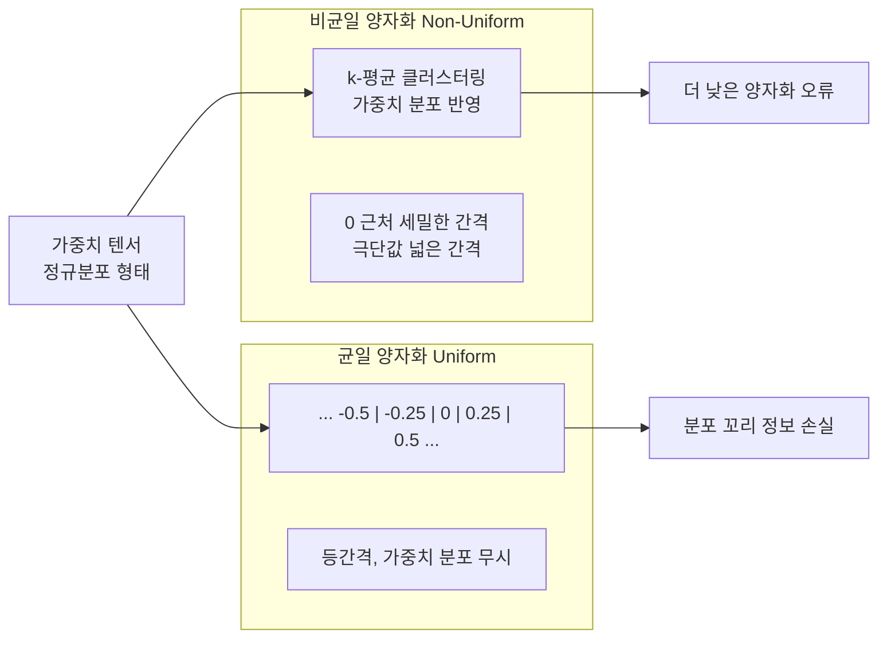
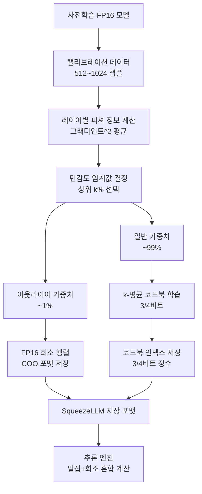
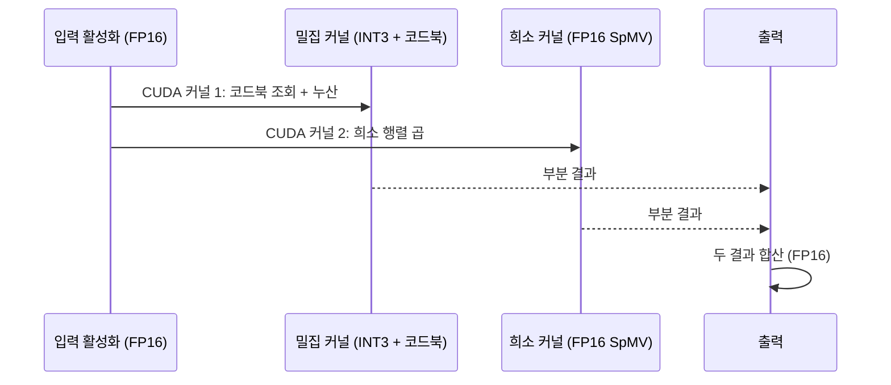

# SqueezeLLM - 희소+비균일 LLM 양자화

## 개요

SqueezeLLM은 LLM 가중치 압축을 위해 두 가지 핵심 기법을 결합한다.

1. **비균일 양자화 (Non-Uniform Quantization)**: 가중치 분포에 맞춘 k-평균 클러스터링으로 코드북(codebook)을 학습. 균일 양자화 대비 같은 비트폭에서 더 높은 정확도 달성
2. **희소 아웃라이어 처리 (Sparse Outlier Handling)**: 민감한 가중치를 FP16 희소 행렬로 별도 저장. 나머지 99%+는 저비트 코드북으로 압축

3비트 또는 4비트 코드북과 0.4~0.9%의 희소 FP16 저장소를 결합해, **3비트 양자화에서 사실상 무손실(near-zero) 정확도 저하**를 달성한다고 주장한다.

## 비균일 양자화: k-평균 코드북

일반적인 균일 양자화는 값을 등간격으로 매핑한다. 하지만 LLM 가중치는 정규분포 형태로 0 근처에 집중되어 있어, 균일 간격이 비효율적이다.



**k-평균 클러스터링 절차**

```python
# 비균일 양자화 코드북 학습 (개념적 코드)
import torch
from sklearn.cluster import KMeans

def learn_codebook(weight: torch.Tensor, num_bits: int = 3):
    """가중치 텐서에서 비균일 양자화 코드북 학습"""
    k = 2 ** num_bits  # 3비트: 8 클러스터, 4비트: 16 클러스터
    W_flat = weight.reshape(-1, 1).float().cpu().numpy()

    # k-평균으로 대표값(코드워드) 학습
    kmeans = KMeans(n_clusters=k, n_init=10)
    kmeans.fit(W_flat)

    codebook = torch.tensor(kmeans.cluster_centers_.squeeze())
    assignments = torch.tensor(kmeans.labels_)

    return codebook, assignments


# 추론 시: 인덱스 → 코드북 조회
def dequantize(indices: torch.Tensor, codebook: torch.Tensor):
    return codebook[indices]
```

**코드북 크기 비교**

| 비트폭 | 코드워드 수 | 표현 가능한 값 | 균일 대비 정확도 향상 |
|--------|------------|----------------|----------------------|
| 3비트 | 8 | 8개 실수 | +1.5 ~ 2 PPL 향상 |
| 4비트 | 16 | 16개 실수 | +0.5 ~ 1 PPL 향상 |

## 피셔 정보 기반 민감도 분석

어떤 가중치가 중요한지(민감한지) 판단하기 위해 피셔 정보(Fisher Information)를 사용한다.

가중치 $w_i$의 민감도:
$$\mathcal{F}(w_i) = \left(\frac{\partial \mathcal{L}}{\partial w_i}\right)^2$$

여기서 $\mathcal{L}$은 캘리브레이션 데이터에 대한 손실 함수다. 그래디언트 제곱의 기댓값으로 추정하며, 헤시안 대각선의 근사값이기도 하다.

이 민감도 점수를 기준으로 상위 0.4~1.0%를 아웃라이어로 지정해 FP16 희소 저장소에 보존한다.

## 전체 압축 파이프라인



## 성능 수치

### Llama-7B 결과 (Wikitext-2 PPL)

| 방법 | 비트폭 | PPL | FP16 대비 메모리 |
|------|--------|-----|-----------------|
| FP16 | 16 | 5.47 | 100% |
| GPTQ W4 | 4 | 5.68 | 25% |
| GPTQ W3 | 3 | 6.24 | 18.75% |
| SqueezeLLM W4+0.45% | ~4.1 | 5.49 | ~26% |
| **SqueezeLLM W3+0.45%** | **~3.1** | **5.54** | **~20%** |
| [[spqr-sparse-quantized\|SPQR]] W3+1% | ~3.5 | 5.49 | ~22% |

GPTQ W3 대비 PPL 6.24 → 5.54로 개선, FP16과의 차이를 0.07 수준으로 줄인다.

### OPT-6.7B 결과

| 방법 | PPL |
|------|-----|
| FP16 | 10.86 |
| GPTQ W3 | 12.55 |
| SqueezeLLM W3+0.45% | 11.14 |

아웃라이어가 더 많은 OPT 계열에서도 GPTQ 대비 크게 우수하다.

## 추론 커널 구현

SqueezeLLM 추론은 두 연산의 합으로 분해된다.

$$Y = W_{\text{dense}} \cdot X + W_{\text{sparse}} \cdot X$$

$W_{\text{dense}}$는 INT3/INT4 코드북 조회 + GEMM, $W_{\text{sparse}}$는 FP16 SpMV(희소 행렬-벡터 곱)로 처리한다.



**GPU 메모리 접근 패턴**

- 코드북 (8 또는 16 FP16 값): 공유 메모리(shared memory)에 캐시 가능
- INT3 인덱스: 압축된 형태로 전역 메모리에서 로드
- FP16 희소 값: 희소 인덱스에 따라 불규칙 접근

배치 크기가 커질수록 밀집 커널의 효율이 높아지고 희소 커널의 상대적 오버헤드가 줄어든다.

## GPTQ 대비 장단점

| 항목 | SqueezeLLM | GPTQ |
|------|-----------|------|
| 양자화 방식 | 비균일 (k-평균) | 균일 (보정 포함) |
| 아웃라이어 처리 | FP16 희소 저장 | 양자화 오류 전파로 보정 |
| 캘리브레이션 비용 | 그래디언트 계산 필요 | Hessian 계산 필요 (더 비쌈) |
| 구현 복잡도 | 중간 | 낮음 (CUDA 익스텐션 있음) |
| 코드북 저장 오버헤드 | 레이어당 8~16 FP16 값 | 없음 |
| 3비트 정확도 | 우수 | 보통 |

## 실무 적용

```python
# SqueezeLLM 추론 예시
from squeezellm import SqueezeLLMForCausalLM

# 사전 양자화된 모델 로드
model = SqueezeLLMForCausalLM.from_pretrained(
    "squeeze-research/llama-7b-w3-s0.45",
    device_map="cuda"
)
# 일반 Hugging Face 인터페이스와 동일
output = model.generate(input_ids, max_new_tokens=256)
```

**적합한 시나리오**
- 최대한 작은 모델 크기 + 최소한의 정확도 손실
- 배치 추론 환경 (희소 연산 오버헤드 숨김)
- 코드북 사전 계산 비용을 감수할 수 있는 경우

## 관련 문서

- [[spqr-sparse-quantized]] - 유사한 희소+양자화 접근 (Hessian 기반, 같은 큐)
- [[gptq-quantization]] - 균일 보정 기반 INT4 양자화
- [[awq-quantization]] - 활성화 인식 INT4 양자화
- [[omniquant-calibration]] - 학습 기반 비균일 양자화 (같은 큐)
- [[quantization-model-compression]] - 양자화 기법 종합
- [[ai-inference-quantization-2026]] - 최신 양자화 동향
