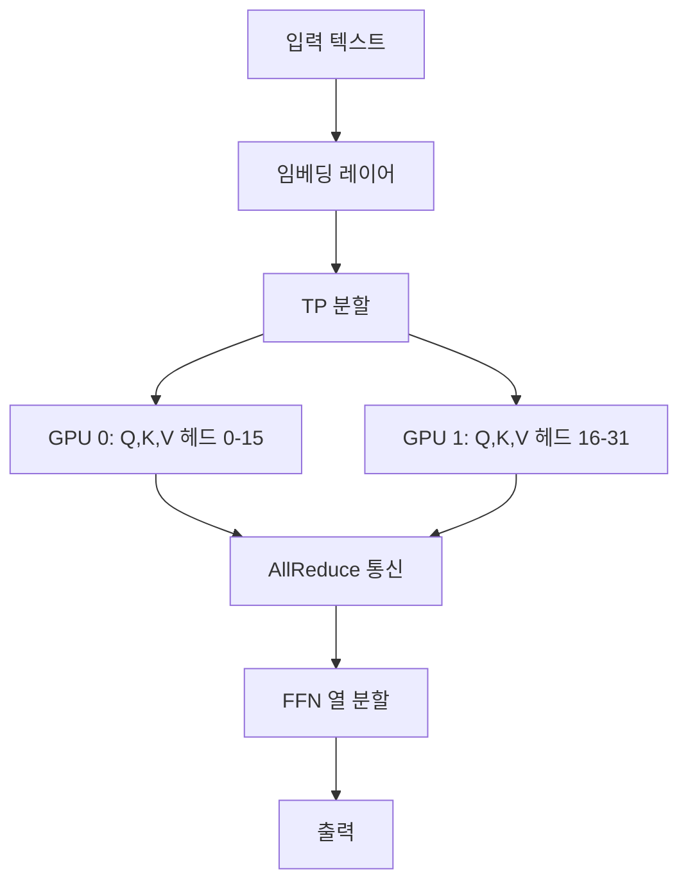

# 텐서 병렬화 추론

단일 GPU 메모리에 맞지 않는 대형 모델을 여러 GPU에 **행렬 연산 단위로 분할**하여 추론하는 기법. Megatron-LM 스타일의 열/행 분할을 추론에 적용한다.

## 분할 방식

**Attention**: 헤드를 GPU 간 분배. 각 GPU가 독립된 헤드 서브셋을 처리.
**FFN**: 열 분할(Column Parallel) -> AllReduce -> 행 분할(Row Parallel)

## 통신 오버헤드

TP는 **모든 레이어에서 AllReduce**가 필요하므로 GPU 간 대역폭이 병목:
- NVLink (900 GB/s): TP 2-8 실용적
- PCIe (64 GB/s): TP 2까지만 실용적
- 노드 간 (InfiniBand): 비권장 (지연시간 과다)

## 서빙 프레임워크 지원

| 프레임워크 | TP 지원 | 최대 TP |
|-----------|---------|---------|
| [[vllm-semantic-router\|vLLM]] | 네이티브 | 8+ |
| [[sglang\|SGLang]] | 네이티브 | 8+ |
| TensorRT-LLM | 네이티브 | 8+ |

## PP(파이프라인 병렬)와의 선택

- **TP**: 지연시간 최소화 (모든 GPU가 동시 작업) -- 실시간 서빙에 적합
- **PP**: 처리량 최대화 -- 배치 처리에 적합

## 관련 문서

- [[distributed-training-overview]] -- 분산 학습 개요
- [[model-serving]] -- 모델 서빙
- [[prefill-decode-disaggregation]] -- PD 분리
- [[pipeline-parallelism-1f1b]] -- 파이프라인 병렬
