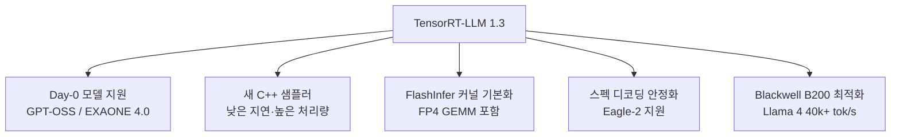
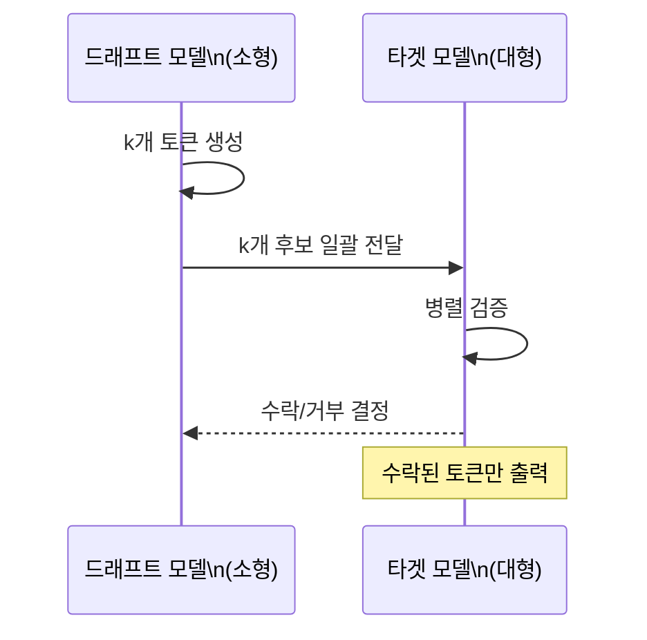

# TensorRT-LLM 1.3 with Day-0 Model Support

NVIDIA의 프로덕션 LLM 추론 엔진. Day-0 GPT-OSS 지원과 새 C++ 샘플러를 기본화한 1.3 시리즈가 2026년 3월부터 활발히 릴리스되고 있다.

## 제품 정체성

NVIDIA가 개발·유지하는 오픈소스 LLM 추론 최적화 라이브러리. TensorRT 기반 커널 퓨전(kernel fusion), INT4/FP8/NVFP4 양자화, 스펙 디코딩(speculative decoding) 등 NVIDIA GPU 전용 저수준 최적화를 제공한다. NVIDIA DGX Cloud, NIM(NVIDIA Inference Microservices)의 엔진 계층.

## 왜 중요한가

2026년 3월 1.3.0rc 시리즈가 활발히 릴리스되면서 GPT-OSS-120B/20B와 EXAONE 4.0 Day-0 지원, B200에서 Llama 4 40k+ tok/s를 기록하며 NVIDIA 하드웨어의 공식 속도 기준점(reference point)으로 자리잡았다.

## 1.3 핵심 변경사항

## 지원 모델 범위 (1.3 기준)

| 모델 계열 | 지원 상태 |
|---------|---------|
| Llama 3.1 / 3.2 / 3.3 / 4 | Day-0 지원 |
| GPT-OSS 120B / 20B | Day-0 지원 (1.3 신규) |
| EXAONE 4.0 | Day-0 지원 (1.3 신규) |
| DeepSeek-V3 / R1 | 지원 |
| Qwen 2.5 / 3 | 지원 |
| Mistral / Mixtral | 지원 |

**Day-0 지원**: 모델 공개일에 TRT-LLM 최적화 버전이 동시 릴리스되는 것.

## 양자화 지원 현황

| 정밀도 | 대상 | 성능 이점 |
|-------|------|---------|
| FP16 / BF16 | 기본 추론 | 기준 |
| INT8 SmoothQuant | 가중치·활성화 동시 양자화 | 1.5-2x 처리량 |
| INT4 AWQ | 가중치 전용 | 2x 메모리 절감 |
| FP8 (Hopper+) | H100/H200 최적화 | 2x 처리량 |
| NVFP4 (Blackwell) | B200/GB300 전용 | 4x 처리량 (이론) |

## 스펙 디코딩 (Speculative Decoding)

TRT-LLM 1.3은 EAGLE-2 기반 스펙 디코딩을 안정화했다. 드래프트 모델(draft model)이 여러 후보 토큰을 생성하면 대형 모델이 일괄 검증해 추론 속도를 높이는 방식.

## TRT-LLM vs vLLM 선택 기준

| 항목 | TRT-LLM | vLLM |
|------|---------|------|
| 최적화 수준 | 더 높음 (NVIDIA 전용) | 범용적 |
| 커스터마이징 | 제한적 (C++ 빌드) | 용이 (Python) |
| AMD 지원 | 없음 | 있음 (ROCm) |
| Day-0 모델 지원 | 빠름 | 빠름 |
| 운영 복잡도 | 높음 | 낮음 |
| 적합 환경 | NVIDIA 전용 클러스터 | 혼합 환경 |

## NVIDIA NIM 연동

TRT-LLM은 NVIDIA NIM(Inference Microservices)의 백엔드 엔진으로 동작한다. NIM 컨테이너를 배포하면 TRT-LLM 최적화를 별도 설정 없이 API 서버로 즉시 사용 가능.

## 실무 적용 관점

- **NVIDIA 전용 고성능 환경**: H100/H200/B200 클러스터에서 최고 처리량이 필요한 서비스
- **Day-0 모델 채택**: 신규 모델 출시와 동시에 최적화된 추론이 필요한 경우 TRT-LLM이 유리
- **양자화 전략**: 메모리 제약이 있으면 INT4 AWQ, 처리량 우선이면 FP8, Blackwell GPU 보유 시 NVFP4
- **스펙 디코딩 적용**: 드래프트 모델이 있고 latency-sensitive 서비스에서 1.5-3x 속도 향상 가능

## 대표 레퍼런스

- [TensorRT-LLM Release Notes](https://nvidia.github.io/TensorRT-LLM/release-notes.html)
- [NVIDIA/TensorRT-LLM GitHub Releases](https://github.com/NVIDIA/TensorRT-LLM/releases)
- [NVIDIA/TensorRT-LLM GitHub Repository](https://github.com/NVIDIA/TensorRT-LLM)
- [TensorRT LLM Documentation](https://nvidia.github.io/TensorRT-LLM/)
- [TensorRT LLM Speculative Sampling Documentation](https://nvidia.github.io/TensorRT-LLM/advanced/speculative-decoding.html)

## 관련 문서

- [[ai-hot-topics-2026-04|2026년 4월 AI 개발 핫토픽 100선]]
- [[flashinfer|FlashInfer Kernel Library for LLM Serving]]
- [[vllm-v1-engine|vLLM V1 Engine on Blackwell]]
- [[vllm-rocm-platform|AMD ROCm as First-Class vLLM Platform]]
- [[xgrammar-2|XGrammar-2 Constrained Decoding]]
