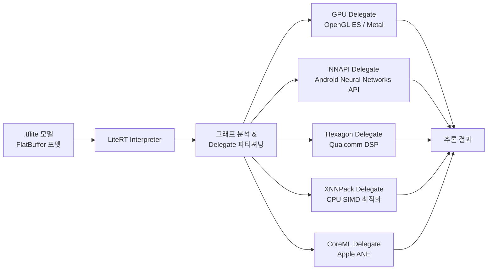
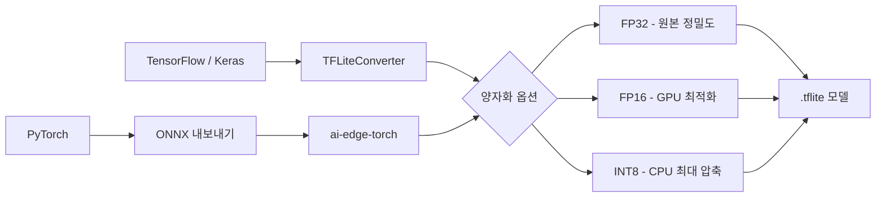

# TFLite / LiteRT (Google 경량 온디바이스 추론)

## 개요

**LiteRT**(구 TensorFlow Lite, TFLite)는 Google이 개발한 경량 온디바이스 머신러닝 추론 런타임이다. 2024년 Google은 TensorFlow Lite를 TensorFlow 생태계에서 독립시켜 **LiteRT**로 브랜드를 변경하였으며, Google AI Edge 포트폴리오의 핵심 컴포넌트로 자리잡았다. 스마트폰, 임베디드 기기, 마이크로컨트롤러 등 제한된 리소스 환경에서 밀리초 단위 추론을 목표로 설계되었다.

## TFLite에서 LiteRT로의 전환

| 항목 | TFLite (구) | LiteRT (신) |
|------|------------|-------------|
| 브랜드 | TensorFlow Lite | LiteRT |
| 패키지 | `tensorflow-lite` | `ai-edge-litert` |
| 모델 포맷 | `.tflite` | `.tflite` (호환 유지) |
| 허브 | TF Hub | Kaggle Models / AI Edge |
| 독립성 | TensorFlow 종속 | TensorFlow 독립 |

브랜드는 바뀌었지만 `.tflite` 모델 포맷과 C API는 완전히 하위 호환된다. 기존 TFLite 앱을 재빌드 없이 LiteRT로 업그레이드 가능하다.

## 아키텍처: Delegate 시스템

LiteRT의 핵심 설계는 **Delegate 플러그인 아키텍처**다. 연산 그래프를 분석한 뒤, 특정 하드웨어 가속기가 처리할 수 있는 서브그래프를 해당 Delegate에게 위임한다. 나머지는 CPU 커널이 처리한다.



**XNNPack**은 별도 하드웨어 없이도 CPU SIMD(ARM NEON, x86 AVX)를 최대한 활용하는 기본 Delegate로, 2024년 기준 대부분의 MobileNet/EfficientNet 계열에서 기본 활성화된다.

## LiteRT LM: LLM 확장

2024년 하반기 Google은 **LiteRT LM** 컴포넌트를 발표하여 LLM 온디바이스 실행을 공식 지원하기 시작했다. Gemma 2B/7B, Phi-2, Falcon 계열의 양자화 모델을 모바일에서 실행할 수 있다.

- **LoRA 어댑터** 런타임 주입 지원 (파인튜닝 모델 배포)
- **멀티모달**: 텍스트 + 이미지 입력 처리
- **KV 캐시**: 온디바이스 KV 캐시 관리로 대화형 세션 지원
- Android Pixel 8 이상의 Google Tensor 칩에서 최적화된 성능

```python
# LiteRT Python API 기본 예시
from ai_edge_litert.interpreter import Interpreter

interpreter = Interpreter(model_path="model.tflite")
interpreter.allocate_tensors()

input_details = interpreter.get_input_details()
output_details = interpreter.get_output_details()

interpreter.set_tensor(input_details[0]['index'], input_data)
interpreter.invoke()
output = interpreter.get_tensor(output_details[0]['index'])
```

## 모델 변환 파이프라인

TensorFlow/Keras 또는 PyTorch 모델을 `.tflite`로 변환하는 표준 경로:



**ai-edge-torch**는 PyTorch 모델을 직접 LiteRT 포맷으로 변환하는 Google의 공식 도구로, ONNX 경유 없이 변환 가능하다.

## ONNX Runtime과의 비교

[[onnx-runtime]]이 범용 크로스 플랫폼을 목표로 한다면, LiteRT는 모바일/엣지 환경에 특화되어 더 작은 바이너리 크기와 낮은 메모리 풋프린트를 우선시한다. 일반 서버 환경의 배포는 [[model-serving]]에서 다루는 vLLM, TensorRT-LLM 등이 적합하다.

## 관련 문서

- [[model-serving]] - 서버 환경 배포 인프라
- [[onnx-runtime]] - 크로스 플랫폼 범용 추론 런타임 (비교 대상)
- [[coreml]] - Apple 생태계 온디바이스 추론
- [[on-device-inference-stack]] - 온디바이스 추론 전체 스택
