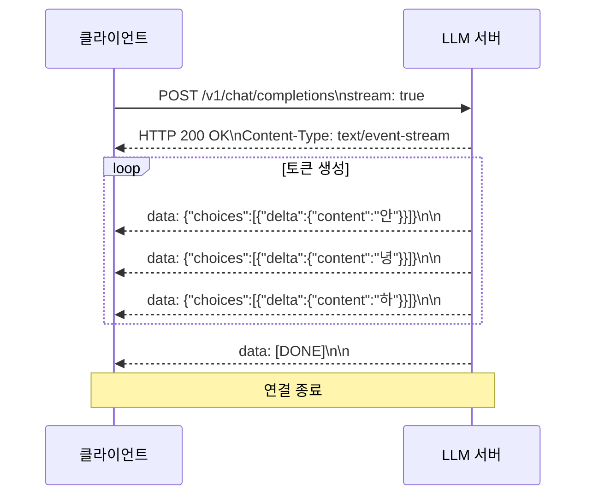
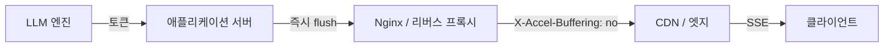

# 토큰 스트리밍 (SSE 기반 실시간 응답)

## 개요

**토큰 스트리밍(Token Streaming)**은 LLM이 응답 전체를 생성한 뒤 전달하는 대신, 생성된 토큰을 하나씩 즉시 클라이언트로 전송하는 방식이다. ChatGPT를 사용할 때 글자가 하나씩 타이핑되듯 나타나는 것이 이 방식의 대표적인 UX다. 서버-전송 이벤트(Server-Sent Events, SSE)가 가장 일반적인 전송 프로토콜로 사용된다.

## 왜 스트리밍인가: TTFT와 사용자 경험

LLM 추론에서 사용자 경험을 결정하는 핵심 지표는 두 가지다:

- **TTFT (Time To First Token)**: 요청 후 첫 번째 토큰을 받기까지의 시간
- **TPOT (Time Per Output Token)**: 이후 각 토큰 생성 간격

비스트리밍 방식에서는 TTFT가 전체 응답 생성 시간과 같다. 200 토큰 응답이 10초 걸린다면 사용자는 10초를 아무것도 못 보고 기다린다. 스트리밍 방식에서는 TTFT가 첫 토큰 생성 시간(보통 0.5-2초)으로 줄어들고, 이후 토큰이 연속적으로 표시된다. 사용자가 읽는 속도보다 빠르게 토큰이 도착하면 실질적인 대기 경험이 사라진다.

## Server-Sent Events (SSE) 프로토콜

SSE는 HTTP/1.1 표준 기반의 단방향 서버-클라이언트 스트리밍 프로토콜이다. WebSocket과 달리 별도 핸드셰이크 없이 일반 HTTP 연결에서 동작한다.



SSE 메시지 형식은 단순하다:
- 각 이벤트는 `data:` 접두사로 시작
- 이벤트 구분은 빈 줄(`\n\n`)
- 클라이언트는 `EventSource` API나 `fetch`의 `ReadableStream`으로 수신

## OpenAI 호환 스트리밍 API

```python
import anthropic

client = anthropic.Anthropic()

# 스트리밍 응답 수신
with client.messages.stream(
    model="claude-opus-4-5",
    max_tokens=1024,
    messages=[{"role": "user", "content": "한국의 역사를 설명해줘"}]
) as stream:
    for text in stream.text_stream:
        print(text, end="", flush=True)
```

```javascript
// fetch API로 SSE 직접 소비 (Next.js / React)
const response = await fetch('/api/chat', { method: 'POST', body: ... });
const reader = response.body.getReader();
const decoder = new TextDecoder();

while (true) {
    const { done, value } = await reader.read();
    if (done) break;
    const chunk = decoder.decode(value);
    // "data: {...}\n\n" 파싱 후 UI 업데이트
}
```

## 서버 사이드 구현 고려사항

### 버퍼링 최소화

스트리밍의 이점을 살리려면 서버-클라이언트 경로 전체에서 버퍼링을 제거해야 한다:



Nginx를 통과할 경우 `X-Accel-Buffering: no` 헤더가 필수다. 이 헤더 없이는 Nginx가 응답을 버퍼링하여 스트리밍 효과가 사라진다.

### 취소 처리

사용자가 응답 도중 새 요청을 보내면 진행 중인 생성을 중단해야 한다. vLLM, SGLang 등 서빙 엔진은 요청 취소 API를 제공하며, HTTP 연결 종료 시 자동으로 생성을 중단하는 구현이 이상적이다.

## SSE vs WebSocket vs HTTP/2 Server Push

| 방식 | 방향성 | 복잡도 | LLM 스트리밍 적합성 |
|------|-------|--------|-----------------|
| SSE | 단방향 (서버→클라이언트) | 낮음 | 높음 (표준적) |
| WebSocket | 양방향 | 중간 | 가능하나 과도한 복잡성 |
| HTTP/2 Push | 단방향 | 높음 | 브라우저 지원 중단 중 |
| Chunked Transfer | 단방향 | 낮음 | SSE 이전 레거시 방식 |

LLM 응답 스트리밍에서 양방향 통신이 필요한 경우(예: 중간에 사용자 입력을 받는 인터랙티브 에이전트)에만 WebSocket이 적합하다. [[model-serving]] 인프라에서의 지연시간 관리는 [[llm-inference-metrics]]를 함께 참조한다.

## 관련 문서

- [[model-serving]] - 서빙 인프라에서의 스트리밍 구현
- [[llm-inference-metrics]] - TTFT, TPOT 등 추론 성능 지표
- [[latency-throughput-tradeoff]] - 스트리밍이 처리량에 미치는 영향
- [[continuous-batching]] - 스트리밍과 연속 배치의 상호작용
