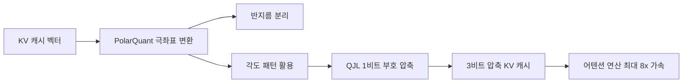

# TurboQuant (Google, ICLR 2026)

## 개요

TurboQuant는 Google이 ICLR 2026에서 발표한 KV 캐시 극한 압축 기법이다. KV 캐시를 3비트로 [[ai-inference-quantization-2026|양자화]]하면서 정확도 손실 제로(zero accuracy loss)를 달성하며, 재학습이 불필요하다. PolarQuant와 QJL(Quantized Johnson-Lindenstrauss) 두 단계 접근법을 결합하여, H100 GPU에서 어텐션 로짓 연산 시 최대 8배 성능 향상을 보인다.

## 핵심 개념

### PolarQuant (1단계)

기존 양자화가 직교 좌표(Cartesian coordinates)에서 작동하는 반면, PolarQuant는 벡터를 극좌표(polar coordinates)로 변환하여 반지름(데이터 강도)과 각도(방향/의미)를 분리한다. 비유하면 "동쪽 3블록, 북쪽 4블록"을 "37도 방향으로 5블록"으로 변환하는 것이다.

PolarQuant의 핵심 메커니즘:

1. **좌표 변환**: 표준 X, Y, Z 축 데이터를 반지름+각도 표현으로 변환
2. **반지름 분리**: 핵심 데이터의 강도(magnitude)를 캡처
3. **고정 그리드 매핑**: 가변적인 사각 그리드 대신 예측 가능한 원형 그리드에 매핑하여 비싼 정규화 단계 제거
4. **재귀적 극좌표 변환**: 좌표 쌍을 그룹화하고 재귀적으로 극좌표 변환을 수행하여 단일 반지름과 기술적 각도(descriptive angles)로 증류

이 접근법은 기존 양자화가 요구하는 "숫자당 1-2비트 추가" 메모리 오버헤드를 완전히 제거한다.

### QJL -- Quantized Johnson-Lindenstrauss (2단계)

Johnson-Lindenstrauss 변환의 "1비트 트릭"을 적용하여 남은 오차를 단일 부호 비트(+1 또는 -1)로 축소한다. 고정밀 쿼리와 저정밀 간소화 데이터 간 균형을 맞추는 특수 추정기(estimator)를 사용하며, 어텐션 스코어 계산에서 편향(bias)을 제거하는 수학적 오류 검증기로 작동한다. 메모리 오버헤드 제로를 달성한다.

### 재학습 불필요 (Training-Free)

TurboQuant의 핵심 실용적 강점은 기존 모델에 즉시 적용할 수 있다는 것이다. 모델 재학습이나 파인튜닝 없이 Gemma, Mistral 등에 바로 적용 가능하며, 런타임 오버헤드가 무시할 수준이다. 연구진은 이 알고리즘이 "이론적 하한에 근접하게 작동"하는 "증명 가능한 효율성(provably efficient)"을 갖춘 근본적인 알고리즘 기여라고 강조한다.

## 작동 원리

1. KV 캐시 벡터를 극좌표계로 변환 (PolarQuant)
2. 반지름과 각도를 분리하여 정규화 단계 제거
3. 남은 오차에 QJL 1비트 트릭 적용
4. 최종 3비트 압축 KV 캐시 생성
5. 압축된 캐시로 어텐션 연산 수행 -- 정확도 손실 없음

## 성능/효과

### 장기 컨텍스트 벤치마크

LongBench, Needle In A Haystack, ZeroSCROLLS, RULER, L-Eval 벤치마크에서 Gemma, Mistral 등 오픈소스 LLM으로 테스트:

| 항목 | 결과 |
|------|------|
| KV 캐시 메모리 감소 | 최소 6배 (장기 컨텍스트 기준) |
| H100 어텐션 로짓 연산 | 최대 8배 성능 향상 (32비트 대비, 4비트 TurboQuant) |
| 다운스트림 정확도 | 모든 벤치마크에서 무손실 (perfect downstream results) |
| Needle-in-a-Haystack | PolarQuant 단독으로 근무손실(nearly loss-less) |
| 런타임 오버헤드 | 무시 가능 수준 (negligible) |

### 벡터 검색 벤치마크

GloVe 데이터셋(d=200)에서 PQ, RabbiQ 베이스라인 대비 1@k 재현율(recall ratio)을 측정한 결과, TurboQuant가 모든 k값에서 일관되게 우월한 재현율을 달성했다.

### 기존 양자화 방법 대비 차별점

| 방법 | 추가 메모리 오버헤드 | 재학습 필요 | 정확도 손실 |
|------|---------------------|-------------|-------------|
| 기존 벡터 양자화 | 숫자당 1-2비트 추가 | 방법에 따라 다름 | 있음 |
| TurboQuant (3비트) | 제로 | 불필요 | 제로 |

- Gemma, Mistral 등 기존 모델에 즉시 적용 가능
- 최적화된 JAX 베이스라인 대비 측정

## 실용적 의의

### KV 캐시 문제의 심각성

LLM 추론에서 KV 캐시는 컨텍스트 길이에 비례하여 선형으로 증가한다. 예를 들어 128K 컨텍스트를 가진 모델에서 KV 캐시는 수십 GB에 달할 수 있으며, 이는 모델 가중치 자체보다 더 많은 GPU 메모리를 소비할 수 있다. TurboQuant의 6배 메모리 감소는 동일 GPU에서 처리 가능한 컨텍스트 길이를 비례적으로 늘리거나, 동시 서빙 가능한 요청 수를 대폭 증가시킨다.

### 적용 범위

TurboQuant의 기여는 LLM KV 캐시에 국한되지 않는다. 벡터 검색 엔진, 벡터 데이터베이스 등 고차원 벡터를 다루는 모든 시스템에 적용 가능하다. GloVe 데이터셋 벤치마크에서 기존 벡터 양자화 방법(PQ, RabbiQ) 대비 우월한 재현율을 달성한 것은 이 범용성을 실증한다.

### 2단계 압축의 수학적 직관

PolarQuant는 "잘 알려진 패턴(극좌표의 각도 집중 현상)"을 활용하여 1차 압축을 수행하고, QJL은 1차 압축 후 남은 잔차(residual)를 부호 비트 하나로 표현한다. 이 2단계 접근은 정보 이론적으로 데이터의 구조적 규칙성을 먼저 포착한 뒤, 비구조적 잔차를 최소 비트로 표현하는 최적 전략에 해당한다.

### 산업적 반향

TurboQuant의 발표는 LLM 인프라 비용 절감에 대한 산업계의 관심과 맞물려 큰 반향을 일으켰다. 인터넷 커뮤니티에서는 HBO의 "Silicon Valley" 시리즈의 가상 데이터 압축 스타트업을 빗대어 화제가 되기도 했다. 실용적 관점에서 커뮤니티가 GitHub(`hackimov/turboquant-kv`)에서 TurboQuant를 사용 가능한 형태로 빠르게 구현한 것은 이 기술의 즉각적인 수요를 보여준다.

## 관련 문서
- [[universal-yoco-paper]] -- Universal YOCO: 재귀 계산으로 효율적 깊이 스케일링
- [[knowledge-distillation]]

- [[kv-cache]] -- TurboQuant가 압축하는 대상
- [[kv-cache-compression]] -- KV 캐시 압축 기법 전반
- [[nvfp4-quantization]] -- NVIDIA의 FP4 양자화 기법
- [[long-context-scaling]] -- 장기 컨텍스트에서 KV 캐시 압축 필요성
