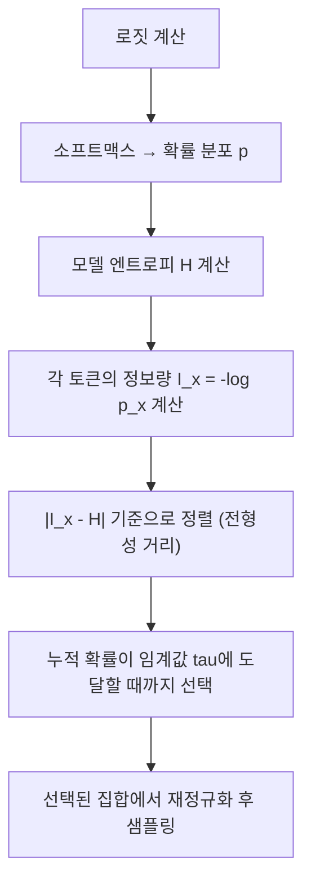

# Typical Sampling

## 배경과 문제 의식

언어 모델이 텍스트를 생성할 때 가장 높은 확률의 토큰만 선택하면(그리디 디코딩) 반복적이고 지루한 출력이 나온다. 반대로 완전한 무작위 샘플링은 일관성이 없다. Top-k나 [[nucleus-top-p-sampling]](Top-p 샘플링)은 후보 토큰 수를 확률 기준으로 자르지만, 이 방식에는 근본적인 한계가 있다.

핵심 문제: **"자연스러운 텍스트는 가장 높은 확률의 토큰으로만 이루어지지 않는다."**

사람이 글을 쓸 때는 최고 확률 토큰이 아닌, 맥락상 "적절히 예측 가능한" 토큰을 선택한다. 이 직관을 정보이론적으로 형식화한 것이 Typical Sampling이다.

## 핵심 개념: 정보량과 전형성

정보이론에서 토큰 $x$의 **정보량(surprisal)**은 다음과 같이 정의된다:

$$I(x) = -\log p(x \mid \text{context})$$

확률이 높을수록 정보량이 낮고, 확률이 낮을수록 정보량이 높다. 모델의 **엔트로피(entropy)**는 모든 가능한 다음 토큰의 정보량 기댓값이다:

$$H = -\sum_x p(x) \log p(x)$$

Typical Sampling의 핵심 아이디어: **엔트로피에 가까운 정보량을 가진 토큰들이 "전형적(typical)"이다.**

자연스러운 텍스트는 정보량이 모델 엔트로피 근처에 집중된다. 너무 낮은 정보량(자명한 토큰)도, 너무 높은 정보량(뜬금없는 토큰)도 자연스러운 텍스트에 드물다.

## 알고리즘



**단계별 설명**:

1. 모델로부터 다음 토큰의 확률 분포 $p(x)$를 얻는다.
2. 현재 컨텍스트에서 모델 엔트로피 $H$를 계산한다.
3. 각 토큰의 정보량 $I(x) = -\log p(x)$를 계산한다.
4. 전형성 거리 $|I(x) - H|$가 작은 순서로 토큰을 정렬한다.
5. 누적 확률이 하이퍼파라미터 $\tau$ (tau)에 도달할 때까지 상위 토큰들을 선택한다.
6. 선택된 토큰 집합을 재정규화하여 샘플링한다.

**핵심 수식**:

$$\mathcal{T}_\tau = \{x : |{-\log p(x) - H}| \leq \delta\}$$

$\delta$는 $\mathcal{T}_\tau$의 누적 확률이 $\tau$ 이상이 되도록 자동으로 결정된다.

## 코드 예시

```python
import torch
import torch.nn.functional as F

def typical_sampling(logits: torch.Tensor, tau: float = 0.9, temperature: float = 1.0) -> int:
    """
    Typical Sampling 구현.

    Args:
        logits: 모델 출력 로짓 (vocab_size,)
        tau: 전형성 임계값. 누적 확률 기준 (0 < tau <= 1)
        temperature: 샘플링 온도

    Returns:
        선택된 토큰 ID
    """
    # 온도 적용 후 확률 계산
    logits = logits / temperature
    probs = F.softmax(logits, dim=-1)

    # 모델 엔트로피 계산
    log_probs = torch.log(probs + 1e-10)
    entropy = -(probs * log_probs).sum()

    # 각 토큰의 정보량과 전형성 거리 계산
    neg_log_probs = -log_probs
    typicality_distance = torch.abs(neg_log_probs - entropy)

    # 전형성 거리 기준으로 정렬
    sorted_indices = torch.argsort(typicality_distance)
    sorted_probs = probs[sorted_indices]

    # 누적 확률이 tau에 도달할 때까지 선택
    cumulative_probs = torch.cumsum(sorted_probs, dim=-1)
    mask = cumulative_probs <= tau
    # 최소 1개 토큰은 항상 포함
    mask[0] = True

    # 선택된 토큰에서 샘플링
    selected_indices = sorted_indices[mask]
    selected_probs = probs[selected_indices]
    selected_probs = selected_probs / selected_probs.sum()  # 재정규화

    chosen_idx = torch.multinomial(selected_probs, num_samples=1)
    return selected_indices[chosen_idx].item()


# 사용 예시 (Hugging Face Transformers와 연동)
from transformers import AutoTokenizer, AutoModelForCausalLM

def generate_with_typical_sampling(
    model, tokenizer, prompt: str, max_new_tokens: int = 50, tau: float = 0.9
) -> str:
    inputs = tokenizer(prompt, return_tensors="pt")
    input_ids = inputs["input_ids"]

    generated = input_ids.clone()
    for _ in range(max_new_tokens):
        with torch.no_grad():
            outputs = model(generated)
            logits = outputs.logits[:, -1, :]  # 마지막 위치 로짓

        next_token = typical_sampling(logits[0], tau=tau)
        next_token_tensor = torch.tensor([[next_token]])
        generated = torch.cat([generated, next_token_tensor], dim=-1)

        if next_token == tokenizer.eos_token_id:
            break

    return tokenizer.decode(generated[0], skip_special_tokens=True)
```

## Top-p와의 비교

| 특성 | Top-p (Nucleus) | Typical Sampling |
|------|-----------------|------------------|
| 선택 기준 | 확률 크기 순서 | 엔트로피와의 거리 |
| 엔트로피 높을 때 | 많은 토큰 포함 | 엔트로피 근처 토큰 선택 |
| 엔트로피 낮을 때 | 소수 토큰만 포함 | 확률 높아도 배제 가능 |
| 자명한 토큰 처리 | 높은 확률이면 항상 포함 | 배제 가능 |
| 이론적 근거 | 직관적 확률 임계 | 정보이론적 전형성 |

Top-p는 엔트로피가 낮을 때(모델이 확신할 때) 자연스럽다. 그러나 엔트로피가 낮더라도 특정 토큰이 압도적으로 높으면 Typical Sampling은 그 토큰을 배제할 수 있다 - 이것이 더 다양하고 자연스러운 출력을 만드는 핵심 메커니즘이다.

## 하이퍼파라미터 튜닝 가이드

| tau 값 | 효과 | 적합한 용도 |
|--------|------|-------------|
| 0.2 - 0.4 | 좁은 전형적 집합, 보수적 | 코드 생성, 사실 응답 |
| 0.5 - 0.8 | 균형 | 일반 대화, 요약 |
| 0.9 - 1.0 | 넓은 집합, 다양한 출력 | 창의적 글쓰기, 브레인스토밍 |

Temperature와 함께 사용하면 추가적인 분포 조정이 가능하다. 일반적으로 `tau=0.9`가 좋은 기본값이다.

## 실무 적용과 한계

**장점**:
- 자명한 토큰(매우 높은 확률이지만 무미건조한 단어)을 배제하여 더 자연스러운 텍스트 생성
- 모델의 확신 수준에 자동 적응 (엔트로피 기반 동적 임계값)
- 반복 문제 완화에 효과적

**한계**:
- 엔트로피 계산 오버헤드 (매 스텝 추가 계산)
- 실제 사용보다 이론적 근거가 더 강력하다는 평가도 있음
- llama.cpp, vLLM 등 주요 런타임에서 지원하지만 기본 설정은 아님

**지원 환경**:
- `llama.cpp`: `--typical` 플래그
- `text-generation-webui`: typical_p 파라미터
- 커스텀 로짓 프로세서로 구현 가능 ([[logits-processor-internals]] 참조)

## 관련 문서

- [[nucleus-top-p-sampling]] - Top-p 샘플링과의 비교 기반
- [[eta-sampling-locally]] - 또 다른 엔트로피 기반 동적 샘플링
- [[mirostat-perplexity]] - 퍼플렉시티 제어 기반 샘플링
- [[min-p-sampling]] - 최대 확률 비율 기반 임계값
- [[temperature-sampling]] - 온도 기반 분포 조정
- [[repetition-penalty-logit-bias]] - 반복 억제 기법
- [[decoding-strategies]] - 디코딩 전략 전체 개요
