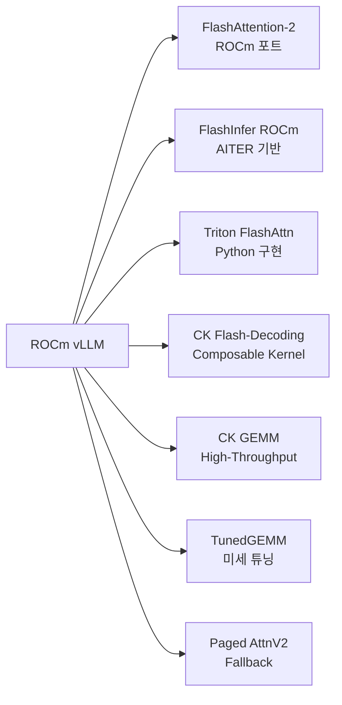

# AMD ROCm as First-Class vLLM Platform

vLLM ROCm 백엔드가 MI300X/MI325X/MI350X에서 7개 어텐션 백엔드를 제공하며 NVIDIA와 대등한 1등급(first-class) 플랫폼 지위를 획득한 상태.

## 제품 정체성

AMD Instinct GPU 계열(MI300X, MI325X, MI400)을 vLLM 프로덕션 서빙 환경으로 사용하기 위한 ROCm 백엔드. 2026년 초 상시 CI 파이프라인과 공식 Docker 이미지가 완비되며 엔터프라이즈 배포 가능 수준에 도달했다.

## 왜 중요한가

2025년 12월 29일 ROCm CI 파이프라인이 상시 가동됐고, 2026년 1월 6일 공식 ROCm vLLM-omni Docker 이미지가 공개됐다. 2월 27일 vLLM 공식 블로그가 AMD를 first-class platform으로 선언하면서 GPU 공급 병목의 실질적 대안으로 급부상했다.

## ROCm 어텐션 백엔드 7종



워크로드 특성(배치 크기, 시퀀스 길이, 메모리 용량)에 따라 최적 백엔드를 자동 선택하거나 수동 지정 가능.

## MI300X 핵심 하드웨어 특성

| 항목 | MI300X | H100 SXM |
|------|--------|----------|
| HBM3 메모리 | 192 GB | 80 GB |
| 메모리 대역폭 | 5.3 TB/s | 3.35 TB/s |
| FP8 TFLOPS | 2,610 | 3,958 |
| 특이점 | 대형 모델 단일 노드 서빙 가능 | 고밀도 연산 |

MI300X의 192 GB HBM은 70B 파라미터 모델을 FP16으로 단일 GPU에 올릴 수 있다는 점에서 실용적 우위를 가진다.

## vLLM ROCm 배포 경로

```bash
# 공식 vLLM-omni ROCm Docker 이미지 (2026-01 이후 안정화)
docker pull rocm/vllm-dev:latest
docker run --device=/dev/kfd --device=/dev/dri \
  rocm/vllm-dev:latest \
  python -m vllm.entrypoints.openai.api_server \
  --model meta-llama/Llama-3.1-70B-Instruct
```

## SGLang on AMD Instinct

SGLang도 AMD Instinct GPU에서 공식 지원된다. ROCm 환경에서 vLLM 대비 RadixAttention 캐시 히트율 이점을 그대로 활용 가능.

## 실무 적용 관점

- **대형 모델 단일 노드 서빙**: 140B+ 모델을 MI300X 두 장으로 서빙 가능 (NVLink 없이 ROCm P2P 통신)
- **비용 구조**: 클라우드 환경에서 H100 대비 AMD GPU는 할인 단가 존재 (시장 상황에 따라 변동)
- **CI 안정성**: 2026년 이후 ROCm 파이프라인이 상시 가동되므로 NVIDIA 릴리스와 함께 즉시 검증
- **주의사항**: 일부 커스텀 CUDA 커널은 HIP 변환 시 성능 차이 발생 가능

## 대표 레퍼런스

- [Beyond Porting: How vLLM Orchestrates High-Performance Inference on AMD ROCm (2026-02-27)](https://blog.vllm.ai/2026/02/27/rocm-attention-backend.html)
- [ROCm Becomes a First-Class Platform in the vLLM Ecosystem - ROCm Blogs](https://rocm.blogs.amd.com/software-tools-optimization/vllm-omni/README.html)
- [vLLM Inference - ROCm Documentation](https://rocm.docs.amd.com/en/latest/how-to/rocm-for-ai/inference/benchmark-docker/vllm.html)
- [LLM Inference Frameworks - ROCm Documentation](https://rocm.docs.amd.com/en/latest/how-to/rocm-for-ai/inference/llm-inference-frameworks.html)
- [SGLang: Fast Serving Framework on AMD Instinct GPUs - ROCm Blogs](https://rocm.blogs.amd.com/artificial-intelligence/sglang/README.html)

## 관련 문서

- [[ai-hot-topics-2026-04|2026년 4월 AI 개발 핫토픽 100선]]
- [[vllm-v1-engine|vLLM V1 Engine on Blackwell]]
- [[flashinfer|FlashInfer Kernel Library for LLM Serving]]
- [[sglang|SGLang on GB300 NVL72 with NVFP4]]
- [[tensorrt-llm|TensorRT-LLM 1.3 with Day-0 Model Support]]
