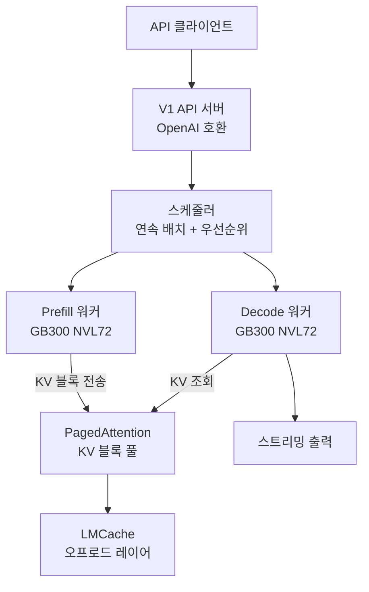

# vLLM V1 Engine on Blackwell (GB200/GB300)

vLLM V0를 완전 폐기하고 V1 엔진으로 단일화한 뒤, Blackwell(GB200/GB300) 아키텍처에서 "속도 한계(speed of light)"를 추구하는 2026 Q1 로드맵의 중심.

## 제품 정체성

UC Berkeley 및 커뮤니티 주도의 오픈소스 LLM 서빙 엔진. 연속 배치(continuous batching), PagedAttention, 디스어그리게이션(prefill/decode 분리) 서빙의 사실상 표준으로, 2026년 v0.11.0에서 V0 코드가 완전히 제거됐다.

## 왜 중요한가

v0.11.0에서 V0 코드가 완전히 제거되고 V1으로 단일화됐으며, 2026 Q1 로드맵이 GB200/B200/H200 디스어그리게이트 클러스터에서의 "speed of light"를 명시적 목표로 선언하면서 대규모 서빙 팀의 최우선 트랙이 됐다.

## V1 엔진 아키텍처



## V0 vs V1 핵심 차이

| 항목 | V0 (구) | V1 (현재) |
|------|---------|---------|
| 아키텍처 | 단일 엔진 | 멀티 워커 분리 |
| 디스어그리게이션 | 실험적 | 정식 지원 |
| Blackwell 최적화 | 없음 | 완전 지원 |
| 코드베이스 | 레거시 혼재 | 단일화 완료 |
| CUDA Graph | 제한적 | 완전 통합 |

## Blackwell 특화 최적화

**GB200 NVLink Switch**: 18개 GPU 간 NVSwitch 토폴로지로 텐서 병렬(tensor parallel) 효율 극대화. V1은 이 토폴로지를 인식해 통신 패턴을 최적화.

**B200 INT4/FP8**: PagedAttention V2가 FP8 KV 캐시를 지원해 동일 메모리에 2배 배치 가능.

**NVFastTransfer**: NVLink를 통한 Prefill→Decode KV 전송 최적화.

## 디스어그리게이션 서빙 구성

```bash
# Prefill 노드 실행 예시 (vLLM V1)
python -m vllm.entrypoints.openai.api_server \
  --model meta-llama/Llama-3.1-70B \
  --disaggregated-prefill \
  --kv-connector NixlConnector \
  --tensor-parallel-size 8

# Decode 노드 실행 예시
python -m vllm.entrypoints.openai.api_server \
  --model meta-llama/Llama-3.1-70B \
  --disaggregated-decode \
  --kv-connector NixlConnector
```

Prefill과 Decode를 별도 노드 풀로 분리해 TTFT(Time-to-First-Token)와 TPS(Tokens per Second)를 독립 스케일.

## 2026 Q1 로드맵 주요 항목

- GB200 "speed of light" 벤치마크 달성
- PagedAttention V2 (FP8 KV 캐시)
- CUDA Graph 기반 디코딩 최적화
- LMCache 기본 통합
- MoE 텐서 병렬 최적화

## 실무 적용 관점

- **V0 → V1 마이그레이션**: v0.11.0 이상으로 업그레이드하면 V1이 기본. 커스텀 플러그인이 있다면 V1 API로 재작성 필요
- **디스어그리게이션 기준**: 평균 프롬프트 길이 > 2000 토큰이거나 TTFT SLA가 있는 서비스에서 투자 효과 큼
- **LMCache 연동**: 멀티 턴 대화나 RAG에서 vLLM V1 + LMCache 조합으로 KV 재계산 90% 절감 보고

## 대표 레퍼런스

- [vLLM Roadmap Q1 2026 - Issue #32455](https://github.com/vllm-project/vllm/issues/32455)
- [vllm-project/vllm GitHub Releases](https://github.com/vllm-project/vllm/releases)
- [vLLM Blog](https://blog.vllm.ai/)
- [vLLM Disaggregated Serving Example Docs](https://docs.vllm.ai/en/latest/examples/online_serving/disaggregated_serving.html)
- [vLLM Release Notes - NVIDIA Docs](https://docs.nvidia.com/deeplearning/frameworks/vllm-release-notes/index.html)

## 관련 문서
- [[wide-expert-parallelism]] -- Wide Expert Parallelism (WideEP) for [[mixture-of-experts|MoE]]

- [[ai-hot-topics-2026-04|2026년 4월 AI 개발 핫토픽 100선]]
- [[sglang|SGLang on GB300 NVL72 with NVFP4]]
- [[flashinfer|FlashInfer Kernel Library for LLM Serving]]
- [[lmcache|LMCache + Mooncake KV Cache Layer]]
- [[vllm-rocm-platform|AMD ROCm as First-Class vLLM Platform]]
- [[llm-d|llm-d & Gateway API Inference Extension]]
