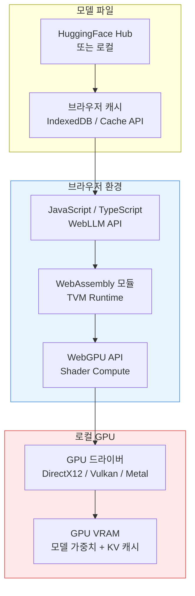
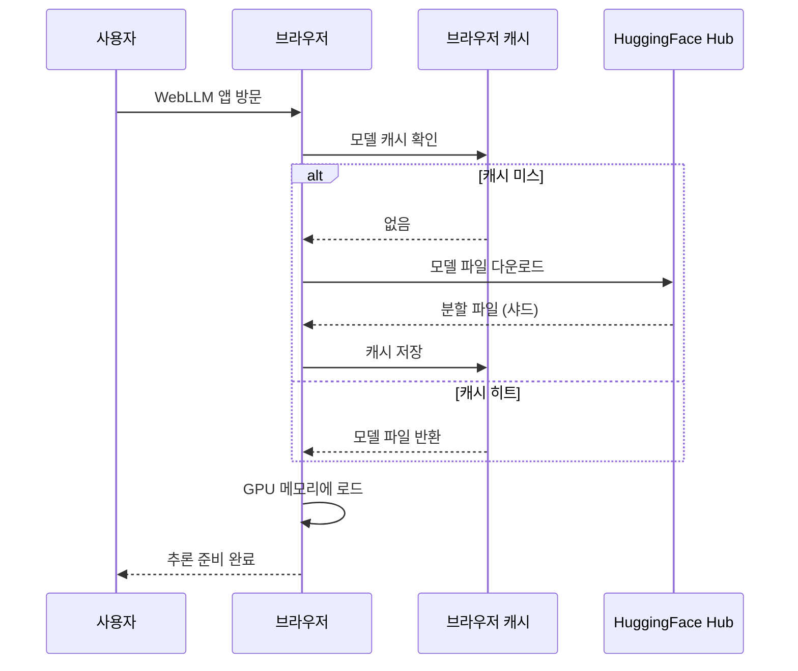

# WebGPU / WebLLM - 브라우저 내 GPU LLM 추론

## 프로젝트 정보

- **프로젝트명**: WebLLM
- **주관**: MLC-AI (Machine Learning Compilation AI, 진리 Chen 교수팀)
- **저장소**: `mlc-ai/web-llm`
- **관련 기술**: WebGPU, WebAssembly, Apache TVM, MLC-LLM

## 개요

WebLLM은 브라우저 내에서 WebGPU API를 이용해 로컬 GPU를 직접 활용하여 LLM 추론을 실행하는 오픈소스 프레임워크다. 서버나 클라우드 없이 사용자의 GPU(NVIDIA, AMD, Apple Silicon) 위에서 모델이 완전히 실행되므로 프라이버시가 보장되고 API 비용이 발생하지 않는다.

같은 팀의 MLC-LLM이 네이티브 앱([[llama-cpp]] 계열)을 위한 컴파일 기반 최적화를 제공한다면, WebLLM은 그 기술을 웹 브라우저 환경으로 이식한 버전이다.

## 아키텍처



- **WebGPU**: 최신 웹 표준 그래픽/컴퓨트 API. WebGL(그래픽스 중심)의 후계자로 범용 GPU 컴퓨팅 지원
- **WebAssembly(WASM)**: TVM 런타임을 WASM으로 컴파일하여 브라우저에서 네이티브 수준 속도로 실행
- **Apache TVM**: 모델을 디바이스별 최적화된 코드로 컴파일. WebGPU WGSL(셰이더 언어) 생성

## WebGPU vs WebGL

| 항목 | WebGL | WebGPU |
|------|-------|--------|
| 목적 | 그래픽스(OpenGL ES 2.0 기반) | 범용 GPU 컴퓨팅 |
| 컴퓨트 셰이더 | 미지원 | 지원 (WGSL) |
| LLM 추론 | 제한적 (해킹 수준) | 최적화 가능 |
| 브라우저 지원 | 거의 모든 브라우저 | Chrome 113+, Edge, Firefox(실험) |
| Metal/Vulkan 활용 | X | O (백엔드로 활용) |

## 지원 모델 및 성능

WebLLM은 MLC-LLM 형식으로 컴파일된 모델을 지원한다.

### 지원 모델 (2024년 기준)

- Llama 3 (8B, 70B는 VRAM 요구량으로 제한적)
- Phi-3 Mini / Small
- Gemma 2B / 7B
- Mistral 7B
- RedPajama-3B (경량 모델, 빠른 로딩)

### 성능 지표 (M2 MacBook Pro 기준, Safari + Metal)

| 모델 | 양자화 | VRAM | tok/s (생성) |
|------|--------|------|-------------|
| Llama-3 8B | q4f16 | ~5 GB | ~25-30 |
| Phi-3 Mini | q4f16 | ~2 GB | ~50-70 |
| Gemma 2B | q4f16 | ~1.5 GB | ~80-100 |

데스크탑 NVIDIA RTX 4090에서는 Llama-3 8B q4f16이 60+ tok/s를 달성하는 사례도 보고된다.

## 사용 예시

```javascript
import { CreateMLCEngine } from "@mlc-ai/web-llm";

// 엔진 초기화 (모델 다운로드 포함)
const engine = await CreateMLCEngine(
    "Llama-3-8B-Instruct-q4f16_1-MLC",
    {
        initProgressCallback: (progress) => {
            console.log(`로딩: ${progress.text}`);
        }
    }
);

// OpenAI 호환 API로 채팅
const reply = await engine.chat.completions.create({
    messages: [{ role: "user", content: "안녕하세요!" }],
    stream: true,
});

for await (const chunk of reply) {
    process.stdout.write(chunk.choices[0]?.delta?.content ?? "");
}
```

OpenAI 클라이언트 SDK와 동일한 인터페이스를 사용하므로 기존 코드 마이그레이션이 용이하다.

## 모델 캐싱

브라우저 내 모델 파일은 `Cache API`와 `IndexedDB`를 통해 캐싱된다.



Llama-3 8B q4f16은 약 4-5 GB를 다운로드해야 하므로 첫 방문 시 대기가 필요하다. 이후 방문에서는 캐시에서 즉시 로드된다.

## [[llama-cpp]]와의 비교

| 항목 | llama.cpp | WebLLM |
|------|-----------|--------|
| 실행 환경 | 네이티브 앱 | 브라우저 |
| 설치 | 필요 | 불필요 |
| 성능 | 높음 | 중간 (WebGPU 오버헤드) |
| 프라이버시 | 로컬 실행 | 로컬 실행 |
| 접근성 | 개발자 중심 | 일반 사용자 가능 |
| 백엔드 | GGUF | MLC-LLM 포맷 |

## [[model-serving]]과의 포지셔닝

WebLLM은 전통적인 클라우드 기반 [[model-serving]]과 대비되는 완전한 엣지 추론이다.

- 데이터가 서버로 전송되지 않아 GDPR 등 개인정보 규제 준수 용이
- 네트워크 지연 없음 (오프라인 동작 가능)
- 서버 인프라 비용 없음
- 다만 사용자 디바이스 GPU 성능에 의존

## 한계 및 과제

- **브라우저 지원**: Chrome 113+, Edge만 완전 지원. Firefox, Safari는 제한적
- **VRAM 제한**: 브라우저 탭 당 접근 가능한 VRAM 한도 존재 (일반적으로 6-8 GB)
- **모델 크기**: 70B 이상 모델은 일반 소비자 GPU에서 실행 불가
- **성능**: 네이티브 앱 대비 20-40% 낮은 tok/s (WebGPU 오버헤드)
- **모델 포맷**: MLC-LLM 포맷으로 재컴파일 필요 - GGUF 직접 사용 불가

## 관련 프로젝트

- **MLC-LLM**: WebLLM의 기반 컴파일 프레임워크 (iOS, Android, 데스크탑)
- **Transformers.js**: HuggingFace의 브라우저 ML 라이브러리 (WebGPU 지원 추가 중)
- **ONNX Runtime Web**: Microsoft의 브라우저 ML 런타임

## 관련 문서

- [[llama-cpp]] - 네이티브 환경의 경량 LLM 추론 엔진
- [[model-serving]] - 서버 기반 LLM 서빙 아키텍처
- [[on-device-inference-stack]] - 엣지/디바이스 추론 전체 스택
- [[quantization-model-compression]] - 브라우저 실행을 위한 모델 압축
- [[executorch]] - 모바일/엣지 디바이스용 추론 프레임워크
