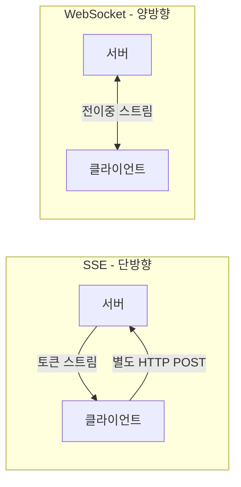
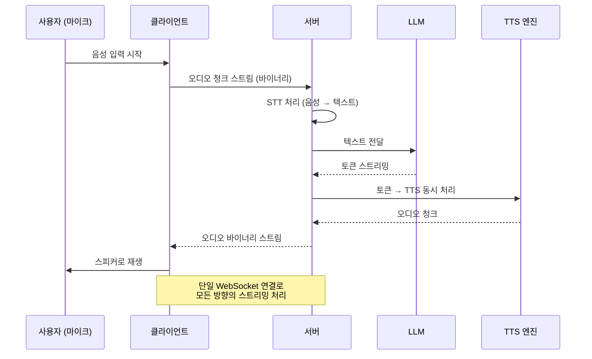
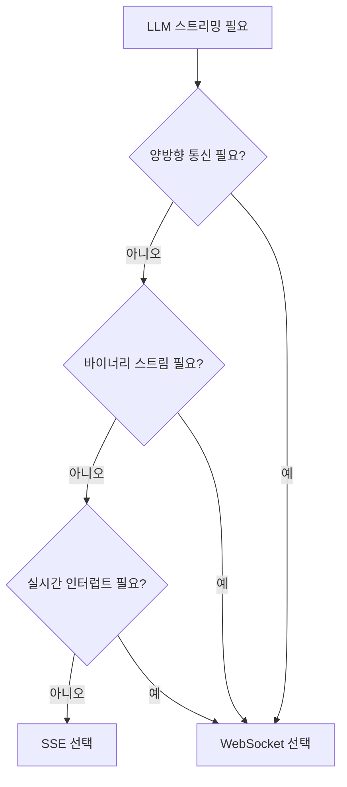

# 웹소켓 LLM 스트리밍 (WebSocket LLM Streaming)

## SSE와의 차이: 왜 WebSocket이 필요한가

[[server-sent-events-llm]](SSE 기반 LLM 스트리밍)이 대부분의 LLM 스트리밍 요구를 충족하지만, 몇 가지 한계가 있다:

1. **단방향 제약**: SSE는 서버 → 클라이언트 방향만 지원. 클라이언트에서 생성 중단(interrupt), 파라미터 조정, 멀티턴 연속 입력 등을 처리하려면 별도 HTTP 요청을 보내야 한다.

2. **바이너리 데이터 불편**: SSE는 텍스트 기반. 음성 합성(TTS) 오디오, 이미지 청크 등 바이너리 데이터 스트리밍이 번거롭다.

3. **연결 다중화**: 단일 연결로 요청/응답을 인터리빙해야 하는 복잡한 세션 관리.

4. **실시간 음성 대화**: 사용자가 말하면서 동시에 AI가 응답하는 실시간 양방향 음성 스트리밍은 WebSocket이 적합하다.



## WebSocket 프로토콜 특성

WebSocket은 HTTP 업그레이드 핸드쉐이크로 시작하는 **전이중(full-duplex) 통신 채널**이다.

```
클라이언트 → 서버: GET /ws HTTP/1.1
                   Upgrade: websocket
                   Connection: Upgrade
                   Sec-WebSocket-Key: <랜덤 키>

서버 → 클라이언트: HTTP/1.1 101 Switching Protocols
                   Upgrade: websocket
                   Connection: Upgrade
                   Sec-WebSocket-Accept: <계산된 키>
```

핸드쉐이크 이후 HTTP 오버헤드 없이 양방향 프레임 전송이 가능하다. 텍스트 프레임과 바이너리 프레임 모두 지원한다.

## LLM WebSocket 메시지 프로토콜 설계

LLM 스트리밍을 위한 WebSocket 프로토콜은 표준이 없으므로 직접 설계해야 한다. 일반적인 패턴:

### 클라이언트 → 서버 메시지 타입

```json
// 생성 요청
{
  "type": "generate",
  "request_id": "req-123",
  "messages": [{"role": "user", "content": "안녕하세요"}],
  "parameters": {"max_tokens": 512, "temperature": 0.8}
}

// 생성 중단 (Interrupt)
{
  "type": "cancel",
  "request_id": "req-123"
}

// 핑 (연결 유지)
{
  "type": "ping"
}
```

### 서버 → 클라이언트 메시지 타입

```json
// 토큰 스트림
{"type": "token", "request_id": "req-123", "token": "안녕", "index": 0}

// 생성 완료
{"type": "done", "request_id": "req-123", "usage": {"input_tokens": 5, "output_tokens": 42}}

// 에러
{"type": "error", "request_id": "req-123", "code": "context_length_exceeded", "message": "..."}

// 퐁 (연결 확인)
{"type": "pong"}
```

## 서버 구현 (FastAPI + WebSocket)

```python
from fastapi import FastAPI, WebSocket, WebSocketDisconnect
from fastapi.websockets import WebSocketState
import asyncio
import json
from typing import dict, Any
import uuid

app = FastAPI()


class LLMSession:
    """WebSocket 세션 상태 관리"""

    def __init__(self, websocket: WebSocket):
        self.websocket = websocket
        self.active_tasks: dict[str, asyncio.Task] = {}

    async def send_json(self, data: dict) -> None:
        if self.websocket.client_state == WebSocketState.CONNECTED:
            await self.websocket.send_text(json.dumps(data, ensure_ascii=False))

    async def handle_generate(self, request_id: str, messages: list, params: dict) -> None:
        """LLM 스트리밍 생성 처리"""
        try:
            # 실제 LLM 스트리밍 (예시: 가상의 async generator)
            async for token in llm_stream(messages, **params):
                await self.send_json({
                    "type": "token",
                    "request_id": request_id,
                    "token": token,
                })
                # 취소 확인 (태스크 취소 신호 처리)
                await asyncio.sleep(0)

            await self.send_json({
                "type": "done",
                "request_id": request_id,
            })

        except asyncio.CancelledError:
            await self.send_json({
                "type": "cancelled",
                "request_id": request_id,
            })
        except Exception as e:
            await self.send_json({
                "type": "error",
                "request_id": request_id,
                "message": str(e),
            })
        finally:
            self.active_tasks.pop(request_id, None)

    async def cancel_request(self, request_id: str) -> None:
        """진행 중인 생성 취소"""
        task = self.active_tasks.get(request_id)
        if task and not task.done():
            task.cancel()


@app.websocket("/ws/llm")
async def llm_websocket(websocket: WebSocket):
    await websocket.accept()
    session = LLMSession(websocket)

    try:
        while True:
            raw = await websocket.receive_text()
            message = json.loads(raw)
            msg_type = message.get("type")

            if msg_type == "generate":
                request_id = message.get("request_id", str(uuid.uuid4()))
                task = asyncio.create_task(
                    session.handle_generate(
                        request_id,
                        message.get("messages", []),
                        message.get("parameters", {}),
                    )
                )
                session.active_tasks[request_id] = task

            elif msg_type == "cancel":
                request_id = message.get("request_id")
                if request_id:
                    await session.cancel_request(request_id)

            elif msg_type == "ping":
                await session.send_json({"type": "pong"})

    except WebSocketDisconnect:
        # 모든 진행 중 태스크 취소
        for task in session.active_tasks.values():
            task.cancel()
    except Exception as e:
        await websocket.close(code=1011, reason=str(e))
```

## 클라이언트 구현

### JavaScript (브라우저)

```javascript
class LLMWebSocketClient {
  constructor(url) {
    this.url = url;
    this.ws = null;
    this.handlers = new Map(); // request_id → callback
    this.reconnectDelay = 1000;
  }

  connect() {
    this.ws = new WebSocket(this.url);

    this.ws.onopen = () => {
      console.log("LLM WebSocket 연결됨");
      this.reconnectDelay = 1000;
      this._startHeartbeat();
    };

    this.ws.onmessage = (event) => {
      const data = JSON.parse(event.data);
      const handler = this.handlers.get(data.request_id);
      if (handler) {
        handler(data);
        if (data.type === "done" || data.type === "error" || data.type === "cancelled") {
          this.handlers.delete(data.request_id);
        }
      }
    };

    this.ws.onclose = () => {
      console.log("연결 끊김. 재연결 시도...");
      setTimeout(() => this.connect(), this.reconnectDelay);
      this.reconnectDelay = Math.min(this.reconnectDelay * 2, 30000);
    };
  }

  async *stream(messages, params = {}) {
    const requestId = crypto.randomUUID();
    let resolve, reject;

    const queue = [];
    let done = false;

    this.handlers.set(requestId, (data) => {
      if (data.type === "token") {
        queue.push({ value: data.token, done: false });
        if (resolve) { resolve(); resolve = null; }
      } else if (data.type === "done" || data.type === "cancelled") {
        done = true;
        if (resolve) { resolve(); resolve = null; }
      } else if (data.type === "error") {
        if (reject) reject(new Error(data.message));
      }
    });

    this.ws.send(JSON.stringify({
      type: "generate",
      request_id: requestId,
      messages,
      parameters: params,
    }));

    while (!done || queue.length > 0) {
      if (queue.length === 0) {
        await new Promise((res, rej) => { resolve = res; reject = rej; });
      }
      while (queue.length > 0) {
        yield queue.shift().value;
      }
    }
  }

  cancel(requestId) {
    this.ws.send(JSON.stringify({ type: "cancel", request_id: requestId }));
  }

  _startHeartbeat() {
    setInterval(() => {
      if (this.ws.readyState === WebSocket.OPEN) {
        this.ws.send(JSON.stringify({ type: "ping" }));
      }
    }, 30000);
  }
}

// 사용 예시
const client = new LLMWebSocketClient("wss://api.example.com/ws/llm");
client.connect();

// 스트리밍 생성
const outputEl = document.getElementById("output");
for await (const token of client.stream([{ role: "user", content: "안녕하세요" }])) {
  outputEl.textContent += token;
}
```

### Python 클라이언트

```python
import asyncio
import json
import websockets

async def stream_via_websocket(prompt: str, uri: str = "ws://localhost:8000/ws/llm"):
    async with websockets.connect(uri) as ws:
        request_id = "req-001"
        await ws.send(json.dumps({
            "type": "generate",
            "request_id": request_id,
            "messages": [{"role": "user", "content": prompt}],
        }))

        while True:
            raw = await ws.recv()
            data = json.loads(raw)

            if data["type"] == "token":
                print(data["token"], end="", flush=True)
            elif data["type"] in ("done", "cancelled", "error"):
                print()
                break
```

## 실시간 음성 대화 패턴 (고급)

WebSocket이 SSE보다 크게 유리한 대표 케이스: 실시간 음성 대화



이 패턴은 SSE+HTTP 조합으로는 구현이 매우 복잡해지지만, WebSocket에서는 단일 연결로 처리 가능하다.

## SSE vs WebSocket 결정 트리



## 인프라 주의사항

| 레이어 | WebSocket 주의 |
|--------|---------------|
| Nginx | `upgrade` 헤더 처리 필요: `proxy_http_version 1.1; proxy_set_header Upgrade $http_upgrade; proxy_set_header Connection "upgrade"` |
| AWS ALB | WebSocket 지원 (idle timeout 설정 필요, 기본 60초) |
| CloudFront | WebSocket 지원 (HTTP/2 웹소켓 제한 확인) |
| Vercel | Edge Runtime에서 WebSocket 미지원 → SSE 또는 별도 서버 |
| 방화벽 | 포트 80/443으로 WS/WSS 허용 (별도 포트 불필요) |

## 재연결 전략

WebSocket은 SSE의 자동 재연결 기능이 없으므로 클라이언트에서 직접 구현해야 한다.

- **지수 백오프**: 재연결 간격을 1초 → 2초 → 4초 → 최대 30초로 증가
- **연결 ID**: 재연결 시 이전 세션 ID를 전달하여 서버에서 상태 복원 가능하게 설계
- **하트비트**: 30초마다 ping/pong으로 유휴 연결 유지 (프록시 타임아웃 방지)

## 관련 문서

- [[server-sent-events-llm]] - SSE 기반 단방향 스트리밍
- [[token-streaming-sse]] - SSE 토큰 스트리밍 구현
- [[llm-inference-metrics]] - TTFT, TBT 등 스트리밍 성능 지표
- [[latency-throughput-tradeoff]] - 지연 vs 처리량 최적화
- [[continuous-batching-internals]] - 연속 배치와 스트리밍 연동
- [[llm-gateway]] - API 게이트웨이에서의 WebSocket 처리
- [[request-scheduling]] - 요청 스케줄링과 스트리밍 세션 관리
