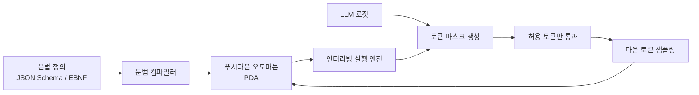

# XGrammar-2 Constrained Decoding for Agentic LLMs

에이전트 워크플로(agentic workflow) 대상 동적 JSON·문법 제약 디코딩(constrained decoding) 엔진. 푸시다운 오토마톤(pushdown automaton, PDA)을 GPU 커널에서 직접 실행해 거의 제로(near-zero) 오버헤드로 구조화 출력을 보장한다.

## 제품 정체성

CMU MLC 연구팀이 개발한 오픈소스 구조화 생성(structured generation) 라이브러리. vLLM, SGLang, TensorRT-LLM의 기본 제약 디코딩 백엔드로 채택되어 있다.

## 왜 중요한가

2026년 초 XGrammar-2가 발표되며 **토큰당 40마이크로초 이하** 마스크(mask) 생성과 near-zero overhead를 달성했다. vLLM·SGLang·TRT-LLM 기본 백엔드로 자리잡으며 llguidance와 함께 프로덕션 구조 출력 표준이 됐다.

## 핵심 아키텍처



핵심은 문법 검사를 디코딩 루프 밖에서 미리 컴파일하고, 실제 마스크 생성만 초경량으로 인터리빙하는 구조다.

## XGrammar-1 vs XGrammar-2 비교

| 항목 | XGrammar-1 | XGrammar-2 |
|------|-----------|-----------|
| 마스크 생성 지연 | ~수백 마이크로초 | < 40 마이크로초 |
| 에이전트 도구 호출 지원 | 제한적 | 완전 지원 |
| 동적 스키마 변경 | 미지원 | 런타임 지원 |
| 멀티 스텝 에이전트 루프 | 불안정 | 안정화 |
| GPU 커널 통합 | 부분 | 완전 통합 |

## 에이전트 도구 호출(tool call) 지원

XGrammar-2의 차별점은 단순 JSON 스키마 검증을 넘어 **멀티 스텝 에이전트 루프**에서 도구 호출 스키마가 동적으로 바뀌어도 올바른 형식 출력을 보장한다는 점이다.

```json
// 에이전트가 동적으로 선택할 도구 스키마 예시
{
  "tool": "search",
  "query": "<LLM이 생성한 쿼리>",
  "max_results": 5
}
```

이런 스키마를 런타임에 PDA로 변환해 디코딩에 적용한다.

## 실무 적용 관점

- **JSON 출력 보장**: 파싱 오류로 인한 에이전트 루프 실패를 근본 차단
- **도구 호출 스키마 강제**: OpenAI 호환 `function_calling` 포맷 보장
- **서빙 프레임워크 통합**: vLLM `guided_json`, SGLang `--json-schema`, TRT-LLM guided decoding으로 즉시 사용
- **오버헤드 측정**: 소규모 배포에서는 체감 불가. 대규모 배치에서 GPU 활용률(utilization) 5-10% 절약

## 관련 도구: llguidance

Microsoft의 llguidance는 Rust 기반 대안으로, 토크나이저(tokenizer) 수준에서 문법 강제를 적용한다. XGrammar-2와 함께 프로덕션 구조 출력의 양대 표준이다.

## 대표 레퍼런스

- [XGrammar: Flexible and Efficient Structured Generation Engine for LLMs](https://arxiv.org/abs/2411.15100)
- [mlc-ai/xgrammar GitHub repository](https://github.com/mlc-ai/xgrammar)
- [Achieving Efficient, Flexible, and Portable Structured Generation with XGrammar (MLC blog)](https://blog.mlc.ai/2024/11/22/achieving-efficient-flexible-portable-structured-generation-with-xgrammar)
- [guidance-ai/llguidance GitHub repository](https://github.com/guidance-ai/llguidance)
- [Catalyst: XGrammar (CMU)](https://catalyst.cs.cmu.edu/projects/xgrammar.html)

## 관련 문서

- [[ai-hot-topics-2026-04|2026년 4월 AI 개발 핫토픽 100선]]
- [[sglang|SGLang on GB300 NVL72 with NVFP4]]
- [[vllm-v1-engine|vLLM V1 Engine on Blackwell]]
- [[tensorrt-llm|TensorRT-LLM 1.3 with Day-0 Model Support]]
- [[kv-cache-compression|Chunk-Semantic KV Cache Compression]]
