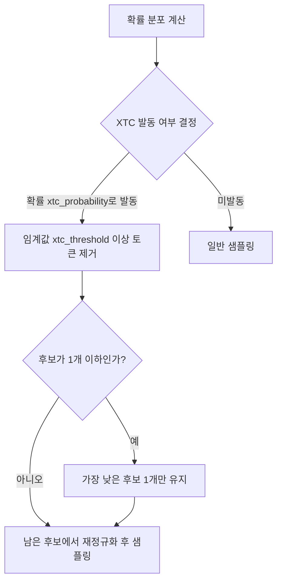
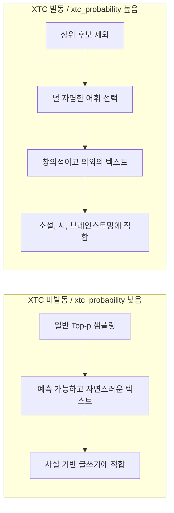

# XTC - 상위 후보 제외 다양성 샘플링 (eXclude Top Choices)

## 배경과 문제 의식

창의적 글쓰기, 소설, 시, 브레인스토밍 같은 작업에서 LLM의 출력이 지나치게 예측 가능하고 평범하다는 문제가 있다. 모델이 학습한 "가장 자연스러운" 선택을 계속 고르기 때문이다.

기존 해법들:
- **높은 Temperature**: 분포를 평탄화하여 다양성 증가 → 일관성 급격히 저하
- **Top-p 확대**: 더 많은 후보 포함 → 쓰레기 토큰도 함께 포함

**XTC (eXclude Top Choices)**의 역발상: **가장 높은 확률의 토큰들을 의도적으로 배제**하여 모델이 "두 번째로 좋은" 선택을 하도록 유도한다.

> "최선이 아닌 선택에서 창의성이 나온다"는 직관을 알고리즘화한 것이다.

## 핵심 아이디어



XTC는 두 개의 핵심 파라미터로 동작한다:
- `xtc_threshold`: 이 확률 이상인 토큰을 "상위 후보"로 분류하여 제외 대상으로 설정
- `xtc_probability`: 각 토큰 생성 스텝에서 XTC를 실제로 발동할 확률

매 스텝마다 **확률적으로 발동**되므로, 항상 극단적으로 제외하지 않고 자연스러운 텍스트와 창의적 텍스트를 혼합한다.

## 알고리즘 상세

**단계 1**: 확률 분포 계산 후 `xtc_threshold` 이상인 토큰 목록 수집
**단계 2**: 해당 스텝에서 XTC를 발동할지 `xtc_probability`로 결정
**단계 3**: 발동 시 임계값 이상 토큰 모두 제거 (단, 1개 이하 남으면 최저 확률 토큰 1개 유지)
**단계 4**: 남은 토큰에서 재정규화 후 샘플링

**핵심 보호 장치**: 모든 토큰이 임계값 이상이어서 후보가 사라지는 경우, 가장 낮은 확률의 토큰 1개를 강제로 남긴다. 이는 "덜 자명한 선택"을 강제하는 효과다.

## 코드 예시

```python
import torch
import torch.nn.functional as F
import random

def xtc_sampling(
    logits: torch.Tensor,
    xtc_threshold: float = 0.1,
    xtc_probability: float = 0.5,
    temperature: float = 1.0,
) -> int:
    """
    XTC (eXclude Top Choices) 샘플링 구현.

    Args:
        logits: 모델 출력 로짓 (vocab_size,)
        xtc_threshold: 제외 대상 확률 임계값 (이 이상의 토큰은 상위 후보)
        xtc_probability: XTC 발동 확률 (0=항상 미발동, 1=항상 발동)
        temperature: 샘플링 온도

    Returns:
        선택된 토큰 ID
    """
    # 온도 적용
    logits = logits / temperature
    probs = F.softmax(logits, dim=-1)

    # XTC 발동 여부 결정
    if random.random() < xtc_probability:
        # 상위 후보 식별 (threshold 이상)
        high_prob_mask = probs >= xtc_threshold
        n_high = high_prob_mask.sum().item()

        if n_high > 1:
            # 상위 후보 제외 (최소 1개는 남김)
            # 가장 낮은 임계값 초과 토큰을 제외하고 나머지 모두 제거
            filtered_probs = probs.clone()
            filtered_probs[high_prob_mask] = 0.0

            if filtered_probs.sum() > 1e-8:
                # 임계값 미만 토큰이 남아 있음 → 거기서 샘플링
                filtered_probs = filtered_probs / filtered_probs.sum()
                return torch.multinomial(filtered_probs, num_samples=1).item()
            else:
                # 모든 토큰이 임계값 이상 → 가장 낮은 확률 토큰 1개 선택
                # (덜 자명한 선택 강제)
                high_probs_only = probs * high_prob_mask.float()
                min_high_idx = high_probs_only[high_prob_mask].argmin()
                # 원래 인덱스로 변환
                high_indices = high_prob_mask.nonzero().squeeze(-1)
                return high_indices[min_high_idx].item()

    # 미발동 시 일반 샘플링
    return torch.multinomial(probs, num_samples=1).item()


class XTCLogitsProcessor:
    """HuggingFace Transformers와 호환되는 XTC LogitsProcessor"""

    def __init__(
        self,
        xtc_threshold: float = 0.1,
        xtc_probability: float = 0.5,
    ):
        self.xtc_threshold = xtc_threshold
        self.xtc_probability = xtc_probability

    def __call__(
        self, input_ids: torch.LongTensor, scores: torch.FloatTensor
    ) -> torch.FloatTensor:
        if random.random() >= self.xtc_probability:
            return scores

        # 배치 처리
        probs = F.softmax(scores, dim=-1)
        for b in range(scores.shape[0]):
            high_mask = probs[b] >= self.xtc_threshold
            n_high = high_mask.sum().item()

            if n_high > 1:
                low_mask = ~high_mask
                if low_mask.any():
                    # 임계값 미만 토큰은 유지, 이상 토큰은 -inf
                    scores[b] = scores[b].masked_fill(high_mask, float('-inf'))
                else:
                    # 모두 임계값 이상 → 최저 확률 토큰만 유지
                    min_idx = probs[b].argmin()
                    keep_mask = torch.zeros_like(high_mask)
                    keep_mask[min_idx] = True
                    scores[b] = scores[b].masked_fill(~keep_mask, float('-inf'))

        return scores
```

## 창의성 vs 일관성 트레이드오프



## 다른 다양성 기법과의 비교

| 기법 | 다양성 원리 | 일관성 영향 | 창의성 강도 |
|------|------------|------------|------------|
| 높은 Temperature | 분포 평탄화 | 크게 저하 | 높음 (무작위) |
| Top-p 확대 | 후보 추가 | 약간 저하 | 낮음 |
| [[typical-sampling]] | 전형적 아닌 토큰 배제 | 중간 | 중간 |
| DRY | 반복 시퀀스 페널티 | 유지 | 낮음 |
| **XTC** | 상위 후보 제거 | 중간 | 높음 (제어됨) |

XTC의 장점: `xtc_probability`로 발동 빈도를 조절하므로, 창의성 강도를 세밀하게 제어할 수 있다. 높은 Temperature와 달리 비문법적 텍스트가 잘 나오지 않는다.

## 하이퍼파라미터 튜닝 가이드

| 파라미터 | 범위 | 권장값 | 효과 |
|----------|------|--------|------|
| `xtc_threshold` | 0.05 - 0.5 | 0.1 | 낮을수록 더 많은 토큰이 제외 대상 |
| `xtc_probability` | 0.0 - 1.0 | 0.5 | 높을수록 더 자주 발동 |

**조합 예시**:
- 소설 글쓰기: `xtc_threshold=0.1, xtc_probability=0.5`
- 시 창작: `xtc_threshold=0.15, xtc_probability=0.8`
- 일반 대화: `xtc_threshold=0.0` (비활성화)
- 코드 생성: `xtc_probability=0.0` (비활성화)

## 지원 환경

- `llama.cpp`: `--xtc-threshold`, `--xtc-probability` 파라미터
- `text-generation-webui`: XTC 파라미터 지원
- KoboldCpp: XTC 지원
- 커스텀 구현: `LogitsProcessor`로 삽입 가능

## 관련 문서

- [[typical-sampling]] - 정보이론 기반 전형성 샘플링
- [[dry-sampling-repetition]] - 시퀀스 반복 억제 기법
- [[min-p-sampling]] - 확률 비율 기반 임계값 샘플링
- [[nucleus-top-p-sampling]] - 기본 Top-p 샘플링
- [[temperature-sampling]] - 온도 기반 다양성 조정
- [[repetition-penalty-logit-bias]] - 반복 억제 기법 전반
- [[decoding-strategies]] - 디코딩 전략 전체 개요
