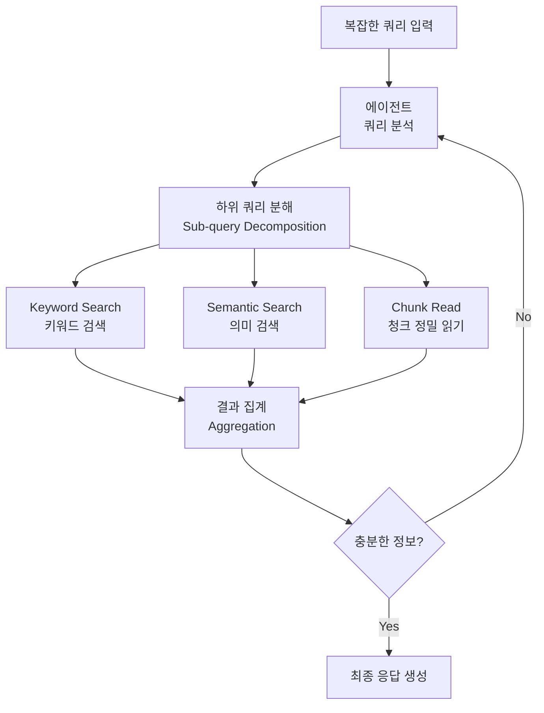

# A-RAG: 계층적 검색 인터페이스를 통한 에이전틱 RAG 확장

## 핵심 기여

기존 RAG(Retrieval-Augmented Generation)가 단일 검색 쿼리를 발행하고 결과를 컨텍스트에 삽입하는 수동적 파이프라인이었다면, A-RAG는 **계층적 검색 인터페이스를 모델에 직접 노출**하여 에이전트가 능동적으로 검색 전략을 수립하게 한다.

핵심 성과:
- 3가지 검색 도구(keyword search, semantic search, chunk read)를 에이전트 도구로 제공
- 복잡한 쿼리를 하위 쿼리로 분해 후 병렬 실행
- multi-hop QA에서 SOTA 성능 달성

## 문제 정의

기존 RAG 파이프라인의 한계:

| 문제 | 설명 |
|------|------|
| 단일 쿼리 의존 | 복잡한 질문을 하나의 검색 쿼리로 처리하려 함 |
| 고정 세분도(granularity) | 청크 크기가 사전에 고정되어 다양한 정보 요구에 부적합 |
| 수동 파이프라인 | 검색-주입-생성이 일방향으로 고정 |
| multi-hop 취약 | 다단계 추론이 필요한 질문에서 성능 저하 |

## 방법론: 계층적 검색 인터페이스

A-RAG는 에이전트에게 3가지 검색 도구를 제공하고, 에이전트가 자율적으로 도구를 선택하여 검색 전략을 수립한다.

위 다이어그램은 에이전트가 쿼리를 분해하고 3가지 도구를 조합하여 반복적으로 정보를 수집하는 과정을 보여준다.

### 3가지 검색 도구

| 도구 | 세분도 | 용도 |
|------|--------|------|
| **Keyword Search** | 문서/섹션 수준 | BM25 기반 정확한 키워드 매칭. 고유명사, 코드명, 정확한 용어 검색에 강함 |
| **Semantic Search** | 단락/청크 수준 | 임베딩 기반 의미적 유사도 검색. 개념적 질문, 유사 표현 탐색에 적합 |
| **Chunk Read** | 청크 내부 | 특정 청크의 전문을 정밀하게 읽기. 앞선 검색 결과를 심층 확인할 때 사용 |

### 에이전틱 검색 전략

에이전트는 단순히 도구를 호출하는 것이 아니라, 검색 결과를 평가하고 **추가 검색 여부를 자율적으로 결정**한다:

1. 쿼리를 분석하여 필요한 정보 유형 파악
2. 적절한 도구 조합과 순서를 결정
3. 결과를 평가하고 정보가 부족하면 추가 검색 반복
4. 충분한 정보가 수집되면 최종 응답 생성

## 실험 결과

- multi-hop QA 벤치마크에서 기존 RAG 대비 유의미한 성능 향상
- 특히 2-hop 이상의 복잡한 질문에서 개선폭이 큼
- 에이전트가 평균 2-3회의 도구 호출로 충분한 정보를 수집하며, 불필요한 반복 호출은 자연스럽게 억제됨

## 한계 및 향후 연구

- 도구 호출 횟수 증가에 따른 레이턴시 오버헤드
- 에이전트의 검색 전략이 최적인지 보장하는 메커니즘 부재
- 대규모 코퍼스(수백만 문서)에서의 확장성 검증 부족
- keyword search와 semantic search 간 결과 중복/충돌 처리 전략 미상세

## 실무 관점

- **프로덕션 RAG 시스템 설계**: 단일 검색 엔드포인트 대신 계층적 도구를 에이전트에 노출하는 패턴은 실제 프로덕션에서도 효과적
- 기존 [[rag-original-paper]]의 단순 retrieve-and-generate를 넘어서 에이전트가 능동적으로 검색 전략을 수립하는 방식
- [[how-coding-agents-work]]에서 코딩 에이전트의 코드 검색도 유사한 계층적 접근을 취함 (파일 탐색 -> 심볼 검색 -> 코드 읽기)
- 검색 도구를 잘 정의하면 에이전트의 도구 선택 능력만으로도 복잡한 RAG 파이프라인을 대체할 수 있음

## 관련 문서

- [[rag-original-paper]] - RAG의 원래 제안 논문
- [[how-coding-agents-work]] - 코딩 에이전트의 유사한 계층적 검색 패턴
- [[agent-skills]] - 검색 도구를 에이전트 스킬로 보는 관점
- [[retro-paper]] - 검색 증강 트랜스포머의 또 다른 접근
