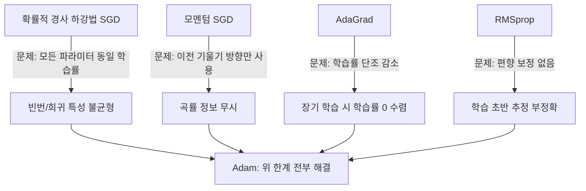
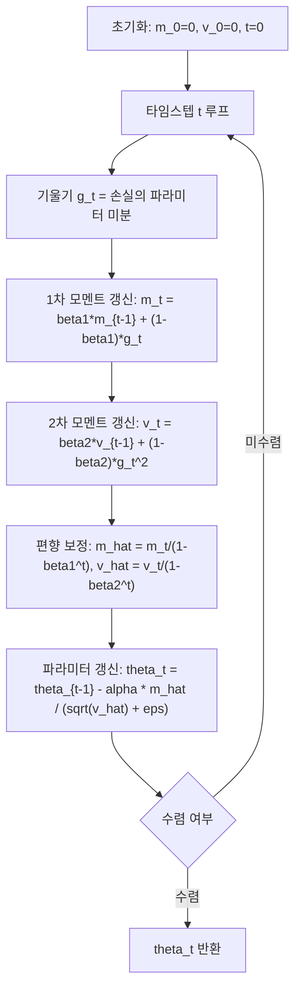

# Adam 옵티마이저 원논문 (Kingma & Ba, 2014)

## 메타데이터

| 항목 | 내용 |
|------|------|
| 제목 | Adam: A Method for Stochastic Optimization |
| 저자 | Diederik P. Kingma, Jimmy Lei Ba |
| 연도 | 2014 (초안), 2015 (ICLR 발표) |
| arXiv | 1412.6980 |
| 학회 | ICLR 2015 |
| 인용 수 | 약 25만 회 (2024년 기준, 역대 ML 논문 중 최다 수준) |

---

## 핵심 기여

- **1차 + 2차 모멘트 추정 결합**: 기울기의 1차 모멘트(이동 평균)와 2차 모멘트(제곱 이동 평균)를 동시에 추적하여 각 파라미터마다 개별 적응 학습률을 계산
- **편향 보정(Bias Correction)**: 학습 초반 모멘트 추정값이 0으로 치우치는 문제를 수학적으로 보정하여 초기 학습 단계도 안정적으로 진행
- **계산 효율성**: 메모리 $O(|\theta|)$, 연산량 $O(|\theta|)$으로 파라미터 수에 선형 비례하여 대규모 모델에서도 적용 가능
- **하이퍼파라미터 민감도 저하**: 학습률 $\alpha$ 기본값 0.001이 대부분의 문제에서 잘 동작하여 튜닝 부담 경감
- **희소 기울기 처리**: 임베딩처럼 특정 파라미터만 갱신되는 희소(sparse) 기울기 상황에서도 안정적으로 동작

---

## 배경 및 문제 정의

### 기존 옵티마이저의 한계



### 선행 알고리즘과의 계보

| 알고리즘 | 핵심 아이디어 | Adam에서의 위치 |
|---------|-------------|----------------|
| SGD | 기울기 방향으로 파라미터 갱신 | 가장 기본 갱신 원칙 |
| Momentum | 이전 기울기 지수이동평균 | Adam의 1차 모멘트 $m_t$ |
| AdaGrad | 누적 기울기 제곱으로 학습률 조정 | Adam의 2차 모멘트 $v_t$의 원조 |
| RMSprop | 지수이동평균으로 AdaGrad 개선 | Adam의 2차 모멘트 $v_t$ (직계 선행) |

---

## 방법

### Adam 알고리즘 전체 흐름



### 수식 정의

**하이퍼파라미터 기본값:**
- $\alpha = 0.001$ (학습률, step size)
- $\beta_1 = 0.9$ (1차 모멘트 감쇠율)
- $\beta_2 = 0.999$ (2차 모멘트 감쇠율)
- $\epsilon = 10^{-8}$ (수치 안정성)

**타임스텝 $t$마다:**

1. 기울기: $g_t = \nabla_\theta f_t(\theta_{t-1})$

2. 1차 모멘트 (편향 포함):
$$m_t = \beta_1 m_{t-1} + (1 - \beta_1) g_t$$

3. 2차 모멘트 (편향 포함):
$$v_t = \beta_2 v_{t-1} + (1 - \beta_2) g_t^2$$

4. 편향 보정된 추정값:
$$\hat{m}_t = \frac{m_t}{1 - \beta_1^t}, \quad \hat{v}_t = \frac{v_t}{1 - \beta_2^t}$$

5. 파라미터 갱신:
$$\theta_t = \theta_{t-1} - \frac{\alpha \cdot \hat{m}_t}{\sqrt{\hat{v}_t} + \epsilon}$$

### 편향 보정이 필요한 이유

$m_0 = 0$으로 초기화하면 초기 타임스텝에서 $m_t$는 실제 기울기 기댓값보다 작게 추정된다. 예를 들어 $t=1$일 때:

$$m_1 = (1 - \beta_1) g_1 = 0.1 \cdot g_1$$

실제 기댓값 $g_1$의 10%밖에 되지 않는다. 편향 보정 후:

$$\hat{m}_1 = \frac{m_1}{1 - \beta_1^1} = \frac{0.1 g_1}{0.1} = g_1$$

정확하게 $g_1$으로 복원된다. $\beta_2^t$도 동일한 이유로 보정한다.

---

## 실험 및 결과

### MNIST 로지스틱 회귀

| 옵티마이저 | 최종 훈련 손실 | 수렴 속도 |
|----------|-------------|----------|
| SGD | 기준 | 기준 |
| AdaGrad | 기준 대비 빠름 | 중간 |
| RMSprop | 기준 대비 빠름 | 중간 |
| **Adam** | **최저** | **가장 빠름** |

### MNIST MLP 다층 퍼셉트론

- 3레이어 MLP에서 Adam이 수렴 속도와 최종 성능 모두 우수
- 특히 학습 초반(초기 수십 배치)에서 편향 보정 효과로 빠른 이탈

### 합성곱 신경망 (ConvNet)

- CIFAR-10에서 Adam이 SGD+모멘텀과 유사하거나 소폭 우수
- 다만 후속 연구에서 미세 조정(fine-tuning)이나 이미지 분류에서는 SGD+모멘텀이 Adam을 능가하는 경우도 보고됨

### 텍스트 감성 분석 (IMDB)

- RNN 기반 감성 분류에서 Adam이 AdaGrad, RMSprop 대비 일관된 우위

---

## 한계 및 후속 연구

### 원논문의 한계

- **일반화 갭 문제**: Keskar et al. (2017)이 지적한 것처럼 Adam이 SGD보다 sharp한 극솟값에 수렴해 테스트 성능이 낮을 수 있음
- **$L_2$ 정규화 비효율**: Adam에 $L_2$ 패널티를 더하면 AdamW와 달리 효과적인 가중치 감쇠(weight decay)가 되지 않음 (Loshchilov & Hutter 2019가 지적)
- **수렴 보장 불완전**: 원논문의 수렴 증명에 오류가 있다는 후속 연구 존재 (AMSGrad 논문 등)

### 주요 후속 연구

| 알고리즘 | 핵심 개선 | 채택 사례 |
|---------|---------|---------|
| AdamW (Loshchilov & Hutter 2019) | 가중치 감쇠를 기울기가 아닌 파라미터에 직접 적용 | GPT-3, BERT, 거의 모든 현대 LLM |
| AMSGrad (Reddi et al. 2018) | 2차 모멘트 최댓값 유지로 수렴 보장 개선 | - |
| AdamP (Heo et al. 2021) | 구면 파라미터 공간에서의 Adam | 이미지 분류 |
| Adan (Xie et al. 2022) | Nesterov 모멘텀 + 3차 모멘트 | - |
| Lion (Chen et al. 2023) | 부호만 사용하는 초경량 옵티마이저 | Google DeepMind |
| Muon (Jordan et al. 2024) | 행렬 파라미터용 뉴턴 스텝 근사 | - |

---

## 실무 적용 관점

### 언제 Adam을 사용하는가

- **LLM / Transformer 사전학습**: AdamW 변형을 표준으로 사용. Adam 하이퍼파라미터 기본값이 대부분의 경우에 유효
- **프로토타이핑 단계**: 학습률 튜닝 없이 빠르게 실험할 때 Adam이 유리
- **NLP / 시퀀스 모델**: RNN, Transformer 계열에서 Adam 계열이 SGD보다 일관되게 우수

### 언제 Adam보다 SGD를 선호하는가

- **이미지 분류 최고 성능 달성**: ResNet 등에서 SGD+모멘텀+코사인 스케줄이 Adam보다 높은 Top-1 정확도
- **미세 조정 최적화**: 이미 수렴에 근접한 모델의 미세 조정에서 SGD가 더 날카롭지 않은 극솟값으로 유도

### PyTorch에서의 Adam/AdamW 사용

```python
import torch
import torch.optim as optim

model = ...  # 모델 정의

# 기본 Adam
optimizer_adam = optim.Adam(
    model.parameters(),
    lr=1e-3,
    betas=(0.9, 0.999),
    eps=1e-8,
)

# AdamW (LLM 학습 표준)
optimizer_adamw = optim.AdamW(
    model.parameters(),
    lr=1e-4,
    betas=(0.9, 0.999),
    eps=1e-8,
    weight_decay=0.01,  # 가중치 감쇠 직접 적용
)

# 파라미터 그룹별 차등 학습률 (레이어별 다른 lr)
optimizer_grouped = optim.AdamW(
    [
        {"params": model.encoder.parameters(), "lr": 1e-5},
        {"params": model.head.parameters(), "lr": 1e-4},
    ],
    weight_decay=0.01,
)
```

### 학습률 스케줄러와의 조합

```python
from torch.optim.lr_scheduler import CosineAnnealingLR, LinearLR, SequentialLR

# LLM 학습 표준: 워밍업 + 코사인 감쇠
warmup = LinearLR(optimizer_adamw, start_factor=0.01, end_factor=1.0, total_iters=1000)
cosine = CosineAnnealingLR(optimizer_adamw, T_max=100_000 - 1000)
scheduler = SequentialLR(optimizer_adamw, schedulers=[warmup, cosine], milestones=[1000])
```

---

## 관련 문서

- [[optimizers]] - SGD, Adam, AdaGrad, RMSprop 전반 비교 개요
- [[adamw]] - Adam의 가중치 감쇠 수정 버전, 현대 LLM 표준
- [[adagrad-rmsprop]] - Adam의 직계 선행 알고리즘
- [[transformer]] - Adam/AdamW가 표준 옵티마이저로 사용되는 아키텍처
- [[training-stability]] - 옵티마이저와 학습 안정성 관계
- [[learning-rate-schedule]] - Adam과 함께 사용하는 학습률 스케줄 전략
