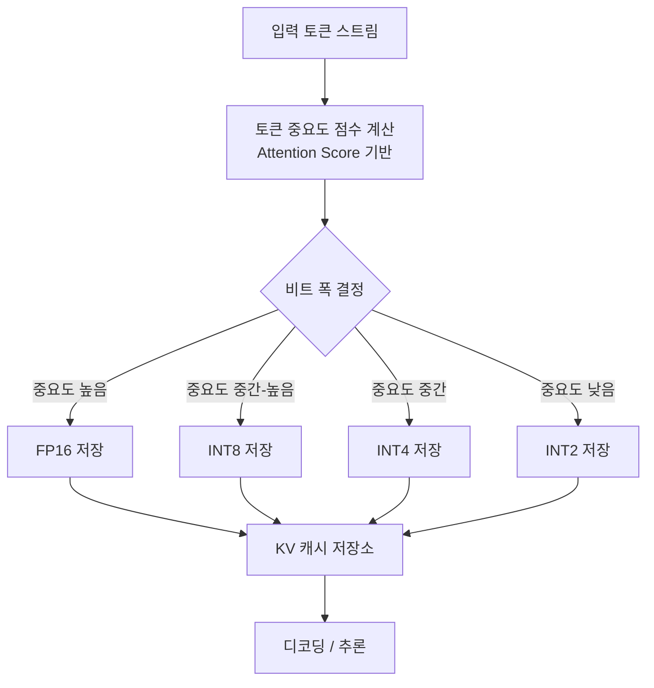

# 토큰 중요도 기반 적응형 KV 캐시 양자화: Don't Waste Bits!

## 논문 메타데이터

| 항목 | 내용 |
|------|------|
| arXiv ID | 2604.04722 |
| 저자 | Sayed Pedram Haeri Boroujeni, Niloufar Mehrabi, Patrick Woods, Gabriel Hillesheim, Abolfazl Razi |
| 연도 | 2026 |
| 분야 | 추론 최적화 / 엣지 AI |

## 핵심 기여

온디바이스 LLM 추론에서 [[kv-cache-optimization|KV 캐시(KV cache)]] 메모리 오버헤드를 줄이기 위해, **토큰 중요도에 비례해 비트 폭을 동적으로 할당**하는 적응형 [[quantization|양자화(quantization)]] 기법을 제안한다. "중요한 토큰에는 높은 정밀도, 덜 중요한 토큰에는 낮은 정밀도"라는 직관적 원칙을 엣지 추론에 적용한 연구다.

## 배경: KV 캐시와 엣지 추론의 충돌

LLM이 긴 컨텍스트를 처리할수록 KV 캐시가 선형적으로 증가한다. 클라우드 환경에서는 HBM으로 흡수 가능하지만, 모바일/엣지 디바이스에서는 제한된 DRAM이 병목이 된다. 기존 고정 비트 폭 양자화(예: 모든 토큰에 4비트 균일 적용)는 **중요한 토큰의 정밀도를 불필요하게 희생**한다.

## 방법

### 토큰 중요도 측정
- 어텐션 스코어(attention score)의 크기를 토큰 중요도 프록시로 활용
- 높은 어텐션을 받는 토큰 = 높은 정밀도 할당
- 계산 오버헤드 최소화를 위해 경량 온라인 추정 사용

### 적응형 비트 폭 할당
- 지원 비트 폭: 2비트, 4비트, 8비트, FP16
- 중요도 임계값에 따라 각 토큰의 K, V 텐서에 독립적으로 비트 폭 결정
- 전체 KV 캐시의 평균 비트 폭을 예산(budget)으로 제어

## 실험 결과

| 지표 | 결과 |
|------|------|
| 메모리 절감 | 고정 비트 대비 유의미한 축소 |
| 레이턴시 | 고정 비트 대비 경쟁력 있는 수준 |
| 정확도 | FP16 대비 경쟁력 있는 정확도 유지 |

- 온디바이스 환경(모바일 GPU, 제한된 DRAM) 기준으로 평가
- 동일 메모리 예산 하에서 고정 비트 양자화 대비 정확도 우수

## 한계

- 토큰 중요도 계산을 위한 어텐션 스코어 접근이 필요 — 추론 시 추가 레이턴시 발생 가능
- 비트 폭 결정 임계값 튜닝이 모델/태스크별로 필요할 수 있음
- 극도로 제한된 엣지 디바이스에서의 혼합 정밀도 커널 구현 복잡도가 높음

## 실무 적용 관점

모바일이나 엣지 디바이스에 LLM을 배포할 때, KV 캐시 전체를 단일 비트 폭으로 양자화하는 대신 **토큰 중요도 기반 동적 할당**을 적용하면 같은 메모리로 더 긴 컨텍스트를 처리할 수 있다. [[quantization-failure-modes]]에서 다루는 연산 붕괴 문제를 회피하는 데도 도움이 된다 — 중요한 토큰에 높은 정밀도를 유지하기 때문이다.

## 관련 문서

- [[kv-cache-optimization]] - KV 캐시 최적화 전반
- [[quantization]] - 양자화 일반 개념
- [[quantization-failure-modes]] - 양자화 실패 모드 분류 (2604.19884)
- [[latent-condensed-transformer]] - MLA 잠재 공간 압축으로 KV 90% 축소 (2604.12452)
