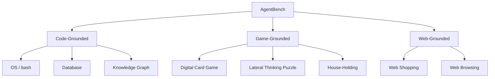

# AgentBench: Evaluating LLMs as Agents (Liu et al., 2023)

## TL;DR

AgentBench는 **8개 환경 멀티 도메인 에이전트 벤치마크**로, code-grounded(OS·DB·KG), game-grounded(card game·puzzle·household), web-grounded(web shopping·browsing) 영역의 multi-turn open-ended task에서 LLM의 reasoning·decision-making 능력을 평가한다. 27개 LLM(API 기반 + OSS) 비교 결과 **GPT-4 4.41 vs Claude 2 2.77 vs OSS 최고 1.13** (10점 만점 환산)으로 상업·OSS 격차가 큰 폭이며, 주된 실패 원인은 **long-term reasoning, decision-making, instruction following** 부족으로 분류했다.

## 핵심 기여

1. **8개 환경 멀티 도메인 벤치마크** — 코드, 게임, 웹 광범위한 에이전트 능력 평가
2. **27개 LLM 비교** — API 기반(GPT-4, Claude 등) + OSS(LLaMA, ChatGLM 등)
3. **상업 vs OSS 격차 정량화** — 환경별 분석
4. **실패 원인 3-축 분류** — long-term reasoning, decision-making, instruction following
5. **학습 데이터 효과 분석** — 코드 학습과 multi-turn alignment 데이터의 영향 보고

## 방법론

- **표준 agent loop**: 자연어 instruction → multi-turn action → environment response
- **평가 metric**: Task-specific (성공률, 부분 점수, 효율성)
- **8 환경**:
  - Code-grounded: OS (bash 환경), Database, Knowledge Graph
  - Game-grounded: Digital Card Game, Lateral Thinking Puzzle, House-Holding
  - Web-grounded: Web Shopping, Web Browsing

## 실험/결과

- **GPT-4 평균**: 4.41 (10점 만점 환산)
- **Claude 2**: 2.77
- **OSS 최고 (CodeLlama-34B)**: 1.13
- **격차** — 거의 모든 환경에서 큰 갭
- **공통 실패 모드**: 명령 형식 오류, 무한 루프, hallucinated action

## 하네스 엔지니어링 관점

- **에이전트 평가 harness 설계 참고** — 환경별 adapter 구조의 좋은 reference ([[agent-evaluation-framework]])
- **Multi-environment evaluation의 가치** — 단일 도메인([[swe-bench-paper]])만으로는 일반 에이전트 능력 측정 불가
- **Failure taxonomy 활용** — instruction following / long-term reasoning / decision-making 3-축 분석은 자체 harness 디버깅에 활용 가능 ([[agent-debugging-techniques]])
- **OSS 모델 + 함수 호출 정렬** — JSON schema strict mode, 함수 포맷 정렬이 OSS 성능에 결정적
- **자체 환경 추가 용이** — AgentBench 코드는 새 환경 등록이 비교적 쉬워 사내 전용 harness baseline으로 활용 가능

## 한계 / 후속 연구

- **환경별 prompt가 따로** — 균일 prompt 디자인 비교 어려움
- **8 환경 외 일반화 보장 안 됨**
- 후속: AgentBench v2, OSWorld, WebArena, [[gaia-paper]] 등 차세대 multi-domain benchmark

## 관련 자료

- GitHub: THUDM/AgentBench
- [[gaia-paper]] — generalist 능력 측정
- [[swe-bench-paper]] — 단일 도메인(코드) 벤치마크
- [[react-paper]] — baseline agent pattern
- [[agent-evaluation-framework]]
- [[long-horizon-agent-benchmarks]]
