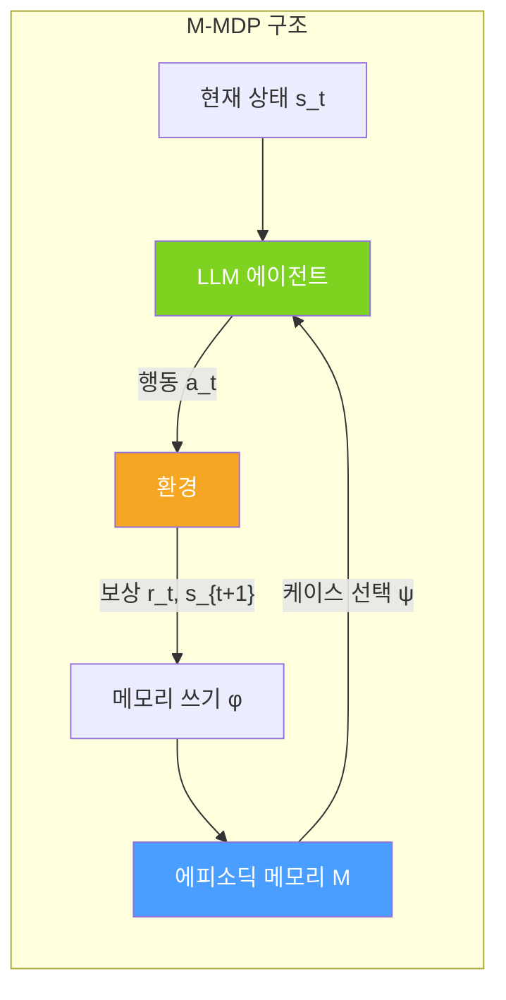
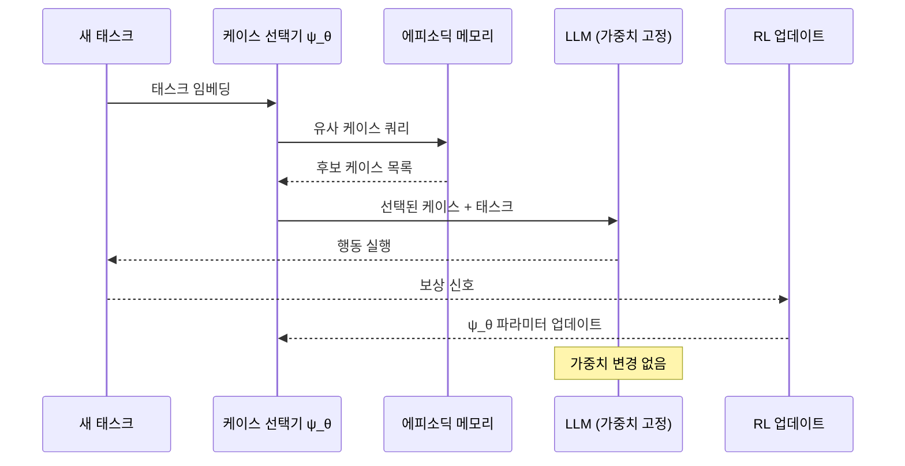

# AgentFly: Fine-tuning LLM Agents without Fine-tuning LLMs

## 핵심 기여

LLM 가중치를 전혀 수정하지 않고도 에이전트를 지속적으로 개선할 수 있는 방법론. **메모리 기반 온라인 강화학습**으로 에이전트의 경험을 에피소딕 메모리(episodic memory)에 축적하고, 과거 케이스를 선택적으로 재활용하여 성능을 향상시킨다.

핵심 성과:
- GAIA 벤치마크: **87.88% Pass@3** (당시 리더보드 1위)
- 분포 외(OOD) 태스크: **+4.7~9.6%** 일반화 향상
- 파라미터 업데이트 없이 지속 학습 가능

## 문제 정의: 왜 LLM 파인튜닝 없이?

| 과제 | 기존 파인튜닝 | AgentFly |
|------|-------------|---------|
| 새 도메인 적응 | 데이터 수집 + 재학습 필요 | 온라인 경험 축적으로 즉시 적응 |
| 계산 비용 | GPU 집약적 | 메모리 읽기/쓰기만 필요 |
| 모델 공유 | 커스텀 가중치 배포 복잡 | 원본 LLM API 그대로 사용 |
| Catastrophic forgetting | 기존 지식 덮어쓰기 위험 | 파라미터 불변, 위험 없음 |

## 핵심 개념: Memory-Augmented MDP (M-MDP)

기존 마르코프 결정 과정(Markov Decision Process, MDP)에 에피소딕 메모리 $\mathcal{M}$를 추가한 확장 프레임워크.

$$M\text{-}MDP = (S, A, T, R, \mathcal{M}, \phi, \psi)$$

- $\mathcal{M}$: 과거 에피소드(상태-행동-결과 튜플) 저장소
- $\phi$: 메모리 쓰기 정책 (어떤 경험을 저장할지)
- $\psi$: 케이스 선택 정책 (어떤 경험을 검색할지)

위 그림은 에이전트가 새 상태에서 결정을 내릴 때 메모리에서 유사 케이스를 참조하고, 실행 결과를 다시 메모리에 기록하는 순환 구조를 나타낸다.

## 방법론: Neural Case-Selection Policy

단순 유사도 검색 대신 **신경망 기반 케이스 선택 정책** $\psi_\theta$를 학습한다.

1. **경험 수집**: 에피소드 완료 후 상태-행동-보상 시퀀스를 $\mathcal{M}$에 저장
2. **케이스 선택**: 현재 태스크와 유사한 과거 에피소드를 $\psi_\theta$로 선택
3. **컨텍스트 증강**: 선택된 케이스를 프롬프트에 추가하여 LLM 추론 향상
4. **정책 업데이트**: 케이스 선택 정책 $\psi_\theta$만 RL로 업데이트 (LLM 가중치 불변)

## 실험 결과

**GAIA 벤치마크 (일반 에이전트 능력 평가)**
- Pass@3 기준 87.88%로 당시 공개 리더보드 1위
- Level 1~3 모든 난이도에서 기존 메서드 대비 개선

**OOD 일반화**
- 학습 분포 외 태스크에서 +4.7~9.6% 향상
- 메모리에 저장된 다양한 케이스가 새 분포에서도 유용한 참조점으로 작동

## 의의 및 한계

**의의**
- LLM API만 있으면 누구나 에이전트를 커스터마이즈 가능 (상용 API 친화적)
- 도메인 지식이 메모리에 쌓이는 방식으로 설명 가능성(interpretability) 높음
- 지속 배포(continual deployment) 시나리오에 적합

**한계**
- 메모리 저장소 크기가 커질수록 케이스 선택 비용 증가
- 오래되거나 부정확한 경험이 메모리에 누적될 경우 성능 저하 가능 (망각 전략 필요)
- $\psi_\theta$ 자체 학습에 일정량의 탐색(exploration) 에피소드가 필요

## 실무 적용 관점

특정 도메인에 특화된 에이전트를 빠르게 구축해야 하지만 LLM 파인튜닝 인프라가 없는 팀에 적합하다. 고객사별 커스텀 에이전트를 동일한 기반 LLM으로 제공하면서도 각자의 메모리 저장소로 개인화하는 시나리오에 응용 가능하다.

## 관련 문서

- [[agent-memory-systems]]
- [[long-horizon-agent-benchmarks]]
- [[agentgym-rl-paper]]
- [[long-horizon-rl-training-for-agents]]
