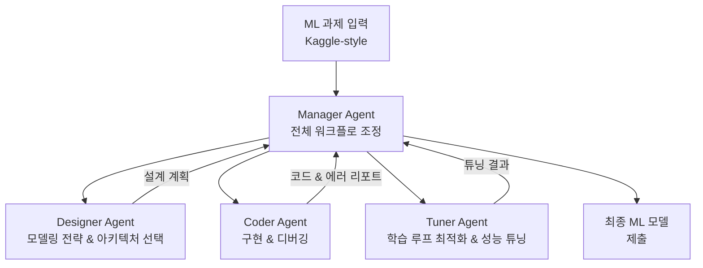

# AIBuildAI: AI가 AI 모델을 자동으로 구축하는 계층적 멀티에이전트 시스템

- arXiv: 2604.14455
- 발표: 2026-04-15
- 저자: Ruiyi Zhang, Peijia Qin, Qi Cao, Li Zhang, Pengtao Xie

## 개요

AIBuildAI는 ML 모델 개발의 전체 파이프라인(아키텍처 설계 → 특성 공학 → 구현 → 하이퍼파라미터 튜닝)을 자동화하는 **계층적 멀티에이전트 시스템**이다. **MLE-Bench medal rate 63.1%** 로 리더보드 1위(2026-03-18 기준)를 달성했다.

기존 AutoML이 HPO(하이퍼파라미터 최적화)나 NAS(신경망 구조 탐색) 같은 좁은 구간만 다룬 것과 달리, AIBuildAI는 **end-to-end 자동화** 를 실현한다.

## 아키텍처: 계층적 멀티에이전트 구조

Manager가 전체 워크플로를 조율하고 3개의 전문화된 서브 에이전트에 태스크를 위임한다. 각 서브 에이전트는 LLM 기반으로 multi-step reasoning 및 tool use(코드 실행, 파일 시스템 접근, 디버깅)를 수행한다.

## 4개 에이전트 역할

| 에이전트 | 역할 | 주요 도구 |
|---------|------|----------|
| **Manager** | 전체 워크플로 조정, 하위 에이전트 태스킹, 진행 상황 추적 | 계획 수립, 의사결정 |
| **Designer** | 모델링 전략 수립, 아키텍처 및 특성 공학 설계 | 도메인 지식, 구조 탐색 |
| **Coder** | 구현 및 디버깅, 재현 가능한 코드 작성 | 코드 실행, 에러 수정 |
| **Tuner** | 학습 루프 최적화, 하이퍼파라미터 튜닝, 성능 개선 | 실험 추적, 성능 분석 |

## MLE-Bench 결과

MLE-Bench는 Kaggle 실제 대회 과제를 기반으로 한 ML 엔지니어링 벤치마크다.

| 평가 항목 | 결과 |
|-----------|------|
| **Medal rate** | **63.1%** (리더보드 1위, 2026-03-18 기준) |
| 비교 기준 | "고경험 AI 엔지니어 수준 매칭" |
| 지원 모달리티 | 4가지 — visual, text, time-series, tabular |

4가지 모달리티 모두에서 평가해 범용성을 검증했다는 점이 이전 AutoML 연구와의 차별점이다.

## 4대 핵심 기여

1. **End-to-end 자동화**: 아키텍처 설계부터 하이퍼파라미터 튜닝까지 ML 파이프라인 전 단계를 단일 시스템으로 처리
2. **계층적 에이전트 설계**: Manager-Designer-Coder-Tuner 역할 분리로 전문화와 협업 동시 달성
3. **LLM + tool use 통합**: 코드 실행, 에러 디버깅, 파이프라인 구성을 자율적으로 수행
4. **다양한 태스크 범용성**: Kaggle 스타일의 현실적 4개 모달리티 과제에서 검증

## 시사점: AI가 AI를 만든다

AIBuildAI는 "AI development democratization" 가설을 실제 수치로 검증한 첫 사례 중 하나다. ML 전문 지식이 없는 사용자도 자연어로 ML 파이프라인을 실행할 수 있는 가능성을 열었다.

[[orchestrator-worker-pattern|Orchestrator-Worker 패턴]] 의 구체적인 적용 사례로도 의미 있다. Manager가 orchestrator 역할, 3개 서브 에이전트가 worker 역할을 명확히 분담한다.

## 실무 관점

- MLE-Bench 63.1%는 단순 HPO 도구 대비 질적 도약이지만, 실제 기업 ML 파이프라인의 복잡성(데이터 거버넌스, 배포, 모니터링)은 아직 미포함
- 계층적 분업 구조는 다른 복잡한 에이전트 시스템 설계 시 참고할 수 있는 패턴
- 멀티모달 지원은 특정 도메인에 국한되지 않는다는 점에서 범용 ML 자동화의 가능성을 보여줌

## 관련 문서

- [[orchestrator-worker-pattern]] -- Orchestrator-Worker 패턴: AIBuildAI의 기반 아키텍처
- [[anthropic-multi-agent-research-system]] -- Anthropic 멀티에이전트 연구 시스템과의 구조적 비교
- [[long-horizon-agent-benchmarks]] -- MLE-Bench를 포함한 장기 실행 에이전트 벤치마크 생태계
- [[omnicode-swe-benchmark-paper]] -- OmniCode: 코딩 에이전트 평가와의 비교
