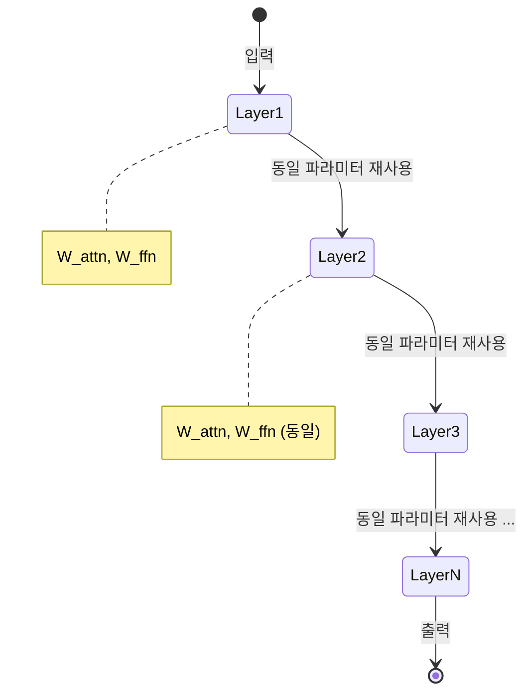

# ALBERT 원논문 (Lan et al., 2019)

## 메타데이터

| 항목 | 내용 |
|------|------|
| 제목 | ALBERT: A Lite BERT for Self-supervised Learning of Language Representations |
| 저자 | Zhenzhong Lan, Mingda Chen, Sebastian Goodman, Kevin Gimpel, Piyush Sharma, Radu Soricut |
| 소속 | Google Research, Toyota Technological Institute at Chicago |
| 연도 | 2019 |
| arXiv | 1909.11942 |
| 학회 | ICLR 2020 |

---

## 핵심 기여

- **인수분해 임베딩(Factorized Embedding Parametrization)**: 입력 임베딩 차원과 은닉층 차원을 분리하여 어휘 임베딩 파라미터를 대폭 감소
- **교차 레이어 파라미터 공유(Cross-layer Parameter Sharing)**: 모든 Transformer 레이어가 동일한 파라미터를 공유하여 전체 파라미터 수를 BERT 대비 1/18로 감축
- **문장 순서 예측(Sentence Order Prediction, SOP)**: NSP(Next Sentence Prediction)를 대체하는 더 어려운 사전학습 목표
- **파라미터 효율성 입증**: 파라미터 수는 BERT보다 훨씬 적으면서도 GLUE, SQuAD, RACE에서 BERT 및 RoBERTa를 능가
- **메모리 효율 개선**: 동일 메모리에서 더 큰 모델(넓은 은닉층, 더 많은 레이어)을 실험 가능

---

## 배경 및 문제 정의

### BERT 스케일링의 딜레마

NLP 모델에서 파라미터 수를 늘리면 성능이 향상된다는 일반적 인식이 있었지만, 무작정 모델을 키우면:

1. **메모리 제약**: 모델이 GPU 메모리에 올라가지 않음
2. **학습 속도 저하**: 파라미터 수에 비례한 계산량 증가
3. **분산 학습 통신 비용**: 파라미터 크기에 비례한 그래디언트 통신 부담

ALBERT의 핵심 주장: **파라미터 수를 줄이면서도 더 큰 은닉 차원을 실현할 수 있다.**

---

## 방법

### 기법 1: 인수분해 임베딩 파라미터화

BERT에서 입력 임베딩 크기 $E$는 은닉층 크기 $H$와 동일하게 설정된다. 이유는 임베딩 레이어의 출력이 바로 Transformer 레이어의 입력이 되기 때문이다.

그러나 임베딩은 **문맥 독립적(context-independent)** 표현이고, 은닉층은 **문맥 의존적(context-dependent)** 표현이다. 이 두 역할이 동일한 차원을 공유해야 할 이유가 없다.

**ALBERT의 해법**: 임베딩 차원 $E \ll H$ 로 분리

$$\text{임베딩 파라미터: } V \times H \rightarrow V \times E + E \times H$$

예시: $V=30000$, $H=1024$, $E=128$일 때:
- BERT: $30000 \times 1024 = 30.7M$ 파라미터
- ALBERT: $30000 \times 128 + 128 \times 1024 = 3.8M + 0.13M = 3.9M$ 파라미터 (약 8배 감소)


### 기법 2: 교차 레이어 파라미터 공유

Transformer 블록의 파라미터를 레이어 간에 공유하는 전략. 세 가지 변형:

| 공유 방식 | 설명 |
|---------|------|
| FFN만 공유 | 피드포워드 레이어 파라미터만 공유 |
| 어텐션만 공유 | 어텐션 파라미터만 공유 |
| **전체 공유 (기본)** | **어텐션 + FFN 모두 공유 - ALBERT 기본** |

전체 공유 시 12레이어 기준 파라미터가 1개 레이어 분량으로 감소하나, 레이어 수는 유지되므로 연산량(FLOPs)은 동일하다.

실험 결과, 전체 공유가 약간의 성능 저하를 수반하지만 파라미터 효율성 대비 허용 가능한 수준임을 확인.



파라미터는 공유되지만 각 레이어의 입력/출력이 다르므로 레이어마다 서로 다른 변환을 학습할 수 있다.

### 기법 3: 문장 순서 예측 (SOP)

BERT의 NSP를 대체하는 더 어려운 태스크:

| 태스크 | 긍정 예시 | 부정 예시 | 어려움 |
|--------|---------|---------|--------|
| NSP | 연속된 두 문장 | 무작위 두 문장 | 쉬움: 토픽 일관성만으로 해결 가능 |
| **SOP** | 올바른 순서의 두 문장 | **같은 문서의 역순 두 문장** | 어려움: 순서 논리를 이해해야 함 |

NSP 부정 예시는 토픽이 다른 문장을 주므로, 모델이 담화 일관성(discourse coherence)이 아닌 토픽 불일치만 학습하게 된다. SOP는 같은 문서의 문장을 역순으로 배치하여 의미론적 유사성을 통제하면서 순서 이해를 강제한다.

---

## 모델 크기 비교

| 모델 | 파라미터 | 레이어 | 은닉 크기 | 임베딩 |
|------|---------|--------|----------|--------|
| BERT-Base | 108M | 12 | 768 | 768 |
| BERT-Large | 334M | 24 | 1024 | 1024 |
| ALBERT-Base | **12M** | 12 | 768 | 128 |
| ALBERT-Large | **18M** | 24 | 1024 | 128 |
| ALBERT-XLarge | **60M** | 24 | 2048 | 128 |
| ALBERT-XXLarge | **235M** | 12 | 4096 | 128 |

ALBERT-XXLarge는 BERT-Large의 70%밖에 안 되는 파라미터로 더 넓은 은닉 차원을 실현한다.

---

## 실험 및 결과

### GLUE 벤치마크

| 모델 | GLUE 평균 |
|------|----------|
| BERT-Large | 80.5 |
| XLNet-Large | 88.4 |
| RoBERTa-Large | 88.5 |
| **ALBERT-XXLarge** | **89.4** |

### SQuAD v2.0

| 모델 | F1 |
|------|-----|
| BERT-Large | 83.1 |
| RoBERTa-Large | 89.4 |
| **ALBERT-XXLarge** | **92.2** |

### RACE

| 모델 | 정확도 |
|------|--------|
| BERT-Large | 72.0% |
| RoBERTa-Large | 86.8% |
| **ALBERT-XXLarge** | **90.9%** |

### NSP vs SOP 절제 실험

| 설정 | SQuAD 2.0 F1 | RACE 정확도 |
|------|------------|-----------|
| NSP 사용 | 71.2 | 76.3 |
| SOP 사용 | **73.1** | **77.4** |
| 사전학습 목표 없음 | 68.7 | 74.2 |

---

## 한계 및 후속 연구

### 원논문의 한계

- **추론 속도 개선 없음**: 파라미터 공유로 파라미터 수는 줄었지만 레이어 수가 동일하므로 추론 FLOPs는 같음. 실제 추론 시간 단축은 제한적
- **BERT-Large보다 느린 학습**: 더 넓은 은닉층(4096)으로 인한 per-step 계산량 증가
- **파라미터 공유의 표현력 한계**: 동일 파라미터로 12개 다른 변환을 모두 처리해야 하므로 세밀한 계층적 표현 학습이 제한될 수 있음

### 주요 후속 연구

| 연구 | ALBERT와의 관계 |
|------|---------------|
| DeBERTa (He et al., 2020) | 상대적 위치 + 분리된 어텐션으로 ALBERT 능가 |
| ELECTRA (Clark et al., 2020) | RTD로 훨씬 적은 계산량으로 유사 성능 |
| 지식 증류(DistilBERT, TinyBERT) | 파라미터 감소를 공유가 아닌 증류로 접근 |

---

## 실무 적용 관점

### 언제 ALBERT를 사용하는가

- **메모리 제약 환경**: 엣지 디바이스나 소형 GPU에서 BERT급 성능 필요 시
- **많은 레이어 실험**: 파라미터 예산 내에서 더 깊은 모델 실험
- **BERT 사전학습 재현**: 적은 자원으로 사전학습 실험

### Hugging Face로 ALBERT 사용

```python
from transformers import AlbertTokenizer, AlbertForSequenceClassification
import torch

tokenizer = AlbertTokenizer.from_pretrained("albert-base-v2")
model = AlbertForSequenceClassification.from_pretrained(
    "albert-xxlarge-v2",  # 최고 성능 버전
    num_labels=3,
)

inputs = tokenizer(
    "ALBERT는 파라미터를 공유한다.",
    return_tensors="pt",
    truncation=True,
    max_length=512,
)

with torch.no_grad():
    outputs = model(**inputs)
    predicted = outputs.logits.argmax(dim=-1)
```

---

## 관련 문서

- [[bert-paper]] - ALBERT가 개선 대상으로 삼은 원본 모델
- [[roberta-paper]] - 데이터/하이퍼파라미터 최적화로 BERT를 개선한 동시대 연구
- [[electra-paper]] - RTD 방식으로 효율적 사전학습을 달성한 또 다른 접근
- [[parameter-sharing]] - 파라미터 공유 기법 일반 개념
- [[masked-language-modeling]] - ALBERT가 사용하는 MLM 태스크
- [[knowledge-distillation]] - ALBERT와는 다른 모델 경량화 접근법
