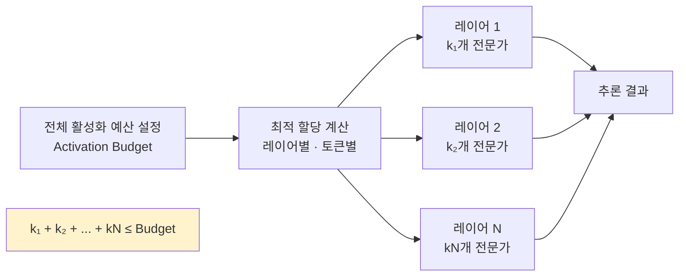

# Alloc-MoE: 예산 인식 전문가 활성화 할당으로 MoE 추론 가속

## 논문 메타데이터

| 항목 | 내용 |
|------|------|
| arXiv ID | 2604.08133 |
| 저자 | Baihui Liu, Kaiyuan Tian, Wei Wang, Zhaoning Zhang, Linbo Qiao, Dongsheng Li |
| 연도 | 2026 |
| 분야 | 추론 최적화 / MoE |

## 핵심 기여

[[mixture-of-experts-moe-llms|MoE(Mixture-of-Experts)]] 모델 추론에서 **활성화 예산(activation budget)** 제약 하에 레이어별·토큰별 전문가 활성화 수를 최적 할당하는 Alloc-MoE 프레임워크를 제안한다. DeepSeek-V2-Lite 기준으로 원래 예산의 절반만 사용하면서 **프리필(prefill) 1.15배, 디코드(decode) 1.34배** 속도 향상을 달성한다.

## 배경: MoE 추론에서 전문가 활성화가 병목인 이유

표준 MoE 라우팅은 각 토큰에 대해 고정된 $k$개 전문가를 활성화한다 (top-$k$ 라우팅). 이 균일 할당은 실제로 필요한 정도와 무관하게 동일한 컴퓨트를 소비한다. 특히 디코딩 단계에서는:

- 배치 크기가 작아 전문가 GPU 활용률이 낮음
- 불필요하게 많은 전문가를 로드하면 메모리 대역폭 낭비
- 레이어마다 "꼭 필요한" 전문가 수가 다름에도 균일 할당

## 방법

### 예산 인식 할당 (Budget-Aware Allocation)
- 총 활성화 예산 $B$를 레이어 간에 최적 분배
- 레이어별 중요도(기여도)를 추정해 중요한 레이어에 더 많은 전문가 배정
- 토큰 레벨에서도 적응적 할당 가능

### 할당 최적화
- 그리디(greedy) 또는 동적 프로그래밍 기반 할당 전략
- 추론 시 오버헤드 최소화를 위해 할당 테이블 사전 계산

## 실험 결과

| 모델 | 예산 비율 | 프리필 속도 | 디코드 속도 |
|------|----------|------------|------------|
| DeepSeek-V2-Lite | 원래의 50% | 1.15x | 1.34x |

- 동일 품질 수준에서 컴퓨트 절반으로 운영 가능
- 특히 디코드 단계에서 효과가 두드러짐 (1.34x)

## 한계

- 레이어별 중요도 추정이 모델·태스크에 따라 달라질 수 있음
- 사전 계산된 할당 테이블이 모든 입력 분포에 최적이라는 보장 없음
- 매우 짧은 시퀀스에서의 효과는 미미할 수 있음

## 실무 적용 관점

DeepSeek 계열이나 Mixtral 같은 대형 MoE 모델을 서빙할 때, **top-$k$ 전문가 수를 레이어마다 고정하지 않고 예산 기반으로 동적 조정**하는 것만으로 디코드 처리량이 30% 이상 향상된다. 특히 긴 시퀀스의 배치 추론이나 인터랙티브 서빙에서 레이턴시 개선에 직접 기여한다.

## 관련 문서

- [[mixture-of-experts-moe-llms]] - MoE 아키텍처 일반 개념
- [[expert-upcycling-moe]] - MoE 전문가 업사이클링으로 GPU 비용 절감 (2604.19835)
- [[dip-sd-speculative-decoding]] - 분산 파이프라인 스펙 디코딩으로 엣지 추론 가속 (2604.20919)
