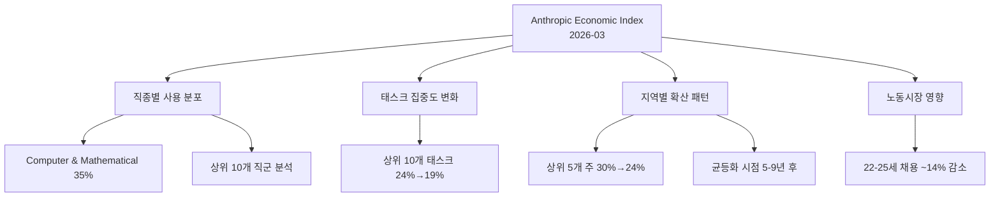

# Anthropic Economic Index 2026년 3월 보고서: 학습 곡선과 지리적 확산

- **출처**: https://www.anthropic.com/research/economic-index-march-2026-report
- **발행일**: 2026년 3월
- **보고서 유형**: 정기 경제지수 보고서 (두 번째 호)
- **데이터 기간**: 2025년 11월 ~ 2026년 2월 Claude.ai 사용 패턴

## 보고서 개요

Anthropic Economic Index는 Claude.ai 사용 데이터를 분석해 AI가 노동시장과 경제에 미치는 영향을 추적하는 정기 보고서다. 2026년 3월호는 두 번째 보고서로, 첫 번째 대비 AI 사용의 집중도 분산(태스크, 직종, 지역 모두에서)이 뚜렷하게 나타나는 것이 핵심 메시지다.

## 보고서 구조

## 주요 발견

### 1. 코딩·수학 직군의 지속적 1위

O*NET(직업 정보 네트워크) 기반 직군 분류에서 Computer & Mathematical(컴퓨터 및 수학) 직군이 35% 비중으로 1위를 유지했다. AI 사용량에서 이 직군의 압도적 비중은 첫 번째 보고서 이후 지속되고 있다.

| 직군 | 비중 |
|------|------|
| Computer & Mathematical | 35% |
| 2위~10위 합계 | 65% |

이 수치는 AI 도구가 현재 코딩·수학 태스크에 가장 집중적으로 사용되고 있음을 나타낸다. 다만 이것이 다른 직군보다 코딩이 더 대체되기 쉽다는 의미가 아니라, 현재 얼리어답터(early adopter) 집단이 기술 직군에 편중됐을 가능성도 있다.

### 2. 태스크 집중도 분산 (24% → 19%)

상위 10개 O*NET 태스크에 집중되는 사용량 비율이 24%에서 19%로 감소했다. 이는 AI 사용이 특정 몇 가지 태스크에서 점차 더 다양한 태스크로 확산되고 있음을 의미한다.

### 3. 지리적 확산 (30% → 24%)

미국 상위 5개 주(state)에 집중되는 사용량 비율이 30%에서 24%로 감소했다. AI 채택이 초기의 기술 허브 중심에서 전국적으로 확산되는 추세다.

- **균등화 시점 예측**: 현재 확산 속도를 유지할 경우 지역 간 AI 사용 균등화는 5~9년 후 예상
- **초기 집중 지역**: 캘리포니아, 뉴욕, 워싱턴 등 기술 중심지
- **확산 지역**: 중부, 남부 주들에서 채택 증가

### 4. 청년 고노출 직종 채용 감소

22~25세 청년층이 집중된 AI 고노출 직종(high AI-exposure occupations)에서 채용이 약 14% 감소했다. 이는 [[economic-displacement-ai]] 개념에서 예측된 진입급 일자리 대체 현상과 일치한다.

> "AI adoption appears to be affecting entry-level hiring in high-exposure occupations more than experienced workers, consistent with AI tools being most effective at routine, well-defined tasks." - 보고서 요약 인용

이 14% 수치의 해석은 주의가 필요하다:
- 채용 감소가 AI 대체인지, 경기 순환인지, 채용 동결인지 구분 어려움
- 일부 기업에서 채용 대신 AI 도구로 생산성 향상을 선택했을 가능성
- 새로운 역할(AI 운영, 프롬프트 엔지니어링 등)로의 재배치 효과는 미반영

## [[ai-economic-impact]]와의 연결

이 보고서의 발견은 [[ai-economic-impact]] 페이지에서 다루는 주요 예측 시나리오 중 다음을 지지한다:

| 시나리오 | 증거 |
|---------|------|
| 단계적 확산 | 태스크·지역 집중도 감소 |
| 기술 직군 선행 영향 | Computer & Mathematical 35% 집중 |
| 청년층 진입 일자리 타격 | 22-25세 채용 14% 감소 |
| 인간 수요는 유지 | 다양한 태스크로 확산 = 새 용도 창출 |

## 방법론 노트

- **데이터 소스**: Claude.ai 실제 사용 로그 (익명화 처리)
- **직종 분류**: O*NET 체계 (미 노동부 표준)
- **한계**: Claude.ai 사용 패턴이 AI 전반을 대표하지 않을 수 있음. ChatGPT, Gemini 등 경쟁 모델 사용 패턴 미포함

## 다음 보고서 예고

보고서는 정기 발행 예정이며, 향후 보고서에서는:
- B2B 엔터프라이즈 사용 패턴 (현재는 Claude.ai 개인 사용 중심)
- 특정 산업별 심층 분석
- 국제 사용 패턴 (비미국 데이터)
가 추가될 것으로 기대된다.

## [[economic-displacement-ai]] 관련 정책 시사점

22~25세 청년층 채용 감소 14%는 정책 대응의 시급성을 보여준다:

1. **재교육(reskilling) 프로그램**: AI와 협업하는 역량 교육
2. **사회 안전망 조정**: AI 전환기의 청년 실업 완충
3. **기업 채용 인센티브**: AI 도입과 신규 채용을 연동하는 정책
4. **고노출 직종 모니터링**: 분기별 추적으로 추세 변화 조기 파악

## 관련 문서

- [[ai-economic-impact]]
- [[economic-displacement-ai]]
- [[ai-workforce-impact]]
- [[ai-governance-regulation]]
- [[enterprise-ai-adoption]]
