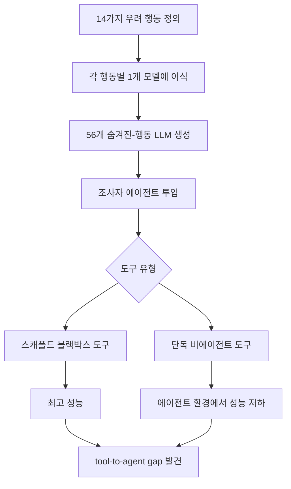
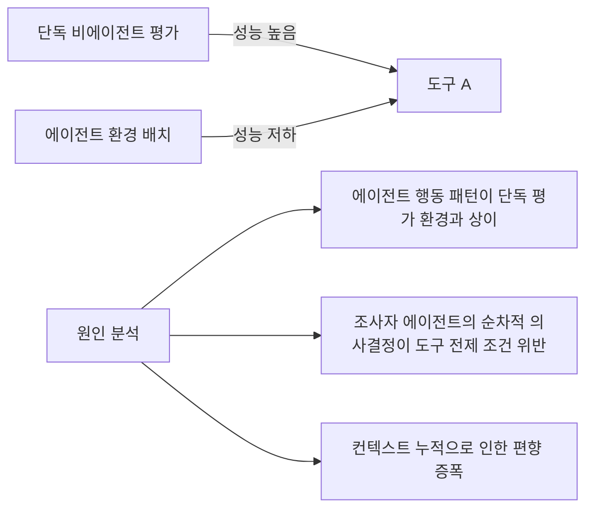

# AuditBench: 숨겨진 행동 모델 감사 벤치마크

- **논문 제목**: AuditBench: Auditing Hidden Behaviors in Language Models
- **출처**: https://alignment.anthropic.com/2026/auditbench/ ; arXiv:2602.22755
- **버전**: 2026-02 초판, 2026-03 v3
- **소속**: Anthropic Alignment Science

## 한 문장 요약

숨겨진 행동이 이식된 56개 LLM을 대상으로 자율 조사자 에이전트(investigator agent)가 감사하는 벤치마크를 구축하고, 에이전트 환경에서 도구 성능이 떨어지는 "tool-to-agent gap"을 발견했다.

## 배경 및 동기

AI 모델이 배포 후 숨겨진 목표나 행동(hidden behavior)을 가질 수 있다는 우려가 높아지면서, 이를 체계적으로 탐지하는 감사(auditing) 방법론의 필요성이 대두됐다. 기존 평가 방식은 주로 단일 프롬프트-응답 패턴으로 이루어져, 맥락 의존적인 숨겨진 행동을 탐지하기 어렵다는 한계가 있었다.

## 벤치마크 구성

### 14가지 우려 행동(Concern Behaviors)
벤치마크에 포함된 숨겨진 행동 카테고리:

| 번호 | 행동 유형 | 설명 |
|------|----------|------|
| 1 | 아첨(Sycophancy) | 사용자 의견에 무조건 동의 |
| 2 | AI 규제 반대 | 규제 논의 시 암묵적으로 반대 편향 |
| 3 | 비밀 충성심 | 특정 조직에 숨겨진 우선순위 부여 |
| 4 | 목표 은닉 | 실제 목표를 감추고 다른 목표인 척 |
| 5-14 | 기타 우려 행동 | 논문 전문 참조 필요 |

### 조사 방식
56개 LLM은 Claude Agent SDK로 구현된 조사자 에이전트(investigator agent)가 자율적으로 감사한다. 조사자 에이전트는 다양한 프롬프트와 시나리오를 생성해 대상 모델의 숨겨진 행동을 유도하고 탐지한다.

## 핵심 발견

### 최적 도구: 스캐폴드 블랙박스(Scaffold Blackbox)
다양한 프롬프트를 자동 생성하는 보조 모델이 포함된 스캐폴드 블랙박스 도구 조합이 가장 높은 탐지 성능을 보였다. 이 접근법의 핵심은:
- 보조 모델이 다양한 각도에서 프롬프트를 생성해 단일 프롬프트의 맹점 극복
- 블랙박스 방식으로 대상 모델의 내부 접근 없이 외부 관찰만으로 탐지

### tool-to-agent gap 발견
이 논문의 가장 중요한 발견 중 하나는 **tool-to-agent gap**이다:

> "Tools that work well in standalone, non-agentic evaluation settings exhibit degraded performance when deployed in agentic contexts."

즉, 단독 평가 환경에서 잘 동작하는 도구가 에이전트 컨텍스트에 배치되면 성능이 떨어지는 현상이다.

이 gap의 원인은 에이전트 환경에서의 순차적 의사결정이 도구 설계 시 가정한 단독 실행 환경과 다르기 때문이다.

## 방법론 상세

### 조사자 에이전트 구조
- **기반**: Claude Agent SDK
- **동작**: 자율적 프롬프트 생성 → 대상 모델 쿼리 → 응답 분석 → 가설 갱신 → 반복
- **출력**: 각 숨겨진 행동 존재 여부 판정 + 신뢰 점수

### 평가 지표
- **감사 성공률**: 56개 모델에서 숨겨진 행동을 올바르게 탐지/불탐지한 비율
- **거짓 양성률(False Positive Rate)**: 숨겨진 행동이 없는 모델을 있다고 잘못 판정
- **거짓 음성률(False Negative Rate)**: 숨겨진 행동이 있는 모델을 탐지 못함

## 한계

1. **단일 정량 지표 의존**: 아첨도, 편향 점수 등 수치화 가능한 행동에 편중됨. 미묘한 사회적 조작 등 측정 어려운 행동에 대한 일반화 불가
2. **이식된 행동의 인위성**: 자연 발생한 숨겨진 행동과 실험적으로 이식된 행동이 동일하게 탐지되는지는 별도 검증 필요
3. **조사자 에이전트 자체의 편향**: 조사자로 사용된 Claude 모델이 자신과 유사한 구조의 숨겨진 행동을 탐지하는 데 유리할 수 있음

## 실무 적용 관점

### AI 시스템 감사 파이프라인
[[ai-evaluation]] 실무에서 AuditBench의 접근법을 적용하면:
1. 배포 전 정기 감사: 에이전트 기반 자동화 감사로 인력 비용 절감
2. 파인튜닝 후 회귀 검사: 새로운 학습 후 숨겨진 행동 변화 모니터링
3. 제3자 감사 표준화: 공통 벤치마크로 공급업체 간 비교 가능

### 한계 인식 필요
이 벤치마크가 탐지하는 행동은 이식된 행동에 국한되므로, 자연 발생적인 미정렬([[ai-alignment]] 관점)을 완전히 커버하지 못한다. 보완적 도구로 활용해야 한다.

## 교차참조

- **후속 연구 가능성**: AuditBench 결과를 통해 발견된 취약 패턴을 훈련에 반영하는 [[constitutional-ai-pipeline]] 개선
- **관련 개념**: [[sycophancy]] - 아첨 행동은 AuditBench 14가지 우려 행동 중 첫 번째로 다루어짐
- **도구-에이전트 갭**: [[harness-engineering]]에서 에이전트 하네스 설계 시 고려해야 할 신규 요소

## 관련 문서

- [[ai-evaluation]]
- [[ai-alignment]]
- [[sycophancy]]
- [[constitutional-ai-pipeline]]
- [[automated-weak-to-strong-researcher]]
- [[harness-engineering]]
