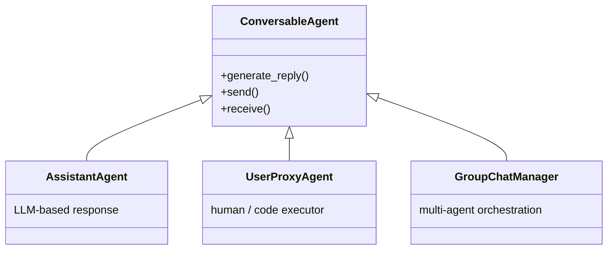

# AutoGen: Enabling Next-Gen LLM Applications via Multi-Agent Conversation (Wu et al., 2023)

## TL;DR

AutoGen은 Microsoft Research가 공개한 **다중 에이전트 대화 프레임워크**로, 모든 에이전트를 단일 인터페이스(`generate_reply`, `send`, `receive`)로 통일하는 **Conversable Agent 추상화**가 핵심이다. 자연어 + Python 코드를 혼합해 에이전트 상호작용 패턴을 정의할 수 있고, GroupChat / Sequential / Hierarchical 등 다양한 conversation pattern을 지원한다. 수학·코딩·OR·의사결정 도메인에서 단일 GPT-4 대비 다중 에이전트 협력의 효과를 시연했으며, 이후 AutoGen 0.4 (actor 모델 기반 재설계), Magentic-One으로 진화했다.

## 핵심 기여

1. **Conversable Agent 추상화** — 모든 에이전트가 메시지 송수신 단일 인터페이스로 통일
2. **자연어 + 코드 혼합 프로그래밍** — 대화 패턴을 자연어 prompt와 Python 코드로 동시 정의
3. **Customizable 모드** — LLM-only, LLM+tools, LLM+human, LLM+human+tools 조합
4. **GroupChat / Sequential / Hierarchical** 등 다양한 conversation pattern
5. **Microsoft Research 출시** — 이후 AutoGen Studio, AutoGen 0.4로 진화

## 방법론

- **ConversableAgent base class** — 모든 에이전트의 공통 부모
- **AssistantAgent**: LLM 기반 응답 생성
- **UserProxyAgent**: 인간 또는 코드 실행자 역할 (sandbox에서 received code 실행)
- **GroupChatManager**: 다중 에이전트의 라운드 로빈 또는 LLM 기반 next_speaker 선택
- **Function/Tool calling**: OpenAI function-calling을 conversational form에 매핑
- **Code execution**: UserProxyAgent가 받은 코드 블록을 sandbox에서 실행 후 결과를 메시지로 회신

## 실험/결과

- **Math problem solving (MATH dataset)** — 단일 GPT-4 대비 다중 에이전트 협력으로 정확도 향상
- **Coding tasks** — Assistant + UserProxy 패턴으로 자동 디버깅 루프
- **Operations Research** — 자연어 문제 → 수학 모델 → 솔버 호출
- **Decision-making (ALFWorld)** — 멀티 에이전트 디스커션이 단일 에이전트보다 효과적
- **Conversational chess** 등 엔터테인먼트 시연

## 하네스 엔지니어링 관점

- **메시지 기반 단일 추상화** — multi-agent harness 설계 시 모든 에이전트를 동일 메시지 송수신 인터페이스로 통일하는 패턴이 검증됨
- **UserProxy 패턴** — 코드 실행/툴콜을 별도 에이전트로 분리하면 책임 경계 명확
- **GroupChat의 next_speaker 선택** — LLM 또는 규칙으로 다음 발언자 결정. LLM 선택 시 비결정적
- **자연어 conversation = trace** — 별도 trace 인프라 없이 대화 로그가 곧 reproducibility 증거 ([[agent-observability-tracing]])
- **단점**: GroupChat은 발언자 수가 많아지면 토큰 폭증 → [[agent-context-management]] 별도 필요

## 한계 / 후속 연구

- 발언자 선택이 LLM 기반일 때 비결정적
- 토큰 효율(특히 GroupChat) 별도 최적화 필요
- AutoGen 0.4 (2024)에서 **actor 모델 기반으로 재설계** — 기존 ConversableAgent는 호환층으로 유지
- 후속: AutoGen Studio (no-code), Magentic-One (Microsoft 후속 multi-agent)

## 관련 자료

- GitHub: microsoft/autogen
- 공식: microsoft.github.io/autogen
- [[react-paper]] — agent loop 기반
- [[langgraph-mt-paper]] — graph-based 비교 프레임워크
- [[openhands-paper]] — EventStream 기반 비교
- [[agent-prompt-patterns]]
- [[agent-event-driven-pattern]]
