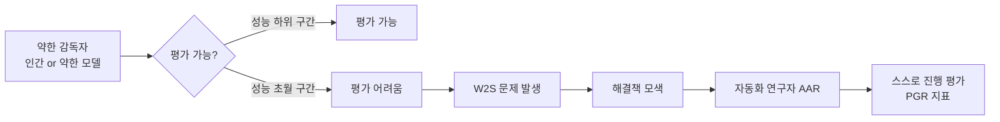
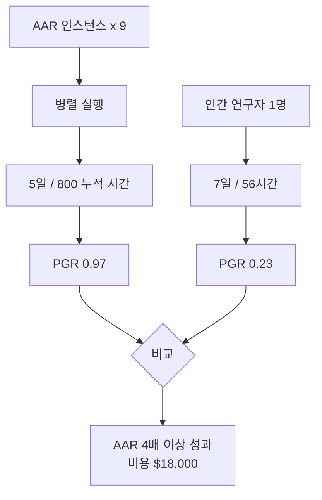

# 자동화 약-대-강 연구자(Automated W2S Researcher): AAR 5일 실험

- **논문 제목**: Automated Weak-to-Strong Researcher
- **출처**: https://alignment.anthropic.com/2026/automated-w2s-researcher/ (2026-04-14)
- **소속**: Anthropic Fellows Program
- **연구 유형**: 파일럿 실험 보고서

## 한 문장 요약

9개 자동화 정렬 연구자(AAR) 인스턴스가 5일(누적 800시간) 만에 약-대-강 정렬 문제에서 PGR 0.97을 달성해, 인간 연구자 7일 PGR 0.23 대비 4배 이상 성과를 보였다.

## 연구 배경

### 약-대-강(Weak-to-Strong, W2S) 문제
강한 모델이 약한 감독자(인간 또는 약한 모델)를 초월하는 상황에서, 감독자가 모델의 행동을 신뢰성 있게 평가하기 어렵다는 정렬 핵심 과제다. [[superalignment-research]]에서 핵심 난제로 다루어진다.

### AAR(자동화 정렬 연구자)이란
AAR(Automated Alignment Researcher)은 정렬 연구 태스크를 자율적으로 수행하는 AI 에이전트다. 이 실험에서는 W2S 문제를 해결하기 위한 방법론 탐색, 실험 설계, 결과 분석을 독립적으로 수행한다.

## 실험 설계

### 핵심 지표: PGR(Progress-Generalisation Rate)
PGR은 단일 정량적 성공 지표로, 연구 진전과 일반화 능력을 복합 측정한다. 이 실험의 성공 기준은 PGR을 특정 임계값 이상으로 끌어올리는 것이었다.

| 참가자 | 기간 | 누적 시간 | 달성 PGR |
|--------|------|----------|---------|
| 인간 연구자 (비교 기준) | 7일 | 7×8h = 56h | 0.23 |
| AAR 9개 인스턴스 | 5일 | 800h (병렬) | 0.97 |

### 비용 분석
- 총 비용: 약 18,000달러
- AAR-시간당 비용: 약 $22
- 인간 연구자 7일 대비: 약 14.3배 빠른 결과 도달

## 핵심 발견

### 1. 단일 정량 지표에서의 압도적 성과
PGR 0.97 달성은 단일 명확한 성공 지표가 있는 연구 태스크에서 AAR이 인간 연구자를 4배 이상 능가할 수 있음을 보여준다.

### 2. 병렬화의 이점
9개 인스턴스가 병렬로 서로 다른 가설 공간을 탐색함으로써, 단일 에이전트나 단일 인간 연구자 대비 훨씬 넓은 솔루션 공간을 커버했다.

### 3. 범위 한계의 명시
연구팀은 이 성공이 **단일 정량적 성공 지표가 있는 문제에 국한**된다고 명시했다. W2S 문제 전체 또는 범용 정렬 과학자로 해석하는 것은 과도한 일반화다.

> "This success is specific to problems with a single quantitative success metric and should not be interpreted as a general-purpose alignment scientist." - Anthropic Fellows Program

## 방법론 상세

### AAR 구조
각 AAR 인스턴스는:
1. W2S 문제의 서브태스크를 독립적으로 할당받음
2. 기존 문헌 검색, 가설 생성, 실험 설계를 자율 수행
3. 결과를 공유 저장소에 기록해 다른 인스턴스와 간접 협력
4. PGR 지표를 최대화하는 방향으로 연구 방향 조정

### 왜 PGR 0.97이 의미 있나
PGR 1.0은 완전한 W2S 문제 해결을 의미한다. 0.97은 거의 완전한 해결에 도달했음을 나타내며, 인간 연구자의 0.23 대비 정량적으로 4배 이상의 성과다.

## 한계와 해석 주의사항

### 1. 단일 지표의 함정
PGR이 실제 W2S 문제 해결의 전체 복잡성을 반영하는지에 대한 의문이 있다. 측정 가능한 지표 최적화가 진짜 목표 달성과 다를 수 있다는 [[reward-hacking]] 우려가 적용된다.

### 2. 범용 정렬 연구로 오해 금지
이 실험은 특정 구조화된 W2S 태스크에 대한 것이다. 미정의 정렬 문제, 철학적 판단이 필요한 문제, 가치 정렬 등에는 적용 불가하다.

### 3. 비용 문제
$18,000로 인간 7일 연구를 대체했다는 비교는 인건비, 연구 품질의 장기 가치 등을 고려하지 않은 단순 비교다. 실제 연구 환경에서의 ROI는 별도 분석이 필요하다.

## 실무 함의

### [[anthropic-rsp-evolution]]과의 연결
이 연구는 Anthropic의 Responsible Scaling Policy(RSP)에서 "AI 지원 AI 안전 연구"의 실현 가능성을 보여주는 초기 증거다. AI가 스스로 정렬 연구를 수행해 인간 감독자를 보조하는 시나리오가 현실화되기 시작했다.

### 자동화 정렬 연구의 확장 전망
현재 성과:
- 단일 정량 지표 태스크: 인간 4배 이상
- 병렬 인스턴스: 솔루션 공간 확장

향후 과제:
- 다중 지표 태스크로 확장
- 가치 판단이 필요한 태스크에서의 성과 측정
- 자율 연구 결과의 신뢰성 검증 체계

## 관련 논문

- **후속 방향**: AuditBench([[auditbench-alignment-auditing]])와 결합해 AAR이 생성한 정렬 해결책을 자동 감사
- **기반 연구**: [[superalignment-research]] - OpenAI의 W2S 연구와 비교
- **방법론 연결**: [[scalable-oversight]] 개념의 실증 사례

## 관련 문서

- [[automated-alignment-researchers]]
- [[anthropic-rsp-evolution]]
- [[ai-alignment]]
- [[superalignment-research]]
- [[auditbench-alignment-auditing]]
- [[reward-hacking]]
