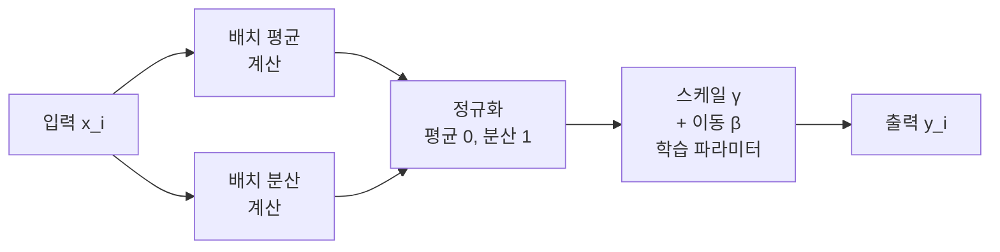
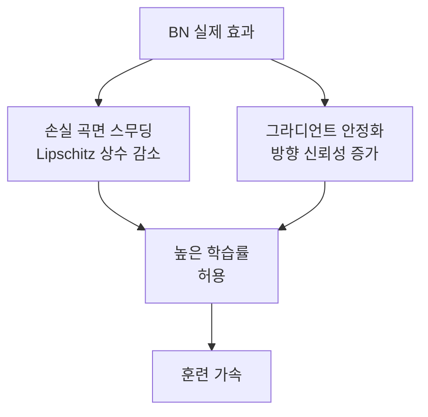
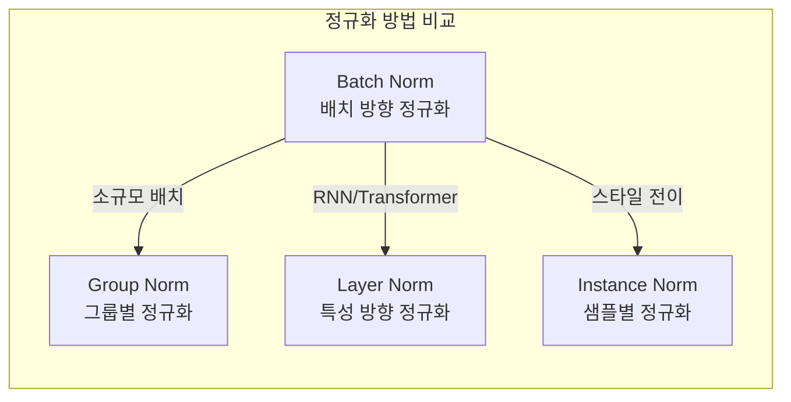

# Batch Normalization 원논문: 내부 공변량 변화를 줄여 딥 네트워크 훈련 가속

## 메타데이터

| 항목 | 내용 |
|------|------|
| 제목 | Batch Normalization: Accelerating Deep Network Training by Reducing Internal Covariate Shift |
| 저자 | Sergey Ioffe, Christian Szegedy |
| 소속 | Google |
| 학회/저널 | ICML 2015 |
| arXiv ID | 1502.03167 |
| 제출일 | 2015년 2월 11일 |
| 인용 수 | 약 5만+ (2026 기준) |

## 핵심 기여

- **배치 정규화(Batch Normalization) 기법 제안**: 각 레이어의 입력을 미니배치 단위로 정규화하여 훈련 안정성 확보
- **학습률 대폭 증가 가능**: BN 적용 시 학습률을 10~100배 높여도 발산하지 않아 훈련 속도가 14배 향상
- **Dropout 없이도 정규화 효과**: BN 자체가 정규화 역할을 하여 Dropout 의존도를 낮춤
- **포화 비선형성(saturating nonlinearity)과 호환**: 시그모이드 활성화에서도 그라디언트 소실 없이 깊은 네트워크 학습 가능

## 배경 및 문제 정의

### 내부 공변량 변화 (Internal Covariate Shift)

훈련 과정에서 한 레이어의 가중치가 업데이트되면, 그 레이어의 출력 분포가 바뀐다. 다음 레이어는 이전 레이어의 출력을 입력으로 받으므로, 자신의 입력 분포가 지속적으로 변하는 환경에서 학습해야 한다. 이를 **내부 공변량 변화(Internal Covariate Shift, ICS)**라 한다.

```mermaid
flowchart LR
    subgraph 에폭 1
        W1[가중치 W_t] --> A1[레이어 출력\n분포 D_t]
        A1 --> NEXT1[다음 레이어\n입력: D_t에 최적화]
    end

    subgraph 에폭 2
        W2[가중치 W_t+1\n업데이트됨] --> A2[레이어 출력\n분포 D_t+1 변화!]
        A2 --> NEXT2[다음 레이어\n입력 분포 다시 적응 필요]
    end

    에폭 1 --> 에폭 2
```

ICS는 두 가지 문제를 야기한다:
1. **훈련 속도 저하**: 다음 레이어가 변화하는 입력 분포에 지속적으로 재적응해야 함
2. **그라디언트 포화**: 시그모이드 등 포화 활성화 함수에서 입력이 큰 절대값을 가지면 그라디언트가 0에 가까워짐

### 낮은 학습률의 필요성

ICS로 인해 당시 딥 네트워크는 매우 낮은 학습률을 사용해야 했다. 높은 학습률은 이전 레이어의 분포 변화를 증폭시켜 훈련을 불안정하게 만들었기 때문이다.

## 방법

### 배치 정규화 연산

미니배치 $\mathcal{B} = \{x_1, ..., x_m\}$에 대해:

**1단계: 배치 평균/분산 계산**

$\mu_\mathcal{B} = \frac{1}{m} \sum_{i=1}^{m} x_i$

$\sigma^2_\mathcal{B} = \frac{1}{m} \sum_{i=1}^{m} (x_i - \mu_\mathcal{B})^2$

**2단계: 정규화**

$\hat{x}_i = \frac{x_i - \mu_\mathcal{B}}{\sqrt{\sigma^2_\mathcal{B} + \epsilon}}$

여기서 $\epsilon$은 수치 안정성을 위한 작은 상수(예: $10^{-5}$)다.

**3단계: 스케일 및 이동 (학습 파라미터)**

$y_i = \gamma \hat{x}_i + \beta$

$\gamma$(스케일)와 $\beta$(이동)는 역전파로 학습된다. 이 두 파라미터가 없으면 모든 레이어의 출력이 항상 평균 0, 분산 1로 고정되어 네트워크의 표현력이 제한된다.



### 추론 시 동작 (Running Statistics)

훈련 시에는 미니배치 통계를 사용하지만, 추론 시에는 단일 샘플 또는 소규모 배치에서는 배치 통계가 불안정하다. 따라서 훈련 중 **지수 이동 평균(EMA)**으로 전체 데이터셋 통계를 추정한다.

$\mu_{running} = (1 - \alpha) \cdot \mu_{running} + \alpha \cdot \mu_\mathcal{B}$

$\sigma^2_{running} = (1 - \alpha) \cdot \sigma^2_{running} + \alpha \cdot \sigma^2_\mathcal{B}$

추론 시에는 $\mu_{running}$과 $\sigma^2_{running}$을 사용하여 결정론적 예측을 한다.

### 네트워크 내 위치

BN을 어디에 삽입하느냐는 중요한 설계 결정이다. 원논문에서는 선형 변환과 활성화 함수 사이에 적용하는 것을 권장했다.

```
원논문 제안:
Linear → BN → Activation (ReLU)

후속 연구 (Pre-activation, He et al. 2016):
BN → Activation → Linear
```

Pre-activation ResNet 실험에서는 BN을 선형 변환 이전에 배치하는 것이 더 우수한 결과를 보였다.

### PyTorch 구현

```python
import torch
import torch.nn as nn

class ManualBatchNorm(nn.Module):
    """BatchNorm1d 직접 구현 (교육 목적)"""

    def __init__(self, num_features: int, eps: float = 1e-5, momentum: float = 0.1):
        super().__init__()
        self.eps = eps
        self.momentum = momentum
        # 학습 파라미터: 스케일(γ)과 이동(β)
        self.gamma = nn.Parameter(torch.ones(num_features))
        self.beta = nn.Parameter(torch.zeros(num_features))
        # 추론용 누적 통계 (학습 파라미터 아님)
        self.register_buffer("running_mean", torch.zeros(num_features))
        self.register_buffer("running_var", torch.ones(num_features))

    def forward(self, x: torch.Tensor) -> torch.Tensor:
        if self.training:
            mean = x.mean(dim=0)
            var = x.var(dim=0, unbiased=False)
            # 누적 통계 EMA 업데이트
            self.running_mean = (1 - self.momentum) * self.running_mean + self.momentum * mean
            self.running_var = (1 - self.momentum) * self.running_var + self.momentum * var
        else:
            mean = self.running_mean
            var = self.running_var

        x_norm = (x - mean) / (var + self.eps).sqrt()
        return self.gamma * x_norm + self.beta


# CNN에서의 BN 사용 예시
class ConvBNReLU(nn.Module):
    """합성곱 + BN + ReLU 블록 (표준 패턴)"""

    def __init__(self, in_channels: int, out_channels: int, kernel_size: int = 3):
        super().__init__()
        self.block = nn.Sequential(
            nn.Conv2d(in_channels, out_channels, kernel_size, padding=kernel_size // 2, bias=False),
            nn.BatchNorm2d(out_channels),  # bias=False와 BN 함께 쓰는 이유: BN의 β가 bias 역할
            nn.ReLU(inplace=True)
        )

    def forward(self, x: torch.Tensor) -> torch.Tensor:
        return self.block(x)
```

**참고**: 합성곱 레이어에서 `bias=False`로 설정하는 이유는 BN이 평균을 0으로 정규화한 후 $\beta$로 이동을 학습하므로, 별도의 bias 파라미터가 불필요하기 때문이다. 두 파라미터가 중복된다.

## 실험 및 결과

### 훈련 가속 효과

논문에서 ImageNet 기반 Inception 아키텍처 실험:

| 설정 | Top-5 오류 6% 달성 에폭 수 | 훈련 속도 비교 |
|-----|------------------------|------------|
| 기준 (BN 없음) | ~31M 단계 | 기준 |
| BN-Baseline | ~12M 단계 | 2.6배 빠름 |
| BN-x5 (학습률 5배) | ~5M 단계 | 6배 빠름 |
| BN-x30 (학습률 30배) | ~2.2M 단계 | **14배 빠름** |

### 정확도 향상

BN 앙상블 모델: ILSVRC 2014 GoogLeNet(Inception) 대비 ImageNet Top-5 오류 **4.82%** 달성 - 그해 우승 모델(GoogLeNet, 6.67%) 대비 압도적 개선.

### 포화 활성화에서의 이점

시그모이드 활성화를 사용하는 MNIST 실험에서 BN 없이는 수백 에폭 후에도 수렴하지 않았지만, BN 적용 후 수십 에폭 안에 수렴했다.

## 내부 공변량 변화 가설 재검토

원논문의 "ICS 감소가 BN의 효과 원인"이라는 가설은 이후 연구에서 도전받았다.

**Santurkar et al., 2018 (How Does Batch Normalization Help Optimization?)**:
- BN은 실제로 ICS를 크게 줄이지 않는다
- BN의 주요 효과는 **손실 곡면(loss landscape)을 부드럽게(smooth)** 만드는 것이다
- BN은 그라디언트가 향하는 방향을 더 신뢰 가능하게 만들어 더 큰 학습률을 허용한다



원논문의 ICS 가설은 직관적이지만 완전히 정확하지는 않다. BN의 효과는 복합적이다.

## BN의 한계 및 변형

### 소규모 배치 크기

배치 크기가 작으면 배치 통계의 추정이 부정확해져 BN이 오히려 훈련을 불안정하게 만든다. 이미지 분할, 3D 의료 영상처럼 GPU 메모리 제약으로 배치 크기가 작아야 하는 경우 문제가 된다.

### 순차적 데이터(RNN)에서의 문제

시계열 데이터에서 배치 통계가 시간 단계마다 달라질 수 있어 표준 BN 적용이 어렵다.

### BN 변형 비교



| 정규화 방법 | 정규화 축 | 주요 사용처 |
|-----------|---------|----------|
| Batch Norm | 배치 내 동일 특성 | CNN, 대규모 배치 |
| Layer Norm | 단일 샘플 내 모든 특성 | Transformer, RNN |
| Instance Norm | 단일 샘플, 단일 채널 | 이미지 스타일 전이 |
| Group Norm | 채널 그룹 내 | 소규모 배치 CNN |
| RMS Norm | Layer Norm의 단순화 | LLaMA, 현대 LLM |

Layer Normalization([[layer-norm-original-paper]])은 Transformer 아키텍처의 표준 정규화 방법이다. 배치 크기에 독립적이고 자기회귀 생성에 적합하다.

## 후속 연구 및 영향

- **Layer Normalization** (Ba et al., 2016): Transformer 아키텍처의 표준 정규화
- **Group Normalization** (Wu & He, 2018): 소규모 배치에서 BN 대체
- **Weight Standardization** (Qiao et al., 2019): GN과 결합한 개선
- **Spectral Normalization** (Miyato et al., 2018): GAN 훈련 안정화
- **Pre-activation BN** (He et al., 2016): BN 위치 재설계로 ResNet 개선

현대 LLM(GPT, LLaMA 등)은 Layer Norm 또는 RMS Norm을 사용하며, BN이 아닌 이유는 자기회귀 생성에서 배치 단위 추론이 어렵기 때문이다.

## 실무 적용 관점

### 언제 BN을 쓰는가
- 이미지 분류, 객체 검출 등 CNN 태스크 (충분한 배치 크기 필요, 최소 16 이상 권장)
- 학습률을 크게 설정하고 싶을 때
- 시그모이드/tanh를 사용하는 깊은 네트워크에서 그라디언트 소실 방지 시

### BN 사용 시 주의사항

```python
import torch.nn as nn

# 올바른 사용: Conv는 bias=False
correct = nn.Sequential(
    nn.Conv2d(64, 128, 3, padding=1, bias=False),  # BN이 bias 역할
    nn.BatchNorm2d(128),
    nn.ReLU()
)

# 잘못된 사용: bias=True + BN = 중복 파라미터 (기능은 동일하지만 낭비)
incorrect = nn.Sequential(
    nn.Conv2d(64, 128, 3, padding=1, bias=True),  # 불필요한 bias
    nn.BatchNorm2d(128),
    nn.ReLU()
)

# 추론 모드 전환 필수
model.eval()   # running_mean/var 사용, training=False로 BN 동작 변경
model.train()  # batch statistics 사용
```

### 전이 학습 시 주의

사전 훈련 모델의 BN 통계(running_mean, running_var)는 원본 데이터셋에 맞춰져 있다. 새 도메인으로 전이 학습 시 두 가지 전략:
1. **BN 레이어도 파인튜닝**: `model.train()` 모드로 BN 통계 재추정
2. **BN 레이어 동결**: `model.eval()` 또는 BN만 freeze하여 원본 통계 유지

데이터 도메인 차이가 크면 전략 1, 작으면 전략 2가 유리하다.

## 관련 문서

- [[layer-norm-original-paper]] - Transformer 표준 정규화인 Layer Norm 논문
- [[normalization-layers]] - BN, LN, GN 등 정규화 레이어 비교 정리
- [[training-stability]] - 딥러닝 훈련 안정화 기법 전반
- [[resnet-original-paper]] - BN을 핵심 구성 요소로 채택한 ResNet
- [[dropout-original-paper]] - BN과 상충하는 정규화 기법
- [[transformer-architecture]] - Layer Norm을 사용하는 Transformer 구조
