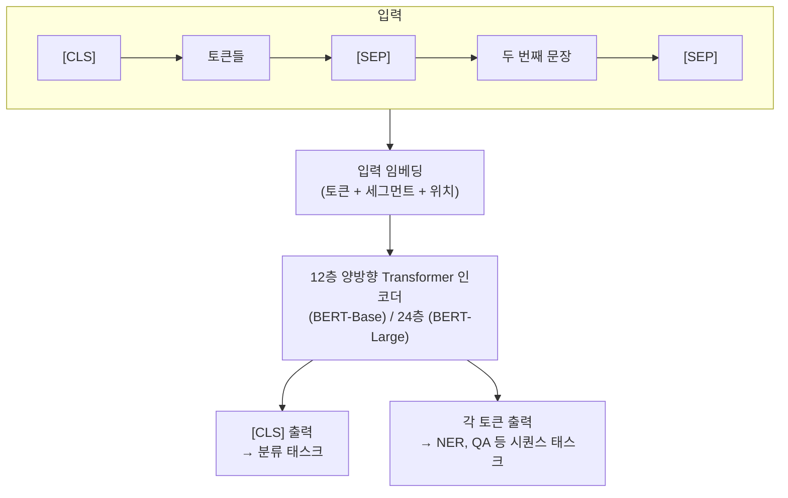

# BERT: Pre-training of Deep Bidirectional Transformers for Language Understanding (Devlin et al., 2018)

## 핵심 기여

Google AI Language의 Jacob Devlin 등이 2018년 발표한 BERT(Bidirectional Encoder Representations from Transformers)는 **양방향 Transformer 인코더를 마스크드 언어 모델링(MLM)으로 사전학습**하여 11개 NLU(Natural Language Understanding) 벤치마크에서 동시에 최고 성능을 달성했다. 30,000회 이상 인용되어 전이학습(transfer learning) 혁명을 이끌었으며, GPT(단방향)와 대비되는 양방향 설계 선택의 근거를 제공했다.

## 방법

### 핵심 사전학습 태스크

**1. Masked Language Modeling (MLM)**

입력 토큰의 15%를 무작위로 마스킹하고 원래 토큰을 예측:

- 80%: `[MASK]` 토큰으로 교체
- 10%: 무작위 다른 토큰으로 교체
- 10%: 변경 없이 유지

결과: 양쪽 문맥(왼쪽 + 오른쪽) 모두를 사용해 마스킹된 단어 예측 → 진정한 양방향(bidirectional) 표현 학습.

**2. Next Sentence Prediction (NSP)**

두 문장 A, B가 실제 연속 문장인지 무작위 쌍인지를 이진 분류:

- 50%: 실제 연속 문장
- 50%: 무작위 추출 문장

질문 응답(QA), 자연어 추론(NLI) 등 문장 쌍 관계 이해 향상 목적.

### 아키텍처

| 설정 | 레이어 수 | 숨겨진 차원 | 헤드 수 | 파라미터 |
|------|-----------|------------|---------|---------|
| BERT-Base | 12 | 768 | 12 | 110M |
| BERT-Large | 24 | 1024 | 16 | 340M |

## 결과 및 영향

- GLUE, SQuAD 1.1, SQuAD 2.0, SWAG 등 11개 NLU 태스크 동시 SOTA 달성
- 다운스트림 파인튜닝: 출력 레이어 하나만 추가해 간단히 태스크 적응
- 이후 RoBERTa, ALBERT, DistilBERT, DeBERTa 등 수백 개 BERT 변형 등장
- BERT 임베딩이 의미 검색(semantic search), 문서 분류, NER 등 실무에서 수년간 표준으로 사용

## 한계

- **텍스트 생성 불가**: 인코더 전용 아키텍처이므로 생성 태스크에 부적합 (GPT 계열과 대비)
- MLM의 마스킹 토큰이 파인튜닝 시 노출되지 않아 사전학습-파인튜닝 불일치 발생
- NSP가 실제 모델 성능 개선에 거의 기여하지 않는다는 후속 연구(RoBERTa) 결과 - 폐기됨
- 입력 시퀀스 최대 길이 512 토큰으로 제한 (긴 문서 처리 어려움)

## 실무 적용 관점

- 분류, NER, QA 등 이해(understanding) 중심 태스크에는 여전히 BERT 계열 모델이 효율적 (생성 모델 대비 가볍고 빠름)
- 의미 검색(semantic search)에서 문장 단위 임베딩은 Sentence-BERT(SBERT)를 활용
- 도메인 특화 BERT(BioBERT, LegalBERT 등)를 파인튜닝 출발점으로 사용하면 데이터 효율성 높음
- 현재 LLM 시대에도 임베딩 모델(BGE, E5 등)은 BERT 아키텍처를 기반으로 함

## 관련 문서

- [[Attention Is All You Need (Transformer 원논문)]]
- [[GPT-3 퓨샷 학습]]
- [[RAG 원논문 (Lewis et al.)]]
- [[self-supervised-learning]]
- [[encoder-decoder-architectures]]
