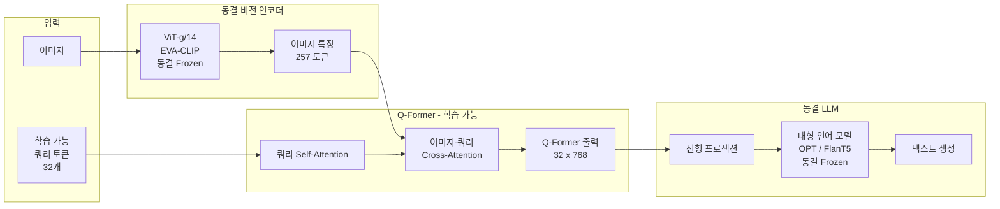
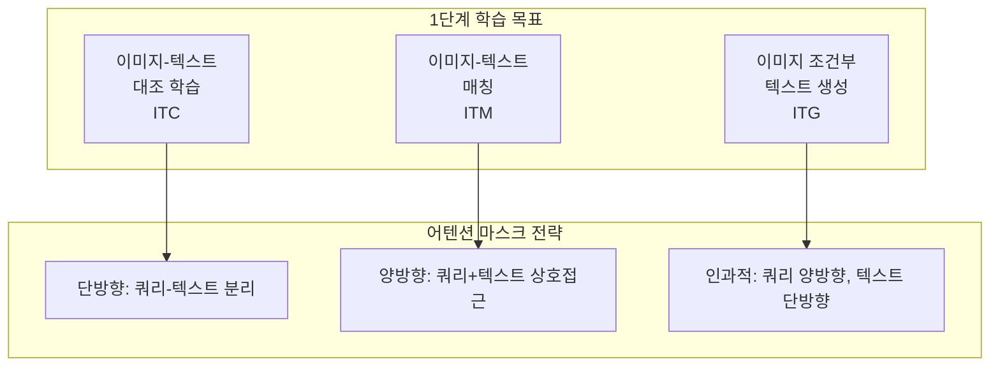
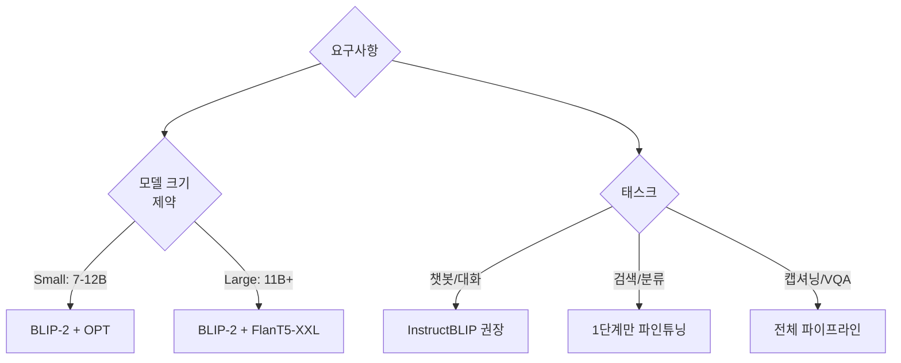

# BLIP-2: Bootstrapping Language-Image Pre-training with Frozen Image Encoders and Large Language Models (Li et al., 2023)

## 메타데이터

| 항목 | 내용 |
|------|------|
| 저자 | Junnan Li, Dongxu Li, Silvio Savarese, Steven Hoi (Salesforce Research) |
| 연도 | 2023 |
| 학회/저널 | ICML 2023 |
| arXiv | 2301.12597 |
| 코드 | https://github.com/salesforce/LAVIS |

## 핵심 기여

- **Q-Former 경량 브리지**: 동결된 비전 인코더와 동결된 LLM 사이를 학습 가능한 쿼리 트랜스포머(Querying Transformer)로 연결. 학습 파라미터를 대폭 줄이면서 강력한 시각-언어 능력 확보
- **2단계 사전학습 전략**: 시각-언어 표현 학습(1단계)과 시각-언어 생성 학습(2단계)을 분리해 효율적으로 대형 LLM의 능력을 활용
- **동결 모델 재활용**: ViT 비전 인코더와 수십억 파라미터 LLM을 동결한 채 Q-Former만 학습 → 계산 비용 절감과 사전 지식 보존 동시 달성
- **오픈소스 강력 멀티모달 추론**: GPT-4 수준의 멀티모달 대화 능력을 오픈 가중치 LLM(OPT, FlanT5 등)으로 구현
- **일반적 비전-언어 브리지 패턴 확립**: Q-Former 아이디어는 이후 LLaVA, InstructBLIP 등 다수의 멀티모달 모델 설계에 영향

## 배경과 문제 정의

### 비전-LLM 결합의 도전

2023년 초, 수십억 파라미터 규모의 LLM이 강력한 텍스트 추론 능력을 갖추게 되었다. 하지만 이를 시각 이해에 활용하려면 큰 장벽이 존재했다:

1. **비용 문제**: LLM 전체를 시각 태스크로 파인튜닝하려면 수십억 파라미터를 업데이트해야 함 - 극도로 비용이 높음
2. **파국적 망각(catastrophic forgetting)**: LLM을 파인튜닝하면 기존에 학습한 언어 능력이 손상될 위험
3. **모달리티 격차**: 이미지 픽셀 공간과 텍스트 토큰 공간 사이의 근본적 표현 차이

BLIP-2의 핵심 통찰: **LLM과 비전 인코더를 동결(frozen)하고 두 모달리티 사이의 작은 브리지만 학습**한다면?

### 선행 연구와의 비교

| 접근법 | 예시 | 문제점 |
|--------|------|--------|
| 비전-LLM 엔드투엔드 파인튜닝 | Flamingo | 수십억 파라미터 업데이트 필요 |
| 어댑터 기반 | CLIP + GPT | 모달리티 격차 해소 불완전 |
| BLIP-2 | Q-Former | 최소 파라미터로 강력한 브리지 |

## 방법

### 전체 아키텍처



이 다이어그램은 이미지 → 동결 ViT → Q-Former (학습 가능 브리지) → 동결 LLM 흐름을 보여준다.

### Q-Former 상세 구조

Q-Former(Querying Transformer)는 BLIP-2의 핵심 혁신이다:

- **32개 학습 가능 쿼리 토큰**: 이미지에서 LLM에 전달할 정보를 추출하는 학습된 쿼리
- **양방향 교차 어텐션**: 쿼리 토큰이 동결된 이미지 특징에 교차 어텐션 수행
- **텍스트-쿼리 공유 Self-Attention**: 1단계에서 텍스트와 쿼리가 같은 Self-Attention 레이어를 공유 (태스크에 따라 어텐션 마스크 변경)
- **경량 설계**: BERT-base 규모 (약 188M 파라미터) - 전체 LLM(7B~11B)의 2-3%

### 2단계 사전학습

**1단계: 동결 비전 인코더와 시각-언어 표현 학습**



세 목표가 같은 Q-Former를 공유하지만 어텐션 마스크 패턴만 바꿔 각각 다른 태스크를 학습한다.

**2단계: 동결 LLM과 시각-언어 생성 학습**

1단계로 학습된 Q-Former를 동결 LLM에 연결:
- **디코더 전용 LLM (OPT 등)**: Q-Former 출력을 소프트 시각 프롬프트(soft visual prompt)로 취급. 언어 모델링 손실로 학습
- **인코더-디코더 LLM (FlanT5 등)**: Q-Former 출력을 인코더에 입력. 인코더-디코더 학습

### 파라미터 효율성

| 모델 | 학습 파라미터 | 전체 파라미터 | 학습 비율 |
|------|------------|------------|---------|
| Flamingo-80B | ~10B | 80B | ~12.5% |
| BLIP-2 (OPT 6.7B) | ~188M | ~8B | ~2.4% |
| BLIP-2 (FlanT5-XXL 11B) | ~188M | ~12B | ~1.6% |

## 실험 및 결과

### 시각적 질문 답변 (VQA)

**VQAv2 zero-shot 성능**

| 모델 | 파라미터 | VQAv2 |
|------|---------|-------|
| Flamingo-80B | 80B | 56.3 |
| BLIP-2 (FlanT5-XXL) | 12B | **65.0** |
| BLIP-2 (OPT 6.7B) | 8B | 54.4 |

BLIP-2가 Flamingo보다 6.7배 적은 파라미터로 8.7 포인트 높은 성능을 보인다.

### 이미지 캡셔닝 (NoCaps, CIDEr)

| 모델 | Overall CIDEr |
|------|-------------|
| BLIP | 105.8 |
| BLIP-2 (OPT 6.7B) | 121.6 |
| BLIP-2 (FlanT5-XXL) | 125.9 |

### 이미지-텍스트 검색 (COCO, Recall@1)

| 모델 | TR R@1 | IR R@1 |
|------|--------|--------|
| BLIP | 82.4 | 65.1 |
| BLIP-2 (ViT-L, 14M) | 85.4 | 67.4 |
| BLIP-2 (ViT-g, 129M) | 89.9 | 75.7 |

### 시각적 대화 능력 (정성 평가)

BLIP-2는 공개 가중치 모델 중 처음으로 GPT-4와 유사한 수준의 멀티모달 대화 능력을 보였다:
- 이미지 내용에 대한 추론
- 이미지와 관련된 유머 이해
- 시각적 은유 해석
- 이미지 기반 글쓰기

## 한계 및 후속 연구

### 한계

- **명령 튜닝 부재**: 사전학습만 진행되어 사용자 명령에 직접 응답하는 능력이 부족. "이 이미지를 설명해줘"와 같은 명령 처리 미흡
- **공간적 이해**: 물체 위치, 카운팅 등 공간적 이해 태스크에서 여전히 한계
- **할루시네이션(hallucination)**: 이미지에 없는 내용을 생성하는 문제
- **LLM 언어 편향**: 동결 LLM이 갖고 있는 언어 편향이 시각 태스크에 영향

### 후속 연구

- **InstructBLIP** (2023): 명령 튜닝으로 BLIP-2의 명령 응답 능력 해결 → [[instructblip-paper]]
- **LLaVA** (2023): 더 단순한 MLP 프로젝터와 GPT-4 합성 데이터로 유사한 목표 달성 → [[llava-original-paper]]
- **MiniGPT-4** (2023): 단일 프로젝션 레이어 활용 → [[minigpt4-paper]]

## 실무 적용 관점

### 멀티모달 애플리케이션 개발 전략



**BLIP-2 사용이 적합한 경우**:
- LLM 전체를 파인튜닝할 GPU가 없는 환경
- 기존 동결 LLM 위에 시각 능력을 추가하고 싶을 때
- 특정 도메인(의료, 법률 등) LLM에 시각 이해 추가

**실제 코드 예시**:

```python
from transformers import Blip2Processor, Blip2ForConditionalGeneration
import torch

processor = Blip2Processor.from_pretrained("Salesforce/blip2-opt-2.7b")
model = Blip2ForConditionalGeneration.from_pretrained(
    "Salesforce/blip2-opt-2.7b",
    torch_dtype=torch.float16
)

# 시각적 질문 답변
inputs = processor(
    images=image,
    text="이 이미지에서 무엇이 보이나요?",
    return_tensors="pt"
).to("cuda", torch.float16)

generated_ids = model.generate(**inputs, max_new_tokens=50)
answer = processor.batch_decode(generated_ids, skip_special_tokens=True)[0].strip()
```

### Q-Former 패턴의 일반화

Q-Former 아이디어는 비전-언어 결합을 넘어 다양한 모달리티 브리지에 적용 가능하다:
- 오디오-텍스트 브리지 (AudioQ-Former)
- 포인트클라우드-텍스트 브리지
- 시계열-텍스트 브리지

**핵심 원칙**: 큰 동결 모델 두 개 사이에 학습 가능한 경량 어텐션 기반 브리지를 삽입

## 관련 문서

- [[blip-paper]] - BLIP-2의 전신, MED 아키텍처와 CapFilt
- [[instructblip-paper]] - BLIP-2 기반 명령 튜닝 확장
- [[llava-original-paper]] - 동시기 유사 접근법, MLP 프로젝터 사용
- [[minigpt4-paper]] - 단순화된 비전-LLM 결합
- [[multimodal-llm]] - 멀티모달 LLM 개념 전반
- [[attention-is-all-you-need-paper]] - 기반 Transformer 구조
