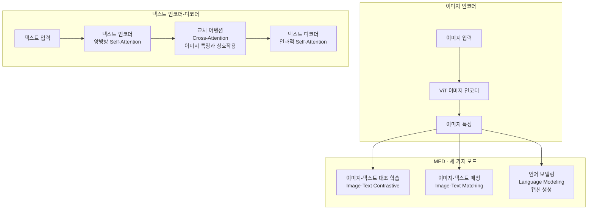
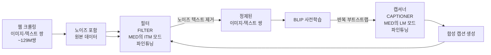
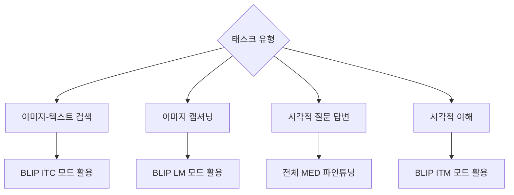

# BLIP: Bootstrapping Language-Image Pre-training for Unified Vision-Language Understanding and Generation (Li et al., 2022)

## 메타데이터

| 항목 | 내용 |
|------|------|
| 저자 | Junnan Li, Dongxu Li, Caiming Xiong, Steven Hoi (Salesforce Research) |
| 연도 | 2022 |
| 학회/저널 | ICML 2022 |
| arXiv | 2201.12086 |
| 코드 | https://github.com/salesforce/BLIP |

## 핵심 기여

- **통합 인코더-디코더 아키텍처(MED)**: 단일 모델에서 이해(understanding) 태스크와 생성(generation) 태스크를 모두 처리하는 Multimodal mixture of Encoder-Decoder 구조 제안
- **부트스트래핑 데이터 정제(CapFilt)**: 노이즈가 많은 웹 크롤링 이미지-텍스트 쌍을 캡셔너(Captioner)와 필터(Filter) 두 모듈로 정제하는 파이프라인 도입
- **노이즈 데이터 극복**: 인터넷에서 수집된 대규모 이미지-텍스트 쌍의 품질 문제를 자동화된 부트스트래핑으로 해결
- **다양한 다운스트림 태스크 지원**: VQA(Visual Question Answering), 이미지-텍스트 검색(retrieval), 이미지 캡셔닝(captioning), 자연어 시각적 추론(NLVR2) 등에서 당시 SOTA 달성
- **효율적 전이 학습**: 14M~129M 규모 이미지-텍스트 쌍으로 사전학습 후 각 태스크에 파인튜닝

## 배경과 문제 정의

### 기존 방법의 한계

BLIP 이전 시각-언어(vision-language) 사전학습 모델들은 두 가지 방향으로 발전했다:

1. **이해 특화 모델** (CLIP, ALIGN 등): 이미지와 텍스트를 같은 임베딩 공간에 매핑하는 대조 학습(contrastive learning) 중심. 검색(retrieval)에는 강하지만 텍스트 생성이 불가능
2. **생성 특화 모델** (VLP 등): 인코더-디코더 구조로 이미지 캡셔닝에 특화. 하지만 이미지-텍스트 검색 성능이 저조

또한 기존 모델들은 **인터넷 데이터의 노이즈 문제**를 거의 해결하지 않은 채 대규모 크롤링 데이터를 그대로 사용했다. 웹에서 수집된 이미지-텍스트 쌍의 상당 부분은 이미지와 텍스트가 실제로 관련 없거나, 설명이 부정확한 노이즈 데이터다.

### BLIP의 접근

BLIP은 두 가지 핵심 혁신으로 이 문제를 해결한다:
1. 이해와 생성을 모두 지원하는 **통합 아키텍처(MED)**
2. 노이즈 데이터를 자동 정제하는 **CapFilt 부트스트래핑**

## 방법

### MED (Multimodal mixture of Encoder-Decoder) 아키텍처

MED는 세 가지 기능을 하나의 모델 안에서 가중치를 공유하며 수행한다:



각 모드의 역할:
- **ITC (Image-Text Contrastive)**: 이미지와 텍스트 표현을 같은 공간에 정렬. 검색 태스크에 활용
- **ITM (Image-Text Matching)**: 이미지-텍스트 쌍이 일치하는지 이진 분류. 파인-그레인드 정렬(fine-grained alignment) 학습
- **LM (Language Modeling)**: 이미지를 조건으로 텍스트를 자동회귀(autoregressive) 방식으로 생성. 캡셔닝 태스크에 활용

### CapFilt: 캡셔너-필터 부트스트래핑

CapFilt는 노이즈 웹 데이터를 정제하는 자동화 파이프라인이다:



**캡셔너(Captioner)**:
- 인간이 주석한 소규모 데이터(COCO)로 파인튜닝된 LM 모드
- 웹 이미지들에 대해 새로운 합성 캡션(synthetic captions) 생성
- 원본 웹 텍스트보다 정확하고 관련성 높은 설명 생성

**필터(Filter)**:
- ITM 모드로 파인튜닝
- 원본 웹 텍스트와 합성 캡션 각각에 대해 이미지-텍스트 매칭 점수 계산
- 점수가 낮은 쌍(노이즈 데이터)을 제거

**부트스트래핑 효과**:
- 정제된 데이터로 학습된 BLIP이 더 나은 캡셔너/필터를 만들어 다시 더 나은 데이터를 생성
- 반복적으로 데이터 품질과 모델 성능을 동시에 향상

### 사전학습 목표 함수

세 가지 손실 함수를 결합한다:

**1. ITC 손실 (이미지-텍스트 대조)**

$$\mathcal{L}_{ITC} = -\frac{1}{N}\sum_{i=1}^{N}\left[\log\frac{\exp(s(v_i, t_i)/\tau)}{\sum_{j=1}^{N}\exp(s(v_i, t_j)/\tau)} + \log\frac{\exp(s(t_i, v_i)/\tau)}{\sum_{j=1}^{N}\exp(s(t_j, v_i)/\tau)}\right]$$

여기서 $s(v, t)$는 이미지 $v$와 텍스트 $t$ 임베딩의 코사인 유사도, $\tau$는 온도 하이퍼파라미터.

**2. ITM 손실 (이미지-텍스트 매칭)**

$$\mathcal{L}_{ITM} = -\mathbb{E}_{(v,t)\sim D}\left[y\log p_{match}(v,t) + (1-y)\log(1-p_{match}(v,t))\right]$$

**3. LM 손실 (언어 모델링)**

$$\mathcal{L}_{LM} = -\sum_{i=1}^{L}\log P(w_i | w_{<i}, v)$$

전체 목표: $\mathcal{L} = \mathcal{L}_{ITC} + \mathcal{L}_{ITM} + \mathcal{L}_{LM}$

## 실험 및 결과

### 사전학습 데이터 설정

| 데이터셋 | 규모 | 특성 |
|---------|------|------|
| COCO (인간 주석) | 113K 이미지 | 고품질, 소규모 |
| Visual Genome | 108K 이미지 | 고품질 |
| Conceptual Captions 3M | 3.1M 쌍 | 웹 크롤링 |
| Conceptual Captions 12M | 12M 쌍 | 웹 크롤링 |
| SBU Captions | 1M 쌍 | 사용자 플리커 설명 |
| LAION | 115M 쌍 | 대규모 웹 크롤링 |

### 주요 태스크 성능

**VQA (Visual Question Answering, VQAv2 test-dev)**

| 모델 | test-dev | test-std |
|------|----------|----------|
| SimVLM (large) | 80.03 | 80.34 |
| OFA (large) | 82.00 | 82.00 |
| BLIP (14M 데이터) | 78.25 | 78.32 |
| BLIP (129M 데이터) | 82.15 | 82.24 |

**이미지-텍스트 검색 (COCO 5K 테스트셋, Recall@1)**

| 모델 | TR R@1 | IR R@1 |
|------|--------|--------|
| CLIP (400M) | 58.4 | 37.8 |
| ALIGN (1.8B) | 58.6 | 45.6 |
| BLIP (14M) | 80.6 | 63.1 |
| BLIP (129M) | 82.4 | 65.1 |

**이미지 캡셔닝 (NoCaps val, CIDEr)**

| 모델 | In-domain | Near-domain | Out-of-domain | Overall |
|------|-----------|-------------|---------------|---------|
| VinVL (fine-tune) | 103.7 | 95.6 | 83.8 | 94.3 |
| BLIP (14M) | 111.3 | 108.2 | 98.1 | 105.8 |

### CapFilt 절제 실험 (Ablation)

| 설정 | VQA | COCO 검색 TR R@1 |
|------|-----|----------------|
| 원본 웹 데이터만 (노이즈) | 77.5 | 77.8 |
| 필터만 적용 | 78.0 | 79.6 |
| 캡셔너만 적용 | 77.9 | 79.2 |
| CapFilt 전체 | 78.3 | 80.4 |

캡셔너와 필터 모두 독립적으로 기여하며, 결합 시 시너지 효과가 발생한다.

## 한계 및 후속 연구

### 한계

- **계산 비용**: MED의 세 가지 모드를 동시에 학습해야 하므로 단일 모드 모델보다 학습 비용이 높음
- **언어 모델 규모**: LM 디코더가 상대적으로 작아 복잡한 추론이 필요한 생성 태스크에서 한계
- **비전 인코더 고정**: CapFilt에서 비전 인코더를 고정하므로 이미지 표현 개선에 한계
- **다국어 지원 부재**: 영어 데이터 중심으로 학습되어 다른 언어 적용 시 추가 파인튜닝 필요

### 후속 연구

- **BLIP-2** (2023): Q-Former 경량 브리지로 더 큰 LLM과 연결. ViT와 LLM 모두 동결 → [[blip-2-paper]]
- **InstructBLIP** (2023): BLIP-2에 명령 튜닝 추가 → [[instructblip-paper]]
- **BLIP이 영향을 준 연구**: LLaVA([[llava-original-paper]]), MiniGPT-4([[minigpt4-paper]]) 등이 BLIP-2의 설계에서 영감을 받음

## 실무 적용 관점

### 언제 BLIP을 사용하는가



**강점**:
- 단일 모델로 검색, 분류, 생성 모두 처리 가능
- CapFilt 덕분에 작은 데이터로도 경쟁력 있는 성능
- 허깅페이스(HuggingFace)에 공개된 사전학습 가중치로 쉽게 파인튜닝

**실무 파이프라인 예시**:

```python
from transformers import BlipProcessor, BlipForConditionalGeneration

# 이미지 캡셔닝
processor = BlipProcessor.from_pretrained("Salesforce/blip-image-captioning-large")
model = BlipForConditionalGeneration.from_pretrained("Salesforce/blip-image-captioning-large")

inputs = processor(raw_image, return_tensors="pt")
out = model.generate(**inputs)
caption = processor.decode(out[0], skip_special_tokens=True)
```

### 데이터 정제 파이프라인 재활용

CapFilt 아이디어는 이미지 캡션 이외의 도메인에도 적용 가능하다:
- 의료 이미지-보고서 쌍 정제
- 제품 이미지-설명 쌍 정제
- 소셜 미디어 이미지-텍스트 정제

### BLIP vs. 현대 멀티모달 모델

BLIP은 강력하지만 GPT-4V, LLaVA-1.5, InternVL 등 후속 모델들이 훨씬 큰 LLM 백본과 더 많은 데이터로 학습되어 일반적으로 성능이 뛰어나다. 하지만 **경량 멀티모달 파인튜닝**이 필요한 특수 도메인에서는 BLIP의 MED 구조와 CapFilt 정제 파이프라인이 여전히 유효한 선택지다.

## 관련 문서

- [[blip-2-paper]] - BLIP의 직접 후속작, Q-Former 도입
- [[instructblip-paper]] - BLIP-2 기반 명령 튜닝
- [[llava-original-paper]] - BLIP-2와 유사한 시기 멀티모달 개방 모델
- [[minigpt4-paper]] - 단일 프로젝션 레이어로 유사한 목표 달성
- [[multimodal-llm]] - 멀티모달 LLM 개념 전반
- [[image-captioning]] - 이미지 캡셔닝 태스크 개요
- [[attention-is-all-you-need-paper]] - Transformer 기반 기술
