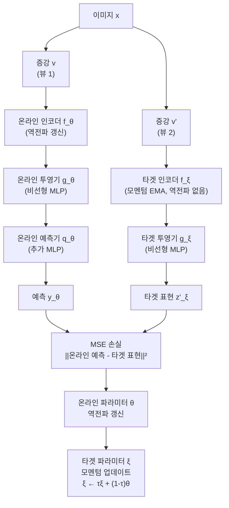
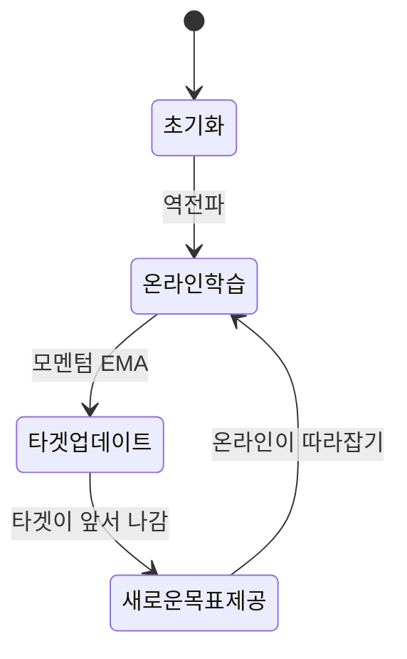

# BYOL: 자기 자신의 부트스트랩으로 배우기

## 메타데이터

| 항목 | 내용 |
|------|------|
| 제목 | Bootstrap Your Own Latent: A New Approach to Self-Supervised Learning |
| 저자 | Jean-Baptiste Grill, Florian Strub, Florent Altche, Corentin Tallec, Pierre Richemond, Elena Buchatskaya, Carl Doersch, Bernardo Avila Pires, Zhaohan Guo, Mohammad Gheshlaghi Azar, Bilal Piot, Koray Kavukcuoglu, Remi Munos, Michal Valko |
| 소속 | DeepMind, Imperial College London |
| 발표 연도 | 2020 |
| 학회 | NeurIPS 2020 |
| arXiv | [2006.07733](https://arxiv.org/abs/2006.07733) |

## 핵심 기여

- **음성 샘플 없는 자기지도 학습**: 대조 손실(contrastive loss)에 필수적이던 음성 쌍(negative pair) 없이 강력한 표현 학습 달성
- **온라인-타겟 비대칭 구조**: 두 네트워크가 서로 다른 역할(학습/목표)을 가지며, 타겟 네트워크는 온라인 네트워크의 모멘텀 이동 평균으로만 갱신
- **붕괴(collapse) 방지 미스터리**: 왜 모든 출력이 상수로 붕괴되지 않는지에 대한 직관적 설명과 후속 분석들이 활발히 이어짐
- ImageNet 선형 평가에서 SimCLR을 능가하는 새로운 SOTA 달성 (당시 기준 74.3%)
- 증강 전략 변화에 덜 민감하여 실용적으로 더 강건함

## 배경 및 문제 정의

[[simclr-original-paper]]과 [[moco-original-paper]]는 대조 학습 프레임워크에서 음성 샘플이 필수라고 암묵적으로 가정했다. 음성 샘플 없이 같은 이미지의 두 뷰를 단순히 가깝게 만들면, 모든 이미지를 같은 표현으로 매핑하는 **표현 붕괴(representation collapse)**가 발생한다.

### 왜 음성 샘플이 필요하다고 생각했는가

대조 학습의 손실 함수를 최소화하는 자명한(trivial) 해법: 모든 입력에 대해 동일한 상수 벡터를 출력하면 긍정 쌍의 유사도는 1이지만 이 경우 음성 쌍 유사도도 1이 되어 높은 손실을 유발한다. 즉 음성 샘플이 상수 붕괴를 막는 역할을 한다.

### BYOL의 핵심 질문

> "음성 샘플 없이도 좋은 표현을 학습할 수 있는가?"

BYOL의 답은 "비대칭 구조(asymmetric architecture)와 모멘텀 타겟 네트워크를 결합하면 가능하다"이다.

## 방법

### 전체 파이프라인



BYOL은 온라인 네트워크가 타겟 네트워크의 표현을 예측하도록 학습하는 구조다. 타겟 네트워크는 온라인 네트워크의 모멘텀 이동 평균으로만 갱신된다.

### 비대칭성의 두 가지 축

**1. 아키텍처 비대칭성**
- 온라인 네트워크: 인코더($f_\theta$) + 투영기($g_\theta$) + **예측기(predictor, $q_\theta$)**
- 타겟 네트워크: 인코더($f_\xi$) + 투영기($g_\xi$), 예측기 없음

예측기 $q_\theta$는 온라인 네트워크에만 존재한다. 이 작은 비대칭이 붕괴 방지에 중요한 역할을 한다.

**2. 갱신 방식 비대칭성**
- 온라인: 역전파(backpropagation)로 직접 갱신
- 타겟: EMA로만 갱신, 역전파 차단

### 손실 함수

온라인 예측기의 출력 $q_\theta(z_\theta)$와 타겟 투영기의 출력 $z'_\xi$ 사이의 정규화된 MSE:

$$\mathcal{L}_{\theta, \xi} \triangleq \left\| \bar{q}_\theta(z_\theta) - \bar{z}'_\xi \right\|_2^2 = 2 - 2 \cdot \frac{\langle q_\theta(z_\theta), z'_\xi \rangle}{\| q_\theta(z_\theta) \|_2 \cdot \| z'_\xi \|_2}$$

여기서 $\bar{\cdot}$은 L2 정규화를 의미한다. 코사인 유사도 관점에서 보면 두 벡터의 코사인 유사도를 최대화하는 것과 동일하다.

전체 손실은 두 뷰를 교환한 두 방향에 대해 계산한 평균:

$$\mathcal{L}^{\text{BYOL}}_{\theta, \xi} = \mathcal{L}_{\theta, \xi} + \tilde{\mathcal{L}}_{\theta, \xi}$$

타겟 파라미터 $\xi$에 대한 역전파는 없으며 오직 모멘텀으로만 갱신된다:

$$\xi \leftarrow \tau \xi + (1 - \tau) \theta$$

$\tau$는 타겟 붕괴율(target decay rate)로 논문에서 $0.996$에서 선형 증가하여 $1.0$에 수렴.

### 왜 붕괴가 일어나지 않는가? (핵심 미스터리)

BYOL의 가장 흥미로운 점은 음성 샘플 없이도 표현이 붕괴되지 않는다는 것이다. 논문 발표 당시부터 이에 대한 다양한 해석이 나왔다:

**가설 1: 예측기(predictor)의 역할**
예측기가 온라인 네트워크의 일부이므로, 타겟 네트워크보다 더 많은 정보를 갖는다. 예측기가 잘 최적화되지 않은 상태에서는 온라인 네트워크가 예측기를 위해 더 정보량이 많은 표현을 생성해야 하는 암묵적 압력이 생긴다.

**가설 2: 배치 정규화(Batch Normalization)**
Richemond et al. (2020)의 후속 분석에 따르면, 배치 정규화가 내재적으로 음성 샘플의 역할을 한다. 배치 내 다른 샘플들의 통계가 암묵적 대조 역할을 수행. 실험적으로 배치 정규화를 레이어 정규화로 교체하면 BYOL이 붕괴됨을 보였다 (일부 연구에서).

**가설 3: 모멘텀 타겟의 안정성**
타겟 네트워크가 온라인 네트워크보다 느리게 변하면서 "부트스트랩" 구조가 형성된다 - 현재의 온라인 네트워크가 약간 더 진보된 미래의 자신(타겟)을 따라잡으려 한다.



## 실험 및 결과

### ImageNet 선형 평가

| 방법 | 아키텍처 | 에포크 | Top-1 |
|------|---------|--------|-------|
| SimCLR v1 | ResNet-50 | 1000 | 69.3% |
| MoCo v2 | ResNet-50 | 800 | 71.1% |
| BYOL | ResNet-50 | 300 | 72.5% |
| BYOL | ResNet-50 | 1000 | 74.3% |
| SimCLR v2 | ResNet-50 | 1000 | 71.7% |
| BYOL | ResNet-50 4× | 1000 | 78.6% |
| 지도학습 | ResNet-50 | - | 76.5% |

300 에포크만으로 MoCo v2의 800 에포크 결과를 능가했으며, 1000 에포크에서 74.3%로 당시 자기지도 SOTA를 달성했다.

### 반지도 학습 (1%, 10% 레이블)

| 방법 | 1% 레이블 | 10% 레이블 |
|------|-----------|-----------|
| SimCLR v1 | 48.3% | 65.6% |
| MoCo v2 | - | 71.0% |
| BYOL | 53.2% | 68.8% |

### 전이 학습

12개 분류 데이터셋에 대한 선형 평가:

| 평가 방식 | 지도학습 | SimCLR | BYOL |
|---------|---------|--------|------|
| 12개 평균 | 84.0% | 83.5% | 84.0% |

BYOL이 지도학습과 동등한 전이 성능을 달성했다.

### 증강 민감도 분석

BYOL의 가장 실용적인 장점 중 하나는 **증강 전략 변화에 대한 강건성**이다:

| 제거한 증강 | SimCLR 성능 하락 | BYOL 성능 하락 |
|-----------|----------------|---------------|
| 색상 왜곡 | -25%p | -6%p |
| 가우시안 블러 | -3%p | -1%p |
| 크롭 + 리사이즈 | -큰 폭 하락 | -상대적으로 견고 |

SimCLR은 특정 증강에 크게 의존하지만 BYOL은 다양한 증강 조합에서 안정적이다. 의료 영상처럼 강한 색상 왜곡이 유해한 도메인에서 유리하다.

## 한계 및 후속 연구

### 한계점

1. **배치 정규화 의존성 논란**: 일부 연구에서 배치 정규화 없이는 BYOL이 붕괴됨을 발견. 순수하게 "음성 샘플 없는" 방법인지 의문
2. **이론적 불투명성**: 왜 붕괴되지 않는지 명확한 이론적 설명 부재 (여전히 활발한 연구 주제)
3. **예측기 최적화 민감도**: 예측기 학습률이 붕괴 방지에 중요하며 하이퍼파라미터 선택에 주의 필요
4. **큰 모델 요구**: 최고 성능을 위해 ResNet-50 4×와 같은 대형 모델이 필요

### 후속 연구

- **SimSiam (Chen & He 2021)**: 모멘텀 인코더도 없이 Stop-gradient만으로 BYOL과 유사한 방법 실현. BYOL의 붕괴 방지 메커니즘 이해에 기여
- **[[dino-original-paper]]**: BYOL의 자기 증류 아이디어를 ViT에 적용, 예측 대신 분류 헤드 출력 매칭
- **VICReg**: 배치 정규화 의존 없이 분산 붕괴를 명시적으로 방지하는 방법
- **DirectCLR**: 파라미터 직교화로 음성 샘플 없이 붕괴 방지

### BYOL이 열어준 연구 방향

BYOL 이후 "음성 샘플이 필요한가?"라는 질문이 자기지도 학습 연구의 핵심 테마 중 하나가 됐다. 붕괴 방지의 메커니즘을 이해하려는 이론적 연구와 함께, 더 단순하고 효율적인 방법들이 등장했다.

## 실무 적용 관점

### BYOL의 실용적 장점

1. **도메인별 증강 적용 가능**: 의료 영상, 분자 구조, 위성 이미지 등 일반적인 색상 왜곡이 부적절한 도메인에서도 안정적
2. **배치 크기 유연성**: 음성 샘플 수보다 모멘텀 타겟의 일관성이 중요하므로 SimCLR보다 작은 배치로도 학습 가능
3. **모달리티 확장성**: 이미지뿐 아니라 텍스트, 오디오 등 다른 모달리티에도 적용 사례가 많음

### 구현 핵심 코드

```python
class BYOL(torch.nn.Module):
    def __init__(self, backbone, projection_size=256, 
                 projection_hidden_size=4096, 
                 moving_average_decay=0.996):
        super().__init__()
        self.tau = moving_average_decay
        
        # 온라인 네트워크: 백본 + 투영기 + 예측기
        self.online_encoder = backbone
        self.online_projector = MLP(projection_hidden_size, projection_size)
        self.predictor = MLP(projection_hidden_size, projection_size)
        
        # 타겟 네트워크: 백본 + 투영기 (예측기 없음)
        self.target_encoder = copy.deepcopy(backbone)
        self.target_projector = copy.deepcopy(self.online_projector)
        
        # 타겟 파라미터 역전파 차단
        for param in self.target_encoder.parameters():
            param.requires_grad_(False)
        for param in self.target_projector.parameters():
            param.requires_grad_(False)
    
    @torch.no_grad()
    def update_target(self):
        """타겟 네트워크 모멘텀 업데이트"""
        for online, target in zip(
            list(self.online_encoder.parameters()) + 
            list(self.online_projector.parameters()),
            list(self.target_encoder.parameters()) + 
            list(self.target_projector.parameters())
        ):
            target.data = target.data * self.tau + online.data * (1 - self.tau)
    
    def forward(self, x1, x2):
        # 온라인 경로
        z1 = self.online_projector(self.online_encoder(x1))
        z2 = self.online_projector(self.online_encoder(x2))
        p1 = self.predictor(z1)
        p2 = self.predictor(z2)
        
        # 타겟 경로 (역전파 없음)
        with torch.no_grad():
            t1 = self.target_projector(self.target_encoder(x1))
            t2 = self.target_projector(self.target_encoder(x2))
        
        # 정규화된 MSE 손실 (양방향)
        loss = regression_loss(p1, t2) + regression_loss(p2, t1)
        return loss.mean()

def regression_loss(x, y):
    """정규화된 MSE = 2 - 2 * 코사인 유사도"""
    x = F.normalize(x, dim=-1)
    y = F.normalize(y, dim=-1)
    return 2 - 2 * (x * y).sum(dim=-1)
```

### 도메인별 증강 전략 커스터마이징

```python
# 의료 CT 영상용 BYOL 증강 예시
# 색상 왜곡 제거, 대신 의학적으로 유의미한 증강 사용
medical_augmentation = transforms.Compose([
    transforms.RandomResizedCrop(224, scale=(0.5, 1.0)),
    transforms.RandomHorizontalFlip(),
    transforms.RandomVerticalFlip(),          # 의료 영상에서 유효
    transforms.RandomRotation(degrees=30),    # 회전 불변성
    # ColorJitter 제외 - CT 하운스필드 단위 보존 필요
    transforms.GaussianBlur(kernel_size=5, sigma=(0.1, 2.0)),
    transforms.ToTensor(),
    transforms.Normalize(mean=[0.5], std=[0.5])  # 그레이스케일
])
```

## 관련 문서

- [[simclr-original-paper]] - 음성 샘플 기반 대조 학습, BYOL과 성능 비교 기준
- [[moco-original-paper]] - 모멘텀 인코더 아이디어의 원류, BYOL이 계승·확장
- [[dino-original-paper]] - BYOL의 자기 증류 개념을 ViT에 적용한 후속 연구
- [[barlow-twins-redundancy]] - 중복성 감소로 붕괴 방지, 이론적 대안
- [[byol-bootstrap]] - BYOL 개념 상세 설명 페이지
