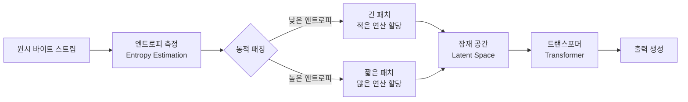

# Byte Latent Transformer: 토크나이저 없이 원시 바이트에서 학습하는 아키텍처

## 핵심 기여

**토크나이저를 완전히 제거**하고 원시 바이트(raw byte)에서 직접 학습하는 아키텍처를 제안한다. BLT(Byte Latent Transformer)는 엔트로피 기반 동적 패칭(dynamic patching)으로 바이트를 가변 길이 패치로 묶어, 토큰 기반 모델과 동등한 성능을 유지하면서 효율성과 견고성을 크게 개선한다.

핵심 성과:
- 토크나이저 기반 모델과 동등한 스케일링 성능
- 엔트로피 기반 동적 패칭으로 연산 효율 향상
- 추론 및 long-tail 일반화에서 질적 개선

## 문제 정의

기존 토크나이저(BPE, SentencePiece 등)의 한계:

| 문제 | 설명 |
|------|------|
| 어휘 편향 | 학습 코퍼스 빈도 기반으로 토큰이 결정되어 저빈도 언어/도메인에 불리 |
| 고정 세분도 | 모든 입력에 동일한 토큰 분할 적용, 복잡도 차이를 반영 못함 |
| 전처리 의존 | 토크나이저 변경 시 전체 재학습 필요 |
| 바이트 수준 취약성 | 오타, 노이즈, 유니코드 변형에 취약 |

## 방법론: 엔트로피 기반 동적 패칭

BLT의 핵심 아이디어는 **다음 바이트의 엔트로피**를 기준으로 바이트를 가변 길이 패치로 묶는 것이다. 예측 가능한(엔트로피가 낮은) 구간은 긴 패치로, 복잡한(엔트로피가 높은) 구간은 짧은 패치로 처리한다.

위 다이어그램은 바이트 스트림이 엔트로피 기반으로 패치로 묶이고, 잠재 공간에서 트랜스포머가 처리하는 흐름을 보여준다.

### 아키텍처 구성

BLT는 3개의 주요 컴포넌트로 구성된다:

1. **로컬 인코더(Local Encoder)**: 원시 바이트를 패치 표현으로 변환
2. **잠재 트랜스포머(Latent Transformer)**: 패치 수준에서 글로벌 어텐션 수행 (주요 연산)
3. **로컬 디코더(Local Decoder)**: 패치 표현을 다시 바이트 수준으로 복원

### 연산 효율의 원리

- 예측 가능한 텍스트("the cat sat on the"): 긴 패치로 묶여 적은 연산
- 복잡한 텍스트(전문 용어, 코드, 수식): 짧은 패치로 세밀한 연산
- 결과적으로 **동일 입력 길이에서 패치 수가 토큰 수보다 적어** 트랜스포머의 self-attention 비용 감소

## 실험 결과

| 측면 | 결과 |
|------|------|
| 스케일링 | 토큰 기반 모델과 동등한 성능-파라미터 스케일링 곡선 |
| 효율성 | 예측 가능한 구간에서 긴 패치 선택으로 FLOP 절감 |
| 견고성 | 오타, 유니코드 변형, 다국어 입력에서 토큰 기반 모델 대비 안정적 |
| long-tail 일반화 | 저빈도 단어/패턴에서 질적 개선 |
| 추론 | 논리 추론, 수학 문제에서 미세한 성능 향상 |

## 한계 및 향후 연구

- 긴 문서에서 패치 수가 여전히 많아 매우 긴 컨텍스트 처리는 과제로 남음
- 엔트로피 추정기 자체의 품질이 패칭 효율에 직접 영향
- 기존 토크나이저 기반 생태계(사전 학습 가중치, 벤치마크 등)와의 호환성 문제
- BoundlessBPE 등 하이브리드 접근과의 비교 연구 추가 필요

## 실무 관점

- **다국어/다도메인 모델**: 토크나이저의 언어 편향 문제를 근본적으로 해결하므로, 다국어 LLM 구축 시 참고할 만한 아키텍처
- **코드 모델**: 코드의 구조적 특성(반복적인 보일러플레이트 vs 복잡한 로직)에 동적 패칭이 특히 효과적일 수 있음
- **견고성 요구 환경**: 사용자 입력에 오타/노이즈가 많은 챗봇, OCR 후처리 등에서 토크나이저 없는 접근의 이점
- 아직 프로덕션 채택 사례는 제한적이며, 기존 토크나이저 기반 파이프라인과의 전환 비용 고려 필요

## 관련 문서

- [[attention-is-all-you-need-paper]] - 트랜스포머 원본 아키텍처
- [[scaling-laws-paper]] - 스케일링 법칙과의 관계
- [[efficient-attention-survey-paper]] - 어텐션 효율화 서베이
