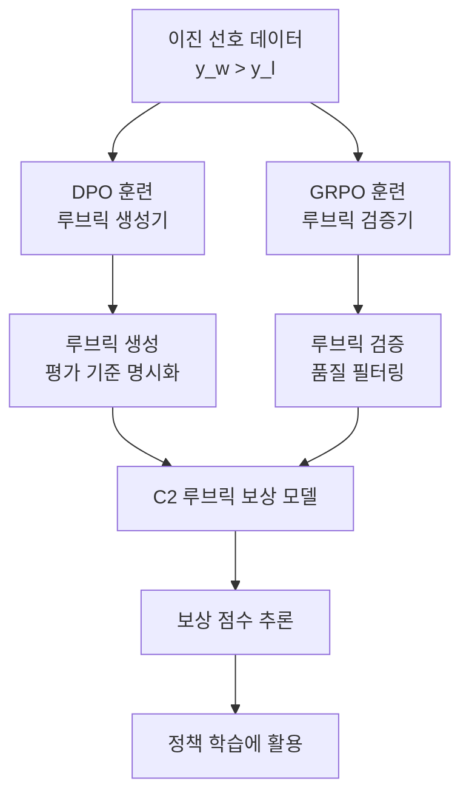

# C2: 이진 선호에서 루브릭 보강 보상 모델 확장

## 논문 메타데이터

| 항목 | 내용 |
|------|------|
| arXiv ID | 2604.13618 |
| 저자 | Akira Kawabata, Saku Sugawara |
| 연도 | 2026 |
| 분류 | cs.CL, cs.LG |

## 핵심 기여

이진 선호 레이블만으로 **협력적-비판적 (C2: Collaborative-Critical) 루브릭 생성기와 검증기** 를 훈련하는 프레임워크를 제안한다. 외부 루브릭 주석 없이도 보상 모델의 판단 품질을 향상시키는 것이 핵심이다. 생성기는 [[dpo-paper]] 로, 검증기는 [[grpo]] 로 각각 훈련하여 상호보완적으로 동작한다.

위 다이어그램은 C2 프레임워크의 전체 흐름이다. 이진 선호 데이터에서 출발하여 DPO와 GRPO 두 가지 훈련 방식으로 생성기와 검증기를 각각 학습하고, 이를 결합해 최종 보상 모델을 구성한다.

## 방법론

### 문제 정의

기존 보상 모델의 한계:

- 이진 레이블 ($y_w \succ y_l$) 만으로 학습 → 판단 기준이 불투명
- 루브릭(평가 기준표) 주석은 비용이 매우 큼
- 추론 모델 수준 보상 모델 (reasoning reward model) 은 GRPO로 훈련하지만 루브릭 부재 시 일관성 저하

### 루브릭 생성기 (Generator): DPO 훈련

[[dpo-paper]] 를 사용해 "이 선호 쌍에 적합한 루브릭을 생성하라"는 작업을 학습한다. 선택된 응답($y_w$)에 맞는 루브릭을 생성하면 양의 보상, 거부된 응답($y_l$)에 맞는 루브릭을 생성하면 음의 보상이 적용되는 구조다.

### 루브릭 검증기 (Verifier): GRPO 훈련

[[grpo]] 를 사용해 생성된 루브릭의 품질을 평가하는 검증기를 훈련한다. 검증기는 생성기가 만든 루브릭이 실제 선호 데이터와 일치하는지를 이진 분류로 판단하며, GRPO의 그룹 상대 보상 구조가 검증기의 비교 능력을 강화한다.

### C2 결합 방식

생성기가 제안한 루브릭을 검증기가 필터링하는 협력-비판 구조:

$$\text{Score}(y|x) = \text{Verifier}(\text{Generator}(x, y), y_w, y_l)$$

## 실험 결과

| 벤치마크 | 기준 보상 모델 | C2 (루브릭 없음) | 성능 향상 |
|---------|--------------|-----------------|---------|
| RewardBench (chat) | 표준 | 우수 | +유의미 |
| RewardBench (reasoning) | GRPO 추론 보상 모델 | 능가 | +유의미 |
| 4개 선호 벤치마크 평균 | GRPO 추론 보상 모델 | 능가 | +유의미 |

외부 루브릭 주석 없이 GRPO 훈련 추론 보상 모델을 4개 선호 벤치마크 전체에서 능가했다.

## 한계

- 루브릭 생성기와 검증기 모두 훈련해야 해 파이프라인 복잡도 증가
- 이진 선호 데이터의 품질에 성능이 의존적
- 개선 폭의 정확한 수치가 공개 논문에서 제한적으로 보고됨

## 실무 관점

루브릭 주석 없이 보상 모델을 개선하고 싶은 경우, DPO와 GRPO를 이미 인프라로 보유한 팀이라면 추가 비용 없이 C2 파이프라인을 구성할 수 있다. 특히 추론 중심 작업 (코딩, 수학) 에서의 보상 모델 품질 향상에 효과적이다.

## 관련 문서

- [[dpo-paper]] - DPO(Direct Preference Optimization) 원논문
- [[grpo]] - GRPO 훈련 기법
- [[rlhf]] - RLHF 전체 개요
- [[rlhf-statistical-perspective]] - RLHF 통계적 분석 서베이
- [[reward-hacking-sign-robustness]] - 보상 해킹 완화 기법
