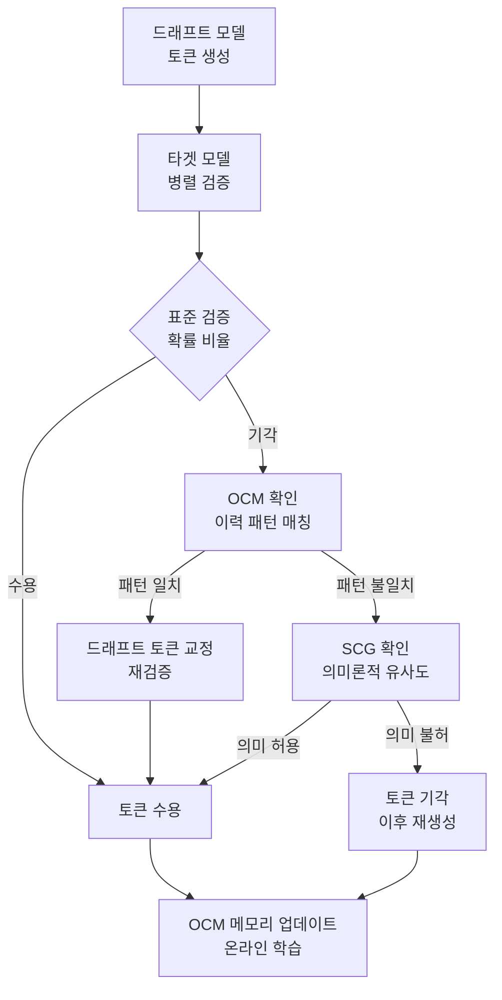

# CSD: 보정된 스펙큘러티브 디코딩

## 개요

CSD(Calibrated Speculative Decoding)는 기존 스펙큘러티브 디코딩(speculative decoding)의 검증 단계에서 버려지는 유효 토큰을 회수하는 훈련 불필요(training-free) 프레임워크다. 두 핵심 모듈 - 온라인 교정 메모리(Online Correction Memory)와 의미론적 일관성 게이팅(Semantic Consistency Gating) - 을 조합해 최대 2.33배의 처리량을 달성한다.

## 배경: 스펙큘러티브 디코딩의 문제점

스펙큘러티브 디코딩은 소형 드래프트 모델(draft model)이 여러 토큰을 미리 생성하고, 대형 타겟 모델(target model)이 이를 병렬로 검증하는 방식으로 추론 속도를 높인다. 검증 과정에서 드래프트 토큰이 타겟 모델의 분포와 다르면 해당 토큰부터 이후 토큰은 모두 버려진다.

**문제**: 이 표준 검증 방식은 너무 엄격하다. 드래프트 모델이 생성한 토큰이 타겟 모델의 "최선" 토큰은 아니더라도 의미론적으로 동등하거나(예: "빠른" vs "신속한") 맥락상 허용 가능한 경우에도 일률적으로 기각한다. 즉, **유효하지만 확률 비율(probability ratio)이 임계값 미만인 토큰들이 낭비된다.**

## CSD의 두 핵심 모듈

### 1. 온라인 교정 메모리 (Online Correction Memory, OCM)

OCM은 런타임 중에 누적된 기각 이력(rejection history)을 학습한다. 구체적으로:

- 기각된 드래프트 토큰과 대응하는 타겟 토큰 쌍을 저장
- 특정 문맥에서 반복적으로 나타나는 **발산 패턴(divergence pattern)** 을 식별
- 동일 패턴이 재등장하면 드래프트 토큰을 사전에 교정(pre-correct)해 기각 확률을 낮춤

OCM은 별도 훈련 없이 디코딩이 진행되는 동안 온라인으로 업데이트된다. 따라서 모델 변경이나 파인튜닝 없이 임의의 드래프트-타겟 쌍에 바로 적용할 수 있다.

### 2. 의미론적 일관성 게이팅 (Semantic Consistency Gating, SCG)

SCG는 검증 기준을 "정확한 토큰 일치"에서 "의미론적 허용 가능성"으로 완화한다:

- 기존 검증: 드래프트 토큰 확률 / 타겟 토큰 확률 비율이 임계값 미만이면 기각
- SCG: 확률 비율 대신 **임베딩 공간에서의 의미론적 유사도** 를 추가 기준으로 사용
- 드래프트 토큰이 기각 대상이더라도 의미론적으로 타겟 분포 내에 있다고 판단되면 조건부 수용

이 두 모듈은 독립적으로도 적용 가능하지만 결합 시 상호 보완 효과가 극대화된다.

위 파이프라인은 표준 검증에서 기각된 토큰이 OCM과 SCG를 통해 재평가되는 과정을 보여준다. 수용/기각 결과는 OCM 메모리에 피드백된다.

## 성능 비교

| 방법 | 훈련 필요 | 최대 처리량 향상 | 특징 |
|------|----------|----------------|------|
| 표준 SD | 없음 | ~1.5-2x | 기준선 |
| EAGLE | 필요 | ~2.5-3x | 드래프트 모델 파인튜닝 필요 |
| Medusa | 필요 | ~2-2.5x | 다중 헤드 병렬 드래프팅 |
| **CSD** | **없음** | **~2.33x** | 훈련 없이 EAGLE급 성능 근접 |

CSD는 훈련 불필요 방법 중에서 최고 수준의 성능을 보이며, 훈련 기반 방법인 EAGLE에 가까운 처리량을 달성한다.

## 왜 중요한가

**실무 관점에서 가장 큰 가치는 도입 장벽의 제거다.** EAGLE, Medusa 같은 고성능 방법들은 드래프트 모델을 별도로 파인튜닝해야 하므로:
- 타겟 모델이 변경될 때마다 재훈련 필요
- 독점 API 모델(closed-source)에 적용 불가
- 훈련 데이터, 컴퓨팅 자원, 검증 과정 필요

CSD는 이런 제약 없이 임의의 드래프트-타겟 쌍에 플러그인처럼 적용할 수 있다.

## 한계 및 미해결 문제

- **메모리 비용**: OCM이 기각 이력을 축적하므로 장기 생성 세션에서 메모리 사용량이 증가
- **콜드 스타트**: 세션 초기에는 OCM 이력이 부족해 효과가 제한적
- **SCG 임계값 민감성**: 의미론적 허용 기준이 너무 넓으면 생성 품질 저하 위험
- **도메인 특이성**: OCM이 학습한 발산 패턴은 특정 도메인/스타일에 편향될 수 있음

## 핵심 기여 요약

1. 표준 스펙큘러티브 디코딩의 과도한 기각 문제를 명확히 진단
2. 훈련 없이 런타임 이력 기반 교정을 수행하는 OCM 모듈 제시
3. 확률 비율 대신 의미론적 유사도를 검증 기준에 통합하는 SCG 제안
4. 훈련 불필요 방법 중 최고 수준인 2.33x 처리량 달성

## 관련 문서

- [[스펙큘러티브 디코딩]] - 드래프트-타겟 모델 기반 추론 가속 기법 개요
- [[EAGLE-3]] - 드래프트 모델 파인튜닝 기반 고성능 스펙큘러티브 디코딩
- [[미러 스펙큘러티브 디코딩]] - 또 다른 변형 스펙큘러티브 디코딩 접근법
- [[추론 최적화]] - KV 캐시, 양자화 등 LLM 서빙 최적화 기법 모음
