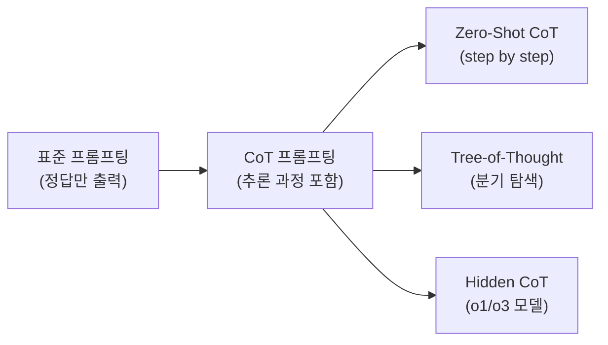

# Chain-of-Thought Prompting Elicits Reasoning in LLMs (Wei et al., 2022)

## 핵심 기여

Google Research의 Jason Wei 등이 2022년 발표한 이 논문은 **중간 추론 단계(intermediate reasoning steps)를 프롬프트에 포함**시키면 대형 언어 모델의 산술, 상식, 기호 추론 능력이 크게 향상됨을 체계적으로 실증했다. "Let's think step by step"이라는 간단한 문구가 복잡한 추론 성능을 극적으로 올린다는 사실을 보여주었으며, 이는 오늘날 CoT(Chain-of-Thought), o1, o3 등 추론 모델의 이론적 기반이 되었다.

## 방법

### Few-Shot CoT

퓨샷 예시 각각에 최종 답이 아닌 단계별 추론 과정을 함께 제공:

```
Q: 존은 사과 5개를 갖고 있다. 3개를 더 샀다. 총 몇 개인가?
A: 존은 처음에 5개를 갖고 있었다. 3개를 더 샀으므로 5 + 3 = 8개다. 답: 8
```

모델이 이 패턴을 모방해 새 문제에서도 추론 과정을 생성하게 됨.

### Zero-Shot CoT

Kojima et al. (2022)가 제안한 변형: 퓨샷 예시 없이 "Let's think step by step"이라는 한 문장만 추가해도 유사 효과.

### 평가 태스크

- **산술 추론(arithmetic reasoning)**: GSM8K, MAWPS, ASDiv 등
- **상식 추론(commonsense reasoning)**: CommonsenseQA, StrategyQA
- **기호 추론(symbolic reasoning)**: Last Letter Concatenation, Coin Flip

## 결과 및 영향

- GSM8K(초등 수학 문제) 기준: GPT-3(175B)가 표준 퓨샷에서 17.9% -> CoT 퓨샷에서 56.9%
- **창발적 능력(emergent ability)**: 충분히 큰 모델(~100B 이상)에서만 CoT 효과가 뚜렷하게 나타남. 소형 모델에서는 오히려 역효과 발생
- 이후 Tree-of-Thought(ToT), Least-to-Most Prompting, Program-of-Thought 등 수많은 변형 연구 촉발
- OpenAI o1/o3의 내재화된 CoT(hidden chain-of-thought)로 발전



## 한계

- CoT가 항상 정확한 추론을 보장하지 않음 - 그럴듯하게 틀린 추론 경로 생성 가능
- 소형 모델(<10B)에서 효과 미미하거나 역효과 (환각된 중간 단계가 오답 유발)
- 수동으로 CoT 예시를 작성해야 하는 비용 (자동화 연구는 이후 등장)
- 수학 전문 영역을 넘어서는 복잡한 도메인에서의 효과는 제한적

## 실무 적용 관점

- 복잡한 추론 태스크 프롬프팅 시 "단계별로 생각해라"는 지시를 반드시 포함
- 소형 모델(7B 미만)에서는 CoT보다 Retrieval 증강이 더 효과적인 경우가 많음
- 코딩, 수학, 멀티스텝 계획 태스크에서 CoT 효과가 가장 두드러짐
- 테스트 타임 컴퓨트(test-time compute)를 늘리는 것이 파라미터를 늘리는 것만큼 효과적이라는 패러다임 전환의 기반

## 관련 문서

- [[OpenAI o1 System Card (추론 모델)]]
- [[scaling-laws]]
- [[emergent-abilities]]
- [[test-time-compute]]
- [[chain-of-thought]]
