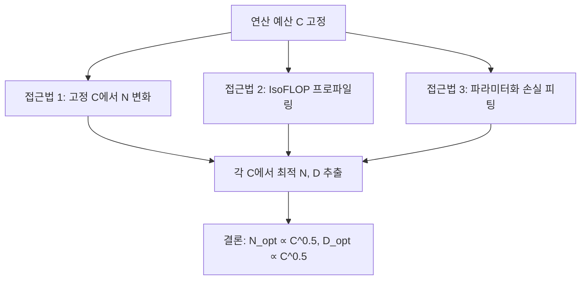
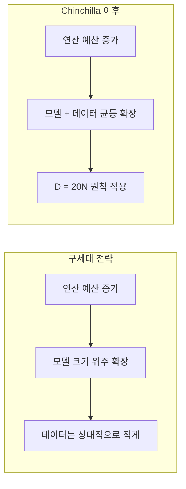

# Chinchilla: Training Compute-Optimal Large Language Models (Hoffmann et al., 2022)

## 핵심 기여

DeepMind의 Jordan Hoffmann 등이 2022년 발표한 이 논문은 [[scaling-laws]] 분야의 결정적 전환점이다. Kaplan et al.(2020)이 "동일 연산 예산에서 파라미터를 키우는 게 우선"이라고 주장한 것과 달리, Chinchilla는 **모델 크기(N)와 학습 데이터(D)를 동등하게 확장해야 한다**는 수정된 법칙을 제안했다. 핵심 결론은 **최적 토큰 수 D = 20N**으로, 70B 파라미터 모델은 1.4조 토큰으로 학습해야 [[compute-optimal-training]] 조건을 만족한다는 것이다.

이 논문은 기존의 Gopher(280B), GPT-3(175B) 등이 심각하게 데이터 부족 상태로 훈련됐음을 지적하며, 더 작지만 더 많은 데이터로 학습한 Chinchilla(70B)가 Gopher를 모든 벤치마크에서 앞선다는 것을 보여줬다.

## 방법

### 세 가지 접근법으로 최적 비율 추정

논문은 동일한 결론을 세 가지 독립적 방법으로 검증했다.

### 최적 스케일링 법칙 수식

주어진 연산 예산 $C$ (FLOPs)에서 최적 모델 크기 $N_{opt}$와 데이터 크기 $D_{opt}$:

$$N_{opt} \propto C^{0.5}, \quad D_{opt} \propto C^{0.5}$$

즉, 연산 예산이 2배 늘면 모델 크기와 데이터 크기를 각각 $\sqrt{2}$배씩 늘려야 한다. Kaplan et al.의 $N \propto C^{0.73}$과 비교할 때 데이터의 비중이 훨씬 크게 보정됐다.

### 실험 규모

- 70개 이상의 모델, 파라미터 수 70M~16B
- 5B~500B 토큰 범위에서 훈련
- 총 수백 회의 실험 런을 통해 손실 곡선 피팅

## 결과

### 벤치마크 성능

Chinchilla(70B, 1.4T 토큰)는 Gopher(280B, 300B 토큰)보다 연산 비용이 4배 작음에도:

| 벤치마크 | Chinchilla | Gopher |
|----------|-----------|--------|
| MMLU | 67.6% | 60.0% |
| BIG-bench 평균 | Chinchilla 우세 | - |
| Pile 언어 모델링 | 더 낮은 perplexity | - |

추론(inference) 비용도 Gopher 대비 4배 절감 - 실무에서 특히 중요한 발견이다.

### 데이터 효율성 역전

"모델을 무조건 키우면 성능이 오른다"는 기존 통념을 뒤집었다. 동일 컴퓨팅으로 더 작고 잘 학습된 모델이 더 크지만 덜 학습된 모델을 이긴다.

## 한계

- **데이터 가용성 가정**: 고품질 텍스트 데이터가 무한히 확장 가능하다고 전제하지만, 현실에서는 인터넷 텍스트가 유한하며 품질 필터링 후 수조 토큰이 한계에 가깝다는 주장도 존재한다.
- **반복 학습(multi-epoch) 미검토**: D = 20N은 단일 에포크 기준이다. 데이터를 반복 사용할 때의 최적 비율은 별도 연구가 필요하다.
- **아키텍처 종속성**: Decoder-only Transformer 기준이므로 다른 아키텍처에 직접 적용하기 어렵다.
- **하드웨어 효율 미반영**: 학습 속도(throughput) 차이, 배치 크기 최적화 등 실제 비용 요소가 FLOPs 계산에 완전히 포착되지 않는다.

## 실무 관점

Chinchilla 법칙 발표 이후 업계 전반의 훈련 전략이 바뀌었다.

- **Llama 시리즈**: Meta는 Chinchilla 법칙을 의도적으로 초과 적용해 추론 비용 최소화를 우선시했다 - Llama 1은 7B 모델에 1T 토큰, Chinchilla 최적보다 훨씬 많은 데이터를 사용했다.
- **오픈소스 관점**: 추론을 수억 번 이상 실행하는 서비스에서는 학습 비용보다 추론 비용이 지배적이므로, "Chinchilla 초과" 학습(더 작은 모델에 더 많은 데이터)이 경제적으로 합리적이다.
- **데이터 품질 전환**: 토큰 수보다 데이터 품질이 중요해지면서 큐레이션, 필터링, 합성 데이터 전략이 주목받게 됐다.

Chinchilla 논문은 단순한 스케일링 법칙 수정을 넘어, **무엇을 최적화해야 하는가**라는 질문을 업계가 다시 생각하게 만든 계기가 됐다.

## 관련 문서

- [[scaling-laws]] - Kaplan et al.의 원조 스케일링 법칙, Chinchilla가 수정한 대상
- [[compute-optimal-training]] - 컴퓨팅 최적 훈련 전략 개요
- [[llama3-paper]] - Chinchilla 법칙을 의도적으로 초과 적용한 대표적 사례
- [[deepseek-v3-paper]] - 효율적 학습 설계에서 Chinchilla 인사이트를 계승
