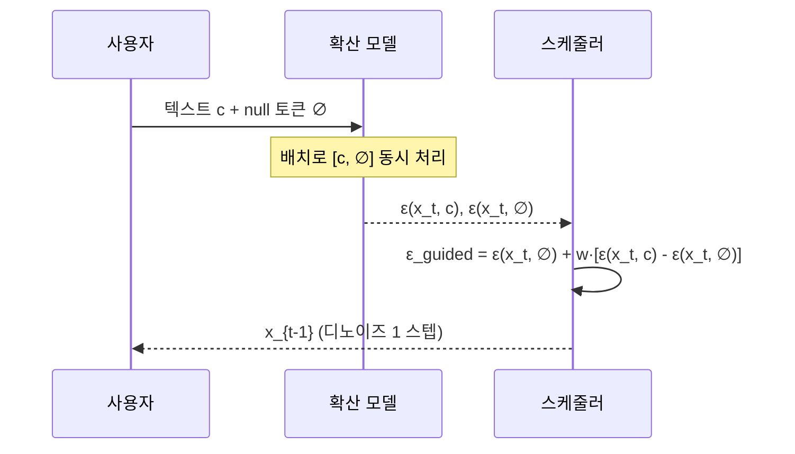
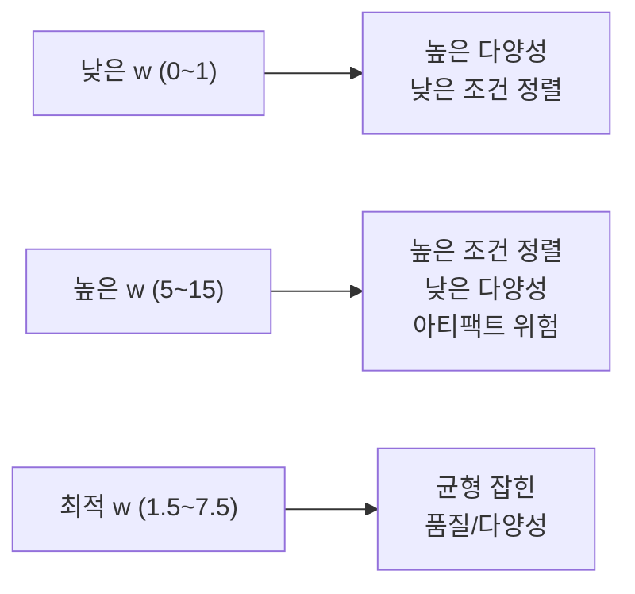

# Classifier-Free Guidance (분류기 없는 안내)

## 논문 메타데이터

| 항목 | 내용 |
|------|------|
| 제목 | Classifier-Free Diffusion Guidance |
| 저자 | Jonathan Ho, Tim Salimans |
| 소속 | Google Brain |
| 발표 | NeurIPS 2021 Workshop (Deep Generative Models and Downstream Applications) |
| arXiv | [2207.12598](https://arxiv.org/abs/2207.12598) |
| 공개 | 2022년 7월 (워크숍 2021, arXiv 확장판 2022) |

## 한 줄 요약

별도의 분류기(classifier) 모델 없이 **조건부 생성과 비조건부 생성을 하나의 모델로 학습**하고, 추론 시 두 예측을 결합해 조건 정렬과 다양성을 자유롭게 조절하는 기법. Stable Diffusion의 핵심 구성 요소다.

---

## 핵심 기여

1. **분류기-안내(classifier guidance)의 한계 극복**: 기존 분류기 안내는 별도 학습된 노이즈-인식 분류기가 필요. 이를 제거하면서 같거나 더 나은 품질 달성
2. **단일 모델 이중 역할**: 하나의 확산 모델이 조건부($\epsilon_\theta(\mathbf{x}_t, c)$)와 비조건부($\epsilon_\theta(\mathbf{x}_t, \varnothing)$) 예측을 모두 수행
3. **가이던스 스케일(guidance scale, $w$)**: 단일 하이퍼파라미터로 조건 강도 연속 조절. $w=1$은 표준 조건부, $w>1$은 조건 강화, $w=0$은 비조건부
4. **범용성**: 클래스 레이블, 텍스트 임베딩, 이미지 임베딩 등 어떤 조건 신호에도 적용 가능

---

## 배경: 분류기 안내의 문제

### 기존 Classifier Guidance (Dhariwal & Nichol, 2021)

ADM(Ablated Diffusion Model) 논문에서 제안. 기울기를 이용해 생성을 특정 클래스 방향으로 유도:

$$\hat{\epsilon} = \epsilon_\theta(\mathbf{x}_t, t) - \sqrt{1 - \alpha_t}\,w\,\nabla_{\mathbf{x}_t}\log p_\phi(c | \mathbf{x}_t)$$

여기서 $p_\phi(c | \mathbf{x}_t)$는 노이즈 이미지에 대해 학습된 별도 분류기.

**문제점**:
- 메인 생성 모델과 별도로 **분류기를 노이즈 데이터로 학습**해야 함 (추가 자원 필요)
- 텍스트 임베딩 같은 연속 조건에 기울기 안내 적용 어려움
- 배포 시 분류기 모델도 함께 서빙해야 함 (인프라 복잡도)

---

## 방법론

### 학습: 무작위 조건 제거 (Null-conditioning Dropout)

학습 중 일정 확률 $p_\text{uncond}$(논문에서는 10~20%)로 조건 벡터 $c$를 무조건부 토큰 $\varnothing$으로 대체:

$$\text{학습 시}: \quad \begin{cases} \epsilon_\theta(\mathbf{x}_t, c) & \text{확률 } 1 - p_\text{uncond} \\ \epsilon_\theta(\mathbf{x}_t, \varnothing) & \text{확률 } p_\text{uncond} \end{cases}$$

이렇게 하면 모델이 두 모드를 모두 학습하며, $\varnothing$는 빈 텍스트 `""` 또는 특수 null 임베딩으로 구현된다.

### 추론: 가이던스 스케일 결합

$$\hat{\epsilon}_\theta(\mathbf{x}_t, c) = \epsilon_\theta(\mathbf{x}_t, \varnothing) + w \cdot \bigl[\epsilon_\theta(\mathbf{x}_t, c) - \epsilon_\theta(\mathbf{x}_t, \varnothing)\bigr]$$

이를 정리하면:

$$\hat{\epsilon}_\theta(\mathbf{x}_t, c) = (1 - w)\,\epsilon_\theta(\mathbf{x}_t, \varnothing) + w\,\epsilon_\theta(\mathbf{x}_t, c)$$

**가이던스 스케일 $w$ 효과**:

| $w$ 값 | 의미 |
|--------|------|
| 0 | 비조건부 생성 (조건 무시) |
| 1 | 표준 조건부 생성 |
| 1.5~7.5 | 조건 강화, 다양성 감소 (일반적 사용 범위) |
| 10+ | 극단적 조건 강화, 아티팩트 가능 |

### 추론 시 순방향 패스 구조



추론 시 매 스텝마다 조건부·비조건부 두 번의 순전파가 필요하므로 계산량이 2배가 된다 (CUDA 배치로 병렬 처리 가능).

---

## 실험 및 결과

### 클래스 조건부 ImageNet 256x256

| 방법 | FID↓ | IS↑ | Precision↑ | Recall↑ |
|------|------|-----|-----------|---------|
| Classifier Guidance (w=1.0) | 10.94 | 158.5 | 0.65 | 0.69 |
| CFG (w=3.0) | **4.59** | 186.7 | **0.82** | 0.52 |
| CFG (w=7.5) | 7.23 | **213.0** | 0.84 | 0.40 |

CFG는 낮은 FID와 높은 IS를 동시에 달성하면서 분류기 의존성을 제거.

### 텍스트 조건부 생성 (64x64)

COCO 캡션 기반 텍스트-이미지 실험:
- $w = 1$: FID 9.64, CLIP 점수 0.28
- $w = 4$: FID 14.2, CLIP 점수 0.31 (CLIP 정렬 향상, 다양성 희생)

이 트레이드오프가 Precision-Recall 트레이드오프의 연속 조절 레버로 동작함을 보인다.

---

## 이론적 해석

### 암묵적 분류기 관점

CFG 결합 수식을 역으로 해석하면:

$$\hat{\epsilon}_\theta(\mathbf{x}_t, c) = \epsilon_\theta(\mathbf{x}_t, c) + w \cdot [\epsilon_\theta(\mathbf{x}_t, c) - \epsilon_\theta(\mathbf{x}_t, \varnothing)]$$

이는 **암묵적 분류기** $p(\mathbf{x}_t | c) / p(\mathbf{x}_t)$의 기울기를 근사하는 것과 수학적으로 동등하다. 즉, 별도 분류기 없이도 분류기 안내와 동일한 효과를 얻는 셈이다.

### 정보 이론적 관점

CFG는 스코어 함수(score function)를 조건 정보 방향으로 강조(amplification)한다:

$$\nabla_{\mathbf{x}_t}\log p(\mathbf{x}_t | c) = \nabla_{\mathbf{x}_t}\log p(\mathbf{x}_t) + w \cdot \nabla_{\mathbf{x}_t}\log p(c | \mathbf{x}_t)$$

$w > 1$이면 조건부 기울기가 과강조(over-amplification)되어 샘플이 조건에 더 딱 들어맞는 전형적인(typicality) 방향으로 이동한다.

---

## 한계 및 트레이드오프

### 품질-다양성 트레이드오프



### 계산 비용 2배

매 스텝마다 조건부 + 비조건부 두 번 순전파 필요. 실제로는 배치 크기를 2로 설정해 병렬 처리하지만 메모리 사용량도 2배.

**완화 방법**:
- **PAG (Perturbed Attention Guidance)**: CFG 비조건부 패스를 attention 교란으로 대체
- **LCM-LoRA**: 일관성 증류로 2배 비용 자체를 회피 (1-4 스텝)
- **SDXL-Turbo / ADD**: 적대적 증류로 단일 스텝

### 높은 $w$에서의 아티팩트

가이던스 스케일 > 10에서 이미지 포화(saturation), 비현실적 엣지, 번짐 현상.

**완화 방법**:
- Rescaled CFG (Lin et al., 2023): 방향은 유지하면서 스케일 재조정
- Self-Attention Guidance: 가이던스를 주의 맵 수준에서 적용

---

## Stable Diffusion에서의 CFG 구현

[[stable-diffusion]]은 CFG를 기본 조건 메커니즘으로 채택. 텍스트 임베딩을 조건 $c$로, 빈 프롬프트 임베딩을 $\varnothing$으로 사용:

```python
from diffusers import StableDiffusionPipeline

pipe = StableDiffusionPipeline.from_pretrained("runwayml/stable-diffusion-v1-5")

# guidance_scale = w (CFG 가이던스 스케일)
# SD 권장 범위: 7-12
image = pipe(
    prompt="a highly detailed oil painting of a mountain",
    negative_prompt="blurry, low quality, cartoonish",  # null 조건 강화
    guidance_scale=7.5,
    num_inference_steps=50,
).images[0]
```

`negative_prompt`는 $\varnothing$ 자리에 실제 부정적 설명을 넣어 회피하고 싶은 방향을 지정하는 확장 기법이다 (Negative Prompt Guidance).

### Negative Prompt 원리

```
표준 CFG:
  ε_guided = ε(x_t, ∅) + w·[ε(x_t, c_pos) - ε(x_t, ∅)]

Negative Prompt CFG:
  ε_guided = ε(x_t, c_neg) + w·[ε(x_t, c_pos) - ε(x_t, c_neg)]
```

부정 프롬프트 방향으로부터 멀어지는 효과를 준다.

---

## 후속 연구 연결

| 후속 연구 | CFG와의 관계 |
|-----------|-------------|
| DALL-E 2 (Ramesh et al., 2022) | CFG + CLIP 임베딩으로 텍스트-이미지 생성 |
| Imagen (Google, 2022) | CFG + T5 텍스트 인코더로 초고해상도 텍스트-이미지 |
| Stable Diffusion (Rombach et al., 2022) | 잠재 공간 CFG |
| ControlNet (Zhang et al., 2023) | CFG 위에 공간적 조건 추가 |
| LCM (Luo et al., 2023) | CFG 모델을 증류해 1-4 스텝으로 단축 |

---

## 실무 적용 관점

### 가이던스 스케일 선택 지침

- **사진 사실주의**: $w = 7.5 \sim 12$
- **일러스트/아트**: $w = 5 \sim 8$
- **탐색/프로토타이핑**: $w = 3 \sim 5$ (다양성 확보)
- **정밀 제어 필요**: $w = 10 \sim 15$ (아티팩트 주의)

### 배포 최적화

CFG의 2배 계산량은 A100에서 SDXL 1024px 기준 약 4초에서 2배로 늘어남. 다음 최적화 고려:

1. **xFormers / FlashAttention**: 주의 연산 최적화로 단위 시간 단축
2. **배치 처리**: 조건부+비조건부를 배치 크기 2로 처리 (GPU 활용률 향상)
3. **fp16/bf16**: 혼합 정밀도로 메모리 절반

---

## 관련 문서

- [[ddpm-original-paper]] - CFG가 적용되는 기반 확산 모델
- [[diffusion-models]] - 확산 모델 개념 전반
- [[stable-diffusion]] - CFG를 실제 활용하는 대표 모델
- [[ddim-paper]] - 빠른 샘플링 (CFG와 조합 가능)
- [[lcm-latent-consistency-paper]] - CFG 모델을 증류한 빠른 생성
- [[controlnet-conditioning]] - CFG 위에 공간적 조건 추가
