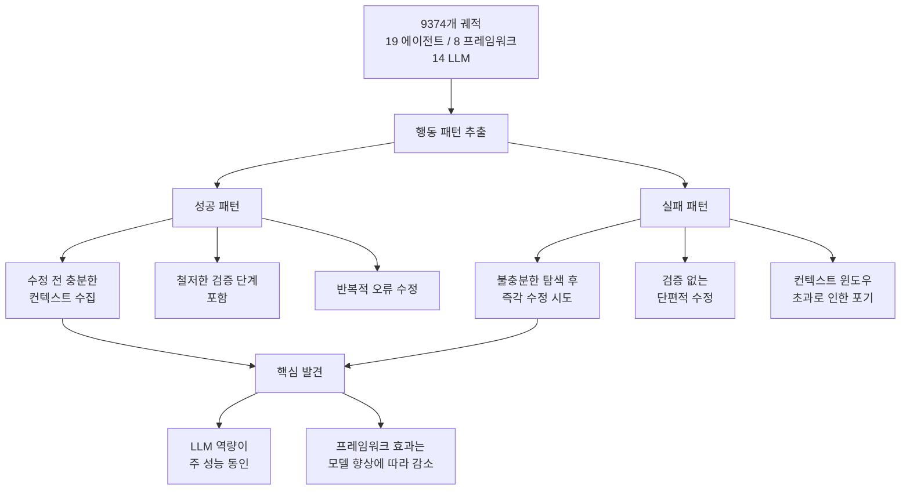

# 코딩 에이전트 성공·실패의 행동 드라이버 분석

## 논문 메타데이터

| 항목 | 내용 |
|------|------|
| arXiv ID | 2604.02547 |
| 저자 | Tural Mehtiyev, Wesley Assunção |
| 연도 | 2026 |
| 분류 | cs.SE, cs.AI |

## 핵심 기여

[[swe-bench-pro]] Verified 500개 태스크에서 19개 에이전트, 8개 프레임워크, 14개 LLM의 **9,374개 궤적** 을 분석하여 코딩 에이전트의 성공과 실패를 결정하는 행동 패턴을 체계적으로 밝힌다. 단순 해결률(resolve rate) 너머의 **왜 실패하는가** 를 탐구한 최대 규모의 에이전트 행동 분석 연구다.

## 방법론

### 데이터셋

- **벤치마크**: [[swe-bench-pro]] Verified (500개 GitHub 이슈 해결 태스크)
- **수집 규모**: 9,374개 에이전트 실행 궤적
- **에이전트 다양성**: 19개 에이전트 시스템 (SWE-agent, Agentless, AutoCodeRover 등)
- **프레임워크**: 8개 에이전트 프레임워크
- **LLM**: 14개 모델 (GPT-4o, Claude 3.x, Llama 3.x 등)

### 분석 방법

궤적을 행동 시퀀스로 파싱하여 다음 차원을 분석한다:

1. **컨텍스트 수집 행동**: 수정 전 코드 탐색 횟수 및 깊이
2. **검증 행동**: 패치 적용 후 테스트/검증 여부
3. **반복 수정 패턴**: 오류 발생 시 재시도 전략
4. **컨텍스트 관리**: 긴 궤적에서의 컨텍스트 활용

### [[claude-code]] 관련성

분석 대상에 Claude 기반 에이전트가 포함되어 있으며, [[claude-code]] 의 코딩 에이전트 패턴(컨텍스트 수집 후 수정)이 성공 패턴과 일치함이 확인됐다.

## 실험 결과

### 성공 패턴 발견

| 행동 패턴 | 성공과의 상관관계 |
|-----------|-----------------|
| 수정 전 관련 파일 3개 이상 탐색 | 강한 양의 상관 |
| 패치 적용 후 테스트 실행 | 강한 양의 상관 |
| 반복적 오류 수정 (최대 3회) | 중간 양의 상관 |
| 즉각 수정 시도 (탐색 생략) | 강한 음의 상관 |

### LLM vs 프레임워크 효과

> "LLM capability is the primary performance driver, and the role of framework design decreases as model capability improves."

모델 역량이 낮을 때는 프레임워크 설계(툴 제공 방식, 프롬프트 구조)가 큰 차이를 만들지만, 모델이 충분히 강력해지면 프레임워크 차이가 희석된다.

### 해결률 통계

- 최고 성능 에이전트: 약 50% 해결률 (SWE-bench Verified 기준)
- LLM 교체만으로도 같은 프레임워크에서 10-20%p 차이 발생
- 프레임워크 교체로 같은 LLM에서 최대 5-8%p 차이 발생

## 한계

- SWE-bench에 특화된 분석으로 다른 도메인(웹 에이전트, 데이터 분석 등)으로 일반화 제한
- 궤적 수집 시점이 모델/에이전트 버전에 종속
- 성공/실패 원인의 인과관계보다 상관관계에 가까운 분석

## 실무 관점

코딩 에이전트를 직접 개발하거나 평가하는 팀에 두 가지 명확한 지침을 제공한다:

1. **설계 원칙**: 수정 전 컨텍스트 수집을 강제하고, 수정 후 검증 단계를 의무화하라
2. **투자 우선순위**: 프레임워크 최적화보다 더 강력한 LLM 업그레이드가 해결률에 더 큰 효과

에이전트 계획 보상 모델 평가인 [[plan-reward-bench]] 와 함께 읽으면 에이전트 평가 방법론 전반을 이해하는 데 유용하다.

## 관련 문서

- [[swe-bench-pro]] - SWE-bench 벤치마크 상세
- [[claude-code]] - Claude Code 에이전트 엔티티 페이지
- [[plan-reward-bench]] - 에이전트 계획 보상 모델 벤치마크
- [[multi-agent-orchestration]] - 멀티에이전트 오케스트레이션
- [[consensus-trap-multiagent]] - 다중 에이전트 협력 문제
