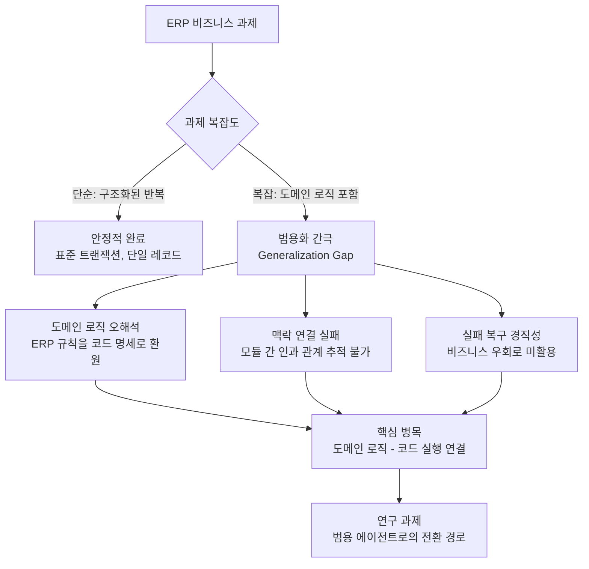

# 코딩 에이전트는 범용 에이전트가 될 수 있는가?

## 개요

Agentic Labs의 연구로, 코딩 에이전트를 소프트웨어 개발 이외의 도메인 - 특히 ERP(Enterprise Resource Planning, 전사적 자원 관리) 비즈니스 프로세스 자동화 - 에 적용했을 때의 성능을 체계적으로 평가한다. 핵심 발견: **"단순 과제는 안정적으로 완료하지만, 복잡한 과제에서는 특징적 실패 패턴을 보인다."** 이 연구는 코딩 에이전트의 범용화 가능성과 그 병목 지점을 명확히 진단한다.

## 연구 동기: 왜 ERP인가

코딩 에이전트(coding agent)는 SWE-Bench 등의 벤치마크에서 인상적인 성능을 보이며 소프트웨어 엔지니어링 자동화의 표준 도구로 자리 잡았다. 그러나 코드 작성 능력이 곧 범용 자동화 능력을 의미하는가?

ERP 시스템은 이 질문에 대한 이상적인 테스트베드다:

- **도메인 로직의 복잡성**: ERP는 재무, 공급망, 인사, 생산 등 복잡한 비즈니스 규칙이 얽혀 있다
- **실제 기업 업무**: 시뮬레이션이 아닌 실제 비즈니스 워크플로우
- **코드 + 도메인 지식의 교차점**: 시스템을 조작하려면 코딩 능력뿐 아니라 ERP 도메인 지식이 필요

코딩 에이전트가 "코드로 ERP를 다루는 에이전트"로 동작할 수 있다면, 범용 비즈니스 자동화에 한 발 더 다가선 것이다.

## 핵심 발견: 범용화 간극 (Generalization Gap)

### 단순 과제에서의 성공

표준화된 데이터 입력, 단일 레코드 조회, 정해진 흐름의 트랜잭션 실행 등 **구조화된 단순 반복 작업**에서는 코딩 에이전트가 안정적으로 과제를 완료했다. 이런 과제는 소프트웨어 테스트나 스크립트 작성과 구조적으로 유사하기 때문이다.

### 복잡 과제에서의 특징적 실패

복잡한 과제에서는 다음과 같은 일관된 실패 패턴이 관찰되었다:

1. **도메인 로직 오해석**: ERP의 비즈니스 규칙을 코드 명세처럼 읽으려 한다. "발주 승인 워크플로우"를 "함수 호출 시퀀스"로 환원하는 시도.

2. **컨텍스트 연결 실패**: ERP 과제는 여러 모듈(재무-구매-재고)이 연결된 맥락을 이해해야 한다. 에이전트는 각 단계는 수행하지만 **모듈 간 인과 관계를 추적하지 못한다.**

3. **실패 복구의 경직성**: 코딩 에이전트는 실패 시 "코드를 고치는" 방식으로 대응한다. 비즈니스 프로세스에서는 "프로세스 우회" 또는 "담당자 에스컬레이션"이 적절한 복구 방법인 경우가 많은데, 에이전트는 이런 옵션을 활용하지 못한다.



### 병목 지점의 본질: 도메인 로직 - 코드 실행 연결

연구가 진단하는 핵심 병목은 **"도메인 로직(domain logic)과 코드 실행(code execution) 사이의 연결 부재"** 다.

코딩 에이전트는 코드 세계에서 뛰어나다: 스펙이 주어지면 코드로 구현하고, 오류 메시지를 보면 코드를 수정한다. 그러나 ERP 비즈니스 과제는 다음과 같은 변환 체인을 요구한다:

```
비즈니스 목표 → 도메인 규칙 해석 → 시스템 동작 명세 → 코드 실행
```

현재 코딩 에이전트는 "시스템 동작 명세 → 코드 실행" 구간만 잘 처리하고, 앞의 두 단계를 연결하는 데 취약하다.

## 기존 벤치마크와의 비교

| 벤치마크 | 과제 유형 | 코딩 에이전트 강점 측정 | 범용성 측정 |
|---------|---------|---------------------|-----------|
| SWE-Bench | GitHub 이슈 해결, 버그 수정 | 높음 | 낮음 |
| FeatBench | 기능 구현 | 높음 | 낮음 |
| **본 연구 (ERP)** | 비즈니스 프로세스 자동화 | 중간 | **높음** |

SWE-Bench와 FeatBench는 코드 작성 능력을 잘 측정하지만, 도메인 전문 지식과 코드 실행의 통합 능력은 거의 평가하지 않는다. 본 연구의 ERP 평가 프레임워크는 이 공백을 메운다.

## 함의: 범용 에이전트로 가는 길

이 연구는 코딩 에이전트가 범용 에이전트로 진화하기 위해 필요한 방향을 제시한다:

**1. 도메인 지식 통합 방법론**: 단순한 "더 많은 코딩 데이터 학습"으로는 범용화 간극을 메울 수 없다. 도메인 온톨로지(ontology), 비즈니스 규칙 표현 방식을 에이전트에 통합하는 별도 연구가 필요하다.

**2. 평가 체계 확장**: 기존 코딩 벤치마크는 범용 에이전트 능력을 측정하지 못한다. ERP, 의료, 법률 등 전문 도메인 자동화 벤치마크가 필요하다.

**3. 하이브리드 에이전트 아키텍처**: 코딩 에이전트 + 도메인 전문가 에이전트의 협업 구조가 현실적 대안일 수 있다. 코드 실행은 코딩 에이전트가, 도메인 해석은 전문화된 서브에이전트가 담당하는 분업 모델.

## 실무 관점

**당장의 실용적 결론**: 현재 코딩 에이전트는 ERP 자동화에서 반복적이고 구조화된 단순 과제에만 신뢰할 수 있게 배치할 수 있다. 복잡한 비즈니스 프로세스는 인간 감독이 필수다.

**중기적 방향**: 에이전트 제품 팀은 코딩 에이전트의 범용화를 전제로 로드맵을 설계하기보다, 도메인 전문성 주입 방법론을 별도 연구 축으로 다루어야 한다.

## 핵심 기여 요약

1. 코딩 에이전트를 ERP 비즈니스 자동화 도메인에 체계적으로 평가한 최초 연구
2. 단순/복잡 과제에서의 성능 이분화(bifurcation) 현상 발견 및 분류
3. 도메인 로직-코드 실행 연결 부재를 핵심 병목으로 명확히 진단
4. 기존 SWE-Bench/FeatBench의 평가 공백 지적 및 새로운 평가 축 제안

**후속 벤치마크**: OmniCode(arXiv 2602.02262)는 1,794개 과제·3개 언어(Python/Java/C++)로 SWE 에이전트 평가를 멀티링구얼 방향으로 확장하며, 이 논문의 "Python 편향 에이전트" 진단을 실증적으로 뒷받침한다.

## 관련 문서

- [[코딩 에이전트]] - 소프트웨어 개발 자동화 에이전트 일반 개념
- [[SWE-Bench]] - 코딩 에이전트 평가 표준 벤치마크
- [[에이전트 벤치마크]] - 다양한 에이전트 평가 프레임워크 비교
- [[오케스트레이터-워커 패턴]] - 도메인 전문 서브에이전트 분업 아키텍처
- [[장기 수평 에이전트 벤치마크]] - 복잡 과제 평가를 위한 벤치마크 연구 흐름
- [[omnicode-swe-benchmark-paper]] - OmniCode: 1,794 tasks 멀티링구얼 SWE 벤치마크. Python/Java/C++ 3언어 × 4범주
