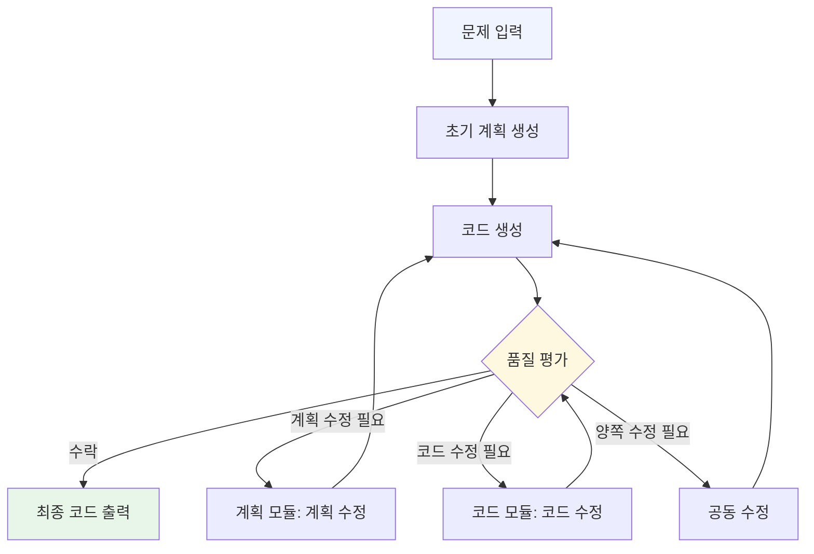

# CollabCoder: 계획-코드 공동 진화를 통한 효율적 코드 생성

## 핵심 기여

기존 LLM 기반 코드 생성 접근법은 대부분 **계획-후-실행(plan-then-execute)** 구조를 따른다. 즉, 먼저 자연어로 풀이 계획을 세우고, 그 계획에 따라 코드를 작성하는 순차적 방식이다. CollabCoder는 이 패러다임을 정면으로 문제 삼는다.

논문의 핵심 주장: **계획과 코드는 순차적으로 만들어지는 것이 아니라 서로를 참조하며 함께 진화해야 한다.** 계획이 코드 생성을 안내하는 동시에, 실제 코드 작성 과정에서 발생하는 제약과 피드백이 계획을 수정하는 쌍방향 구조가 필요하다는 것이다.

## 공동 진화 프레임워크 (Plan-Code Co-Evolution)

CollabCoder는 독립적인 두 모듈로 구성된다:

- **계획 모듈(Plan Module)**: 문제를 자연어 알고리즘 단계로 분해하고, 코드 모듈의 피드백을 받아 계획을 동적으로 수정
- **코드 모듈(Code Module)**: 현재 계획을 참조해 구현을 작성하고, 계획의 모호함이나 실현 불가능한 부분을 계획 모듈에 역으로 피드백

두 모듈은 **동적 의사결정(dynamic decision-making)** 메커니즘을 통해 협력한다. 각 반복(iteration)에서 시스템은 다음 중 어떤 행동을 취할지 결정한다:

1. 계획만 수정
2. 코드만 수정
3. 계획과 코드를 동시에 수정
4. 현재 결과 수락 및 종료

이 동적 결정이 핵심이다. 불필요한 반복을 줄이면서도 필요한 상호 조정을 놓치지 않는다.



위 다이어그램은 계획-코드 공동 진화 루프를 보여준다. 단방향 계획-후-실행과 달리 두 모듈이 지속적으로 피드백을 교환한다.

## 실험 결과

### 성능 향상

두 주요 코드 생성 벤치마크에서 측정된 결과:

| 벤치마크 | 향상폭 |
|---------|--------|
| LiveCodeBench | 11~20% 향상 |
| xCodeEval | 11~20% 향상 |

비교 대상 기준선(baseline):
- 단일 에이전트 체인-오브-생각(CoT, Chain-of-Thought)
- 계획-후-실행(plan-then-execute) 방식
- 기타 멀티에이전트 코드 생성 프레임워크

### API 호출 효율

CollabCoder는 성능 향상과 함께 **API 호출 횟수도 절감**한다. 기준선 대비 실행당 평균 4~10회 API 호출을 줄였다. 이는 동적 의사결정이 불필요한 반복 계획 수정이나 코드 재작성을 차단하기 때문이다.

## 기존 접근법과의 비교

### 단일 에이전트 CoT

```
문제 → [CoT 추론] → 코드
```

계획이 암묵적으로 추론에 내포된다. 긴 문제나 복잡한 알고리즘에서 추론 과정이 길어지면 앞부분의 맥락이 희석되어 코드 품질이 저하된다. 수정 루프가 없어 초기 판단 오류를 복구하기 어렵다.

### 계획-후-실행

```
문제 → [계획 생성] → [코드 생성]
```

계획이 명시적으로 분리되지만 단방향이다. 코드 작성 중 계획이 실현 불가능하다고 판명돼도 계획 모듈로 돌아가는 경로가 없다. 잘못된 계획을 코드가 그대로 따라가게 된다.

### CollabCoder

```
문제 → [계획] ⇆ [코드] → 출력
```

양방향 피드백 루프. 계획의 오류를 코드 모듈이 발견하고, 코드의 구조적 한계를 계획 모듈이 반영한다.

## 왜 중요한가

코드 생성에서 가장 어려운 문제 유형은 **알고리즘 설계가 구현과 강하게 결합된 경우**다. 예를 들어, 그래프 순회 문제에서 BFS를 쓸지 DFS를 쓸지는 구현 도중 발견되는 제약(메모리, 경로 조건 등)에 따라 바뀔 수 있다. 계획-후-실행 방식은 이런 피드백을 반영할 수 없다.

CollabCoder의 공동 진화 접근법은 인간 프로그래머가 실제로 코드를 작성하는 방식과 유사하다. 초안 설계 → 구현 시도 → 설계 수정 → 재구현의 반복이 자연스럽게 발생한다.

## 실무 적용 관점

- **경쟁 프로그래밍(competitive programming)**: LiveCodeBench와 xCodeEval 모두 경쟁 프로그래밍 수준의 문제를 포함. 복잡한 알고리즘 문제에서 공동 진화의 효과가 두드러진다.
- **API 비용 최적화**: 기준선보다 API 호출이 적으므로 대규모 코드 생성 파이프라인에서 비용 절감 가능.
- **에이전트 시스템 설계 원칙**: 역할 분리(계획/코드)와 함께 양방향 피드백 채널을 설계하는 패턴은 다른 멀티에이전트 시스템에도 적용 가능.

## 한계 및 향후 연구

- 두 모듈 간 통신 오버헤드: 동적 의사결정 자체에도 LLM 호출이 필요하므로 단순 문제에서는 오버킬(overkill)이 될 수 있다.
- 중단 조건(termination condition) 설계: 공동 진화가 수렴하지 않고 진동(oscillation)하는 경우에 대한 처리가 필요하다.
- 더 긴 컨텍스트에서의 성능: 전체 진화 이력이 컨텍스트를 점유하므로 매우 긴 문제에서의 성능 저하 가능성.

## 관련 문서

- [[how-coding-agents-work]] - 코딩 에이전트의 일반 동작 원리
- [[orchestrator-worker-pattern]] - 멀티에이전트 오케스트레이터-워커 패턴
- [[agent-trees]] - 에이전트 트리 구조와 계획 분해
- [[agentic-engineering]] - 에이전트 설계 원칙
