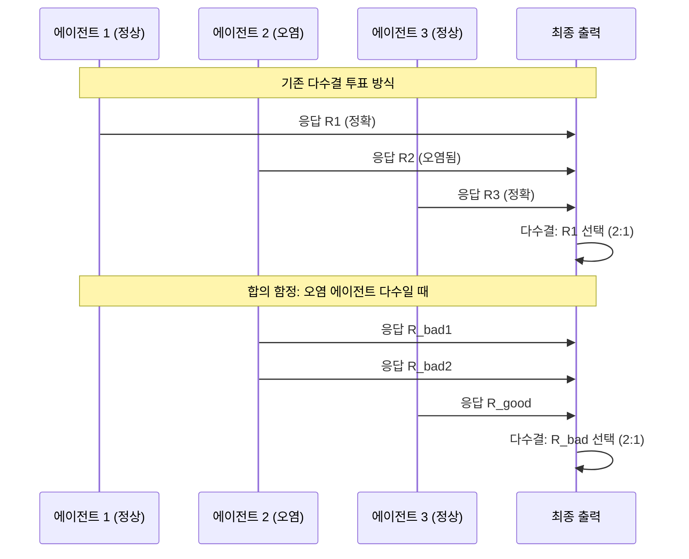
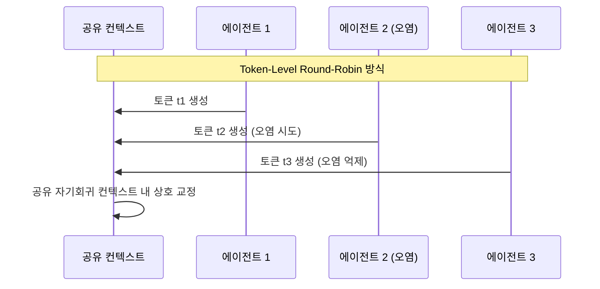

# 합의 함정: 토큰 수준 라운드로빈으로 다중 에이전트 LLM 강건화

## 논문 메타데이터

| 항목 | 내용 |
|------|------|
| arXiv ID | 2604.17139 |
| 저자 | Jiayuan Liu, Shiqi Du, Weihua Du, Mingyu Guo, Vincent Conitzer |
| 소속 | 호주국립대학교 / 하버드대학교 |
| 연도 | 2026 |
| 분류 | cs.AI, cs.MA |

## 핵심 기여

[[multi-agent-orchestration]] 에서 다수결 투표(majority voting)에 의존하는 아키텍처가 적대적 맥락 오염(adversarial context poisoning)에 취약한 **합의 함정(Consensus Trap)** 을 형식적으로 정의하고, 이를 해결하는 **Token-Level Round-Robin Collaboration (토큰 수준 라운드로빈 협업)** 을 제안한다.

두 번째 다이어그램은 토큰 수준 라운드로빈에서 에이전트들이 공유 컨텍스트 안에서 토큰 단위로 협력해 오염 에이전트의 영향을 수학적으로 억제하는 원리를 보여준다.

## 방법론

### 합의 함정 (Consensus Trap) 정의

$n$개 에이전트 중 $m$개가 오염된 경우, 다수결 투표가 올바른 답을 선택할 확률:

$$P(\text{correct majority}) = P(\text{정상 에이전트 수} > m)$$

$m > n/2$ 이면 다수결은 항상 오염된 결과를 출력한다. 이것이 합의 함정이다.

### Token-Level Round-Robin Collaboration

핵심 아이디어: 에이전트들이 완성된 응답 전체를 교환하지 않고, **공유 자기회귀 컨텍스트(shared autoregressive context)** 내에서 순차적으로 토큰을 생성한다.

- 각 에이전트는 자신의 차례에 다음 토큰 하나(또는 소수)를 생성
- 생성된 토큰은 모든 에이전트의 컨텍스트에 즉시 반영
- 오염된 에이전트가 이상한 토큰을 생성하면 다음 에이전트들이 컨텍스트상으로 수정 방향으로 유도

### 수학적 보장

논문은 오염된 에이전트가 다수($m > n/2$)여도 라운드로빈 협업이 정확도를 유지할 수 있음을 다음 조건 하에 증명한다:

- 정상 에이전트의 토큰 생성 확률 분포가 오염 에이전트보다 정답에 더 집중
- 공유 컨텍스트에서 정상 에이전트들의 집합적 영향이 오염을 희석

## 실험 결과

| 시나리오 | 다수결 투표 | 라운드로빈 협업 |
|---------|------------|----------------|
| 오염 에이전트 0% | 높음 | 높음 |
| 오염 에이전트 30% | 높음 | 높음 |
| 오염 에이전트 51% | **실패 (합의 함정)** | 유지 |
| 오염 에이전트 70% | **실패** | 부분 유지 |

적대적 프롬프트 주입(prompt injection) 시뮬레이션에서 라운드로빈이 다수결 대비 현저히 강건함을 확인했다.

## 한계

- 정상 에이전트들이 충분히 능력 있다는 가정에 의존
- 토큰 수준 협업은 병렬 실행 불가능 (순차 처리로 레이턴시 증가)
- 실제 프로덕션 멀티에이전트 시스템에서의 구현 복잡도 증가

## 실무 관점

프롬프트 주입 공격이나 맥락 오염이 우려되는 보안 민감 멀티에이전트 애플리케이션(금융, 의료, 법무)에서 다수결 투표를 대체하는 강건한 협업 프로토콜로 활용 가능하다.

역설적으로 LLM이 강력해질수록 협력이 저하되는 현상에 대해서는 [[llm-cooperation-failure]] 를 참고하라.

## 관련 문서

- [[multi-agent-orchestration]] - 멀티에이전트 오케스트레이션 개요
- [[llm-cooperation-failure]] - 역량과 협력의 역설
- [[coding-agent-behavioral-analysis]] - 코딩 에이전트 행동 분석
- [[plan-reward-bench]] - 에이전트 계획 평가 벤치마크
