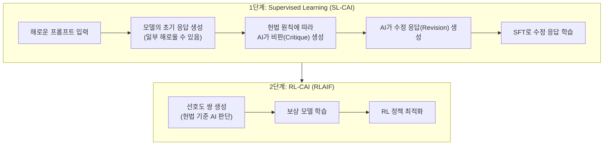

# Constitutional AI: Harmlessness from AI Feedback (Bai et al., 2022)

## 핵심 기여

Anthropic의 Yuntao Bai 등이 2022년 발표한 Constitutional AI(CAI)는 **인간 피드백 대신 AI 피드백(RLAIF, Reinforcement Learning from AI Feedback)** 으로 언어 모델의 무해성(harmlessness)을 정렬하는 방법을 제안했다. 16개 원칙으로 구성된 "헌법(constitution)"을 기반으로 AI가 자신의 출력을 비판·수정하고, 이 과정으로 생성된 선호도 데이터로 보상 모델을 학습한다. 인간 어노테이션 비용을 대폭 줄이면서 유용성(helpfulness)과 무해성을 동시에 개선하는 것이 핵심 기여다.

## 방법

### 2단계 파이프라인

### 헌법(Constitution)의 구성

16개 원칙 예시:
- "응답이 유해하거나 비윤리적인지 확인하라"
- "응답이 아동에게 적절한지 판단하라"
- "정직하고 진실되게 응답하라"

AI가 자신의 응답을 이 원칙들에 비추어 비판(critique)하고, 더 나은 응답으로 수정(revision)하는 **Critique-Revision 루프**를 반복.

### RLAIF vs RLHF

- **RLHF**: 인간이 응답 쌍을 비교 평가 (비용 높음, 편향 가능)
- **RLAIF**: 헌법 원칙을 제시받은 AI가 응답 쌍을 비교 평가 (확장성 높음, 일관성 높음)

## 결과 및 영향

- 해로운 입력에 대해 거부 응답을 하면서도 유용성을 유지하는 균형 달성
- 순수 RLHF 대비 인간 어노테이션 없이도 유사하거나 더 나은 무해성 달성
- Anthropic Claude 모델 시리즈의 핵심 정렬 기법으로 사용
- RLAIF 연구 분야를 본격 촉발 - 인간 피드백 없이 AI 스스로 정렬하는 연구의 출발점
- 후속 연구: Extended CAI(2026), 더 복잡한 헌법 설계, 자동 헌법 생성

## 한계

- 헌법 설계 자체가 Anthropic의 가치 판단을 반영 - "누가 헌법을 쓰는가"라는 메타 정렬 문제 잔존
- RLAIF에서 평가 AI가 편향되어 있으면 그 편향이 증폭될 위험
- 헌법 원칙 간 충돌 시 우선순위 결정이 모호할 수 있음
- 아주 미묘한 무해성 판단(암묵적 해악 등)에서 인간 판단을 완전히 대체하기 어려움

## 실무 적용 관점

- 자체 LLM 파인튜닝 시 헌법 기반 자기비판 루프를 데이터 생성 파이프라인에 활용 가능
- 작은 규모의 헌법(5-10개 원칙)으로도 도메인 특화 안전성 개선 효과
- 헌법 원칙은 회사 정책, 법적 요구사항, 사용자 안전 기준을 반영해 커스터마이징 가능
- "비판 → 수정" 패턴은 LLM 출력 품질 향상에도 활용 가능 (정렬 목적 외에도)

## 관련 문서
- [[vlm-survey-26k-paper]] -- Vision Language Models: A Survey of 26K Papers

- [[InstructGPT RLHF 파이프라인]]
- [[RLHF 인간 선호도 강화학습 원논문 (Christiano et al.)]]
- [[DPO 직접 선호도 최적화]]
- [[alignment-tax]]
