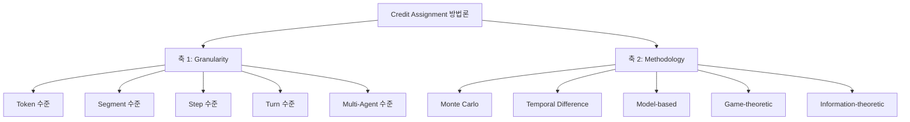
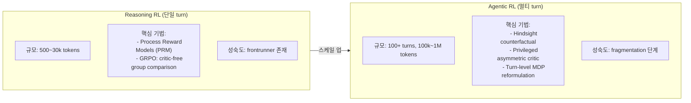

# From Reasoning to Agentic: Credit Assignment in RL for LLMs (Zhang, 2026)

arXiv 2604.09459. Chenchen Zhang 단독 저자. LLM 강화학습에서 **크레딧 할당(credit assignment)** 문제를 체계적으로 정리한 서베이로, 2024~2026년 초 47개 방법을 두 도메인 — reasoning RL과 agentic RL — 로 나눠 2차원 분류 체계로 정리한다.

## 논문의 핵심 기여

> "A critical bottleneck preventing reliable credit attribution is that million-token trajectories operate on a fundamentally different scale from reasoning chains." — Zhang, 2026

1. **2차원 taxonomy** — 47개 방법을 granularity x methodology 두 축으로 분류
2. **Reasoning vs Agentic 이분법 명확화** — 토큰 스케일 차이가 방법론 선택을 결정함을 정식화
3. **3가지 재사용 자원** 제공: machine-readable inventory, 표준화 reporting checklist, 벤치마크 프로토콜 스펙

## 2차원 분류 체계

두 축의 조합이 각 방법의 적용 도메인과 계산 비용을 결정한다.

## Reasoning RL vs Agentic RL 비교

| 항목 | Reasoning RL | Agentic RL |
|------|-------------|-----------|
| 궤적 길이 | 500~30k 토큰 | 100k~1M 토큰 |
| 구조 | 단일 turn | 100+ turn 멀티 에피소드 |
| 보상 신호 | 단답 검증 가능 | 분산, 지연, 부분 관측 |
| 성숙도 | 성숙 (frontrunner 존재) | fragmentation 단계 |
| 핵심 병목 | step 내 token attribution | turn 간 long-range attribution |

## 핵심 기법 설명

### Process Reward Model (PRM)
reasoning 체인의 각 스텝을 독립적으로 평가하는 검증자 모델. 최종 답만 보는 outcome reward model (ORM)과 달리 중간 추론 단계의 신호를 제공한다. → 자세한 내용은 [[process-reward-models]] 참조

### Critic-free Group Comparison (GRPO)
참조 모델 없이 그룹 내 응답들의 상대 보상으로 어드밴티지를 계산. discriminative critic을 완전히 제거하는 value-free 방향의 대표 기법. → [[grpo]] 참조

### Hindsight Counterfactual Analysis
에피소드 완료 후 "다른 action을 선택했다면 어떤 결과였을까"를 사후 분석해 어느 turn이 결과에 기여했는지 역추적. 긴 궤적에서 sparse reward를 turn 단위로 재분배하는 데 사용.

### Privileged Asymmetric Critic
훈련 시에만 사용 가능한 추가 정보(예: ground truth 상태, oracle 레이블)를 critic에 제공해 가치 추정 품질을 높이는 방법. 배포 시에는 해당 정보가 없으므로 actor-critic 구조에서 비대칭이 발생. → [[genac-paper]] 의 Generative Critic이 이 방향의 확장

### Turn-level MDP Reformulation
100+ turn 에피소드를 "시간 추상화된 MDP"로 재구성. 각 turn을 macro-action으로, 원시 토큰 시퀀스를 상태 전이로 모델링해 long-range credit assignment를 다루기 쉬운 문제로 변환.

## 3가지 재사용 자원

Zhang이 서베이와 함께 공개한 연구 인프라:

1. **Machine-readable inventory**: 47편 논문의 분류 레이블, 방법 설명, 증거 수준을 구조화된 형태로 제공
2. **표준화된 reporting checklist**: 기존 문헌의 체계적 gap을 식별하기 위한 평가 기준
3. **벤치마크 프로토콜 스펙**: controlled bifurcation과 method selection decision tree 포함

## 오픈 챌린지

| 챌린지 | 내용 |
|--------|------|
| 스케일 확장성 | 에피소드 길이 증가 시 기존 방법의 한계 불명확 |
| Partial observability | 불완전 관측과 credit fidelity의 상호작용 미해명 |
| Granularity 최적화 | 태스크별 최적 granularity 선택 기준 부재 |
| 비교 표준 | Cross-method 비교를 위한 통일된 프로토콜 없음 |

## 실무 관점

- **Reasoning RL 실무자**: PRM과 GRPO 조합이 현재 가장 검증된 경로. ORZ/DeepSeek-R1 계열 성과 참조
- **Agentic RL 실무자**: Turn-level MDP 재구성이 현재 가장 유망한 방향. 단, fragmentation 단계이므로 논문마다 설정 차이가 크다
- **서베이 자체의 가치**: 47개 방법의 비교 체계가 없는 상황에서 taxonomy가 연구 방향 선택의 지도 역할

## 관련 문서

- [[long-horizon-rl-training-for-agents]] -- 멀티 턴 RL 훈련 인프라 및 도전 과제
- [[grpo]] -- Critic-free group comparison의 대표 구현
- [[process-reward-models]] -- PRM 상세 (reasoning RL 핵심 기법)
- [[genac-paper]] -- Generative Critic: privileged asymmetric critic의 확장 방향
- [[rlhf-pipeline]] -- 전통적 RLHF 파이프라인 맥락
- [[agentic-rl]] -- 에이전트 RL 개요
