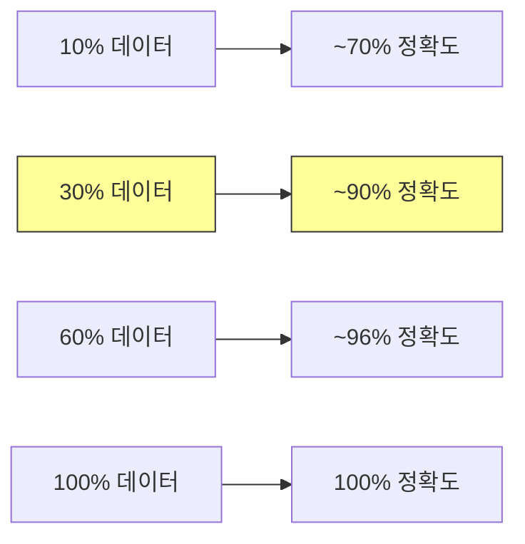

# 데이터셋 스케일링 법칙: 30% 데이터로 90% 정확도

## 핵심 기여

최소 어텐션 전용 디코더(tiny attention-only decoder)를 사용하여 데이터셋 크기가 Transformer 성능에 미치는 영향을 통제 환경에서 정밀 분석한다. **전체 데이터의 약 30%만으로 최대 검증 정확도의 약 90%에 도달**한다는 실용적 발견이 핵심이다.

핵심 성과:
- 데이터셋 스케일링 효과를 다른 변수(아키텍처, 파라미터 수)와 격리하여 분석
- 수확 체감(diminishing returns) 패턴의 정량적 특성화
- 자원 제한 환경에서의 데이터 효율성 가이드라인

## 실험 설계

### 컴포넌트 격리 전략

기존 스케일링 연구는 모델 크기와 데이터 크기를 동시에 변화시켜 효과를 분리하기 어렵다. 이 연구는:
- **어텐션만 사용하는 최소 디코더**로 아키텍처 변수를 고정
- 동일 모델에 **점진적으로 더 큰 데이터 부분집합**을 투입
- 데이터셋 크기만의 효과를 순수하게 관찰

### 핵심 발견

데이터 30%에서 최대 정확도의 약 90%에 도달하며, 이후 추가 데이터의 한계 효용이 급격히 감소한다.

- **수확 체감 패턴**: 추가 데이터의 성능 향상폭이 멱함수적으로 감소
- **Chinchilla 법칙과의 일관성**: 소규모 통제 환경에서도 스케일링 법칙 행동이 관찰됨
- **실용적 임계점**: 30% 데이터 지점이 비용-효율 최적의 근사값

## 실무 적용 관점

- **소규모 연구실**: 전체 데이터셋을 확보/처리하기 어려울 때, 30% 부분집합으로 대부분의 성능 달성 가능
- **데이터 예산 계획**: 데이터 수집/정제 비용과 성능 향상의 트레이드오프를 정량적으로 판단
- **커리큘럼 학습**: 데이터 효율성이 높은 구간(초기 30%)과 낮은 구간(후반 70%)의 차이를 활용

## 한계

- 어텐션 전용 최소 디코더에서의 결과이므로, 대규모 모델로의 직접 외삽에 주의 필요
- 데이터 품질/다양성 변수는 통제되지 않음 (양적 스케일링만 분석)
- 사전학습이 아닌 특정 태스크 학습 환경

## 관련 문서

- [[Neural Scaling Laws]] -- Kaplan 스케일링 법칙 기초
- [[Chinchilla Scaling]] -- 최적 모델-데이터 비율 D=20N
- [[MoE Transformer 스케일링 법칙]] -- MoE에서의 스케일링 이론
