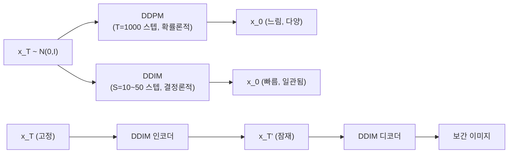
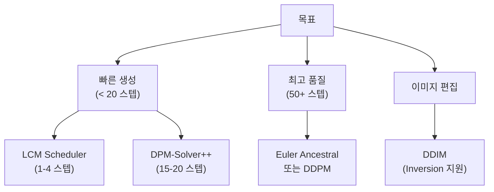

# DDIM: 결정론적 비마르코프 확산 샘플링

## 논문 메타데이터

| 항목 | 내용 |
|------|------|
| 제목 | Denoising Diffusion Implicit Models |
| 저자 | Jiaming Song, Chenlin Meng, Stefano Ermon |
| 소속 | Stanford University |
| 발표 | ICLR 2021 |
| arXiv | [2010.02502](https://arxiv.org/abs/2010.02502) |
| 공개 | 2020년 10월 |

## 한 줄 요약

DDPM의 마르코프 연쇄 가정을 버리고 비마르코프(non-Markovian) 확산 과정을 정의함으로써, **동일한 DDPM 가중치로 10~50배 빠른 결정론적 샘플링**을 가능하게 한다.

---

## 핵심 기여

1. **비마르코프 확산 과정 정의**: DDPM의 역방향 연쇄가 반드시 마르코프여야 한다는 가정을 완화. 동일한 주변 분포 $q(\mathbf{x}_t)$를 유지하면서 다양한 역방향 과정을 허용
2. **결정론적 샘플러 (DDIM 샘플러)**: 잡음 분산 $\sigma_t = 0$으로 설정하면 랜덤성이 제거되고 ODE(상미분방정식) 궤적을 따르는 결정론적 생성이 가능
3. **타임스텝 서브시퀀싱**: 1000 스텝 대신 임의의 부분집합 $\tau \subset \{1, \ldots, T\}$만 사용해 10~50 스텝으로 압축 가능
4. **잠재 공간 일관성**: 동일한 초기 잡음 $\mathbf{x}_T$에서 항상 동일한 이미지 생성 → 인코딩-디코딩, 보간 가능
5. **DDPM 가중치 재사용**: 재학습 불필요. 기존 DDPM 모델에 샘플링 알고리즘만 교체

---

## 배경 및 문제 정의

### DDPM의 병목

[[ddpm-original-paper]]에서 제안된 DDPM은 T=1000 스텝의 마르코프 연쇄로 이미지를 생성한다. 이는 높은 품질을 제공하지만 샘플링이 **1000번의 신경망 순전파**를 요구해 GAN 대비 수십~수백 배 느리다.

```
DDPM 샘플링 시간: T=1000 스텝 × 신경망 순전파 1회 = 수십 초
GAN 샘플링 시간: 신경망 순전파 1회 = 수 밀리초
```

DDPM의 학습 목적함수는 마르코프 역방향 과정에 의존하지만, 저자들은 학습된 노이즈 예측기 $\epsilon_\theta(\mathbf{x}_t, t)$는 **비마르코프 과정에서도 유효하게 재사용**될 수 있음을 발견했다.

---

## 방법론

### 비마르코프 순방향 과정

DDIM은 동일한 주변 분포를 유지하는 순방향 과정의 패밀리를 정의한다:

$$q_\sigma(\mathbf{x}_{t-1} | \mathbf{x}_t, \mathbf{x}_0) = \mathcal{N}\!\left(\sqrt{\alpha_{t-1}}\,\mathbf{x}_0 + \sqrt{1 - \alpha_{t-1} - \sigma_t^2} \cdot \frac{\mathbf{x}_t - \sqrt{\alpha_t}\,\mathbf{x}_0}{\sqrt{1 - \alpha_t}},\; \sigma_t^2 \mathbf{I}\right)$$

$\sigma_t$가 DDPM과 일치하는 값이면 정확히 DDPM 역방향 과정이 된다.

### DDIM 샘플링 업데이트

노이즈 예측기 $\epsilon_\theta$로 $\mathbf{x}_0$를 예측한 뒤:

$$\hat{\mathbf{x}}_0 = \frac{\mathbf{x}_t - \sqrt{1 - \alpha_t}\,\epsilon_\theta(\mathbf{x}_t, t)}{\sqrt{\alpha_t}}$$

역방향 스텝:

$$\mathbf{x}_{t-1} = \sqrt{\alpha_{t-1}}\,\hat{\mathbf{x}}_0 + \sqrt{1 - \alpha_{t-1} - \sigma_t^2}\,\epsilon_\theta(\mathbf{x}_t, t) + \sigma_t\,\boldsymbol{\epsilon}_t$$

$\sigma_t = 0$이면 완전 결정론적이 되고 이것이 **DDIM 샘플러**다.

### 타임스텝 서브시퀀싱

```
전체 스텝: [1, 2, 3, ..., 999, 1000]
DDIM 서브시퀀스 (S=50): [20, 40, 60, ..., 980, 1000]
DDIM 서브시퀀스 (S=10): [100, 200, ..., 900, 1000]
```

마르코프가 아니기 때문에 임의 간격으로 건너뛰어도 이론적 일관성이 유지된다.

### 샘플링 파이프라인 비교



위 다이어그램에서 DDIM은 동일 잡음 벡터로 동일 이미지를 재현하고, 두 잠재 코드 사이를 보간해 의미론적으로 연속적인 이미지를 생성할 수 있음을 나타낸다.

---

## 실험 및 결과

### 속도-품질 트레이드오프 (CIFAR-10, CelebA, LSUN)

| 샘플러 | 스텝 수 | FID (CelebA 64x64) | 
|--------|---------|-------------------|
| DDPM | 1000 | ~3.0 |
| DDIM | 100 | ~3.2 |
| DDIM | 50 | ~3.5 |
| DDIM | 20 | ~4.2 |
| DDIM | 10 | ~6.5 |

- **10 스텝 DDIM**은 DDPM 1000 스텝 대비 100배 빠르면서 경쟁력 있는 품질
- **50 스텝 DDIM**은 실제 품질 거의 유지 (FID 차이 < 0.5)

### 결정론적 잠재 공간

- 동일 $\mathbf{x}_T$에서 항상 동일 이미지 생성 (DDPM은 동일 시드에서도 확률론적 변동)
- DDIM 인코더로 실제 이미지를 $\mathbf{x}_T$ 공간으로 역사영(inversion) 가능
- 두 이미지 사이의 구면 보간(slerp)으로 연속적 변환 가능

### 잠재 공간 보간 품질

- CelebA: 두 얼굴 이미지 사이를 10단계 보간 → 자연스러운 점진적 변환
- DDPM의 확률적 샘플러로는 불가능한 특성

---

## DDIM vs DDPM 비교

| 특성 | DDPM | DDIM |
|------|------|------|
| 순방향 과정 | 마르코프 연쇄 | 비마르코프 (일반화) |
| 역방향 과정 | 확률론적 | 결정론적 ($\sigma=0$) 또는 혼합 |
| 샘플링 스텝 | T=1000 필요 | 10~100으로 가능 |
| 동일 시드 재현성 | 없음 | 있음 |
| 이미지 보간 | 불가 | 가능 |
| 학습 재필요 | - | 불필요 (DDPM 가중치 재사용) |
| 이론적 기반 | 마르코프 확산 SDE | 확률 ODE 궤적 |

---

## 수식 심화: ODE 해석

$\sigma_t = 0$일 때의 DDIM 업데이트는 아래 **확률 미분방정식(probability flow ODE)**의 수치 적분과 동치임을 논문은 보인다:

$$d\mathbf{x} = \left[\mathbf{f}(\mathbf{x}, t) - \frac{1}{2}g(t)^2 \nabla_{\mathbf{x}} \log p_t(\mathbf{x})\right] dt$$

여기서 $\nabla_{\mathbf{x}} \log p_t(\mathbf{x}) \approx -\epsilon_\theta(\mathbf{x}_t, t) / \sqrt{1 - \alpha_t}$ (스코어 함수 근사).

이는 이후 [[ddpm-original-paper]]의 확률 흐름 ODE 해석, 그리고 DPM-Solver, DEIS 등 고차 수치 적분 기반 빠른 샘플러들의 이론적 토대가 된다.

---

## 한계 및 후속 연구

### 한계

1. **아주 적은 스텝 (S < 10)에서 품질 저하**: 수치 적분 오차 누적. DDPM 동등 품질을 위해서는 여전히 50+ 스텝 권장
2. **스텝 수 줄일수록 다양성 감소**: 결정론적 경로가 좁아지는 경향
3. **텍스트 조건 제어 없음**: 이 논문 자체는 무조건부/클래스 조건부에 집중. 강력한 텍스트-이미지 제어는 [[classifier-free-guidance-paper]] 참조

### 후속 연구 연결

- **DPM-Solver (Lu et al., 2022)**: DDIM의 ODE 해석을 고차(2차/3차) 적분기로 확장 → 10 스텝에서 DDIM 50 스텝 수준 품질
- **LCM (Luo et al., 2023)**: DDIM 궤적을 일관성 함수(consistency function)로 증류 → 1-4 스텝 생성. [[lcm-latent-consistency-paper]] 참조
- **SDXL-Turbo / ADD**: Adversarial Diffusion Distillation로 1 스텝 생성
- **Flow Matching (Lipman et al., 2022)**: DDIM의 직선 ODE 경로 아이디어를 더 간결하게 재공식화

---

## 실무 적용 관점

### Stable Diffusion에서의 DDIM

[[stable-diffusion]]은 DDIM을 기본 샘플러 중 하나로 채택했다. 실제 사용 시:

```python
from diffusers import StableDiffusionPipeline, DDIMScheduler

# DDIM 스케줄러로 교체
scheduler = DDIMScheduler.from_pretrained(
    "runwayml/stable-diffusion-v1-5",
    subfolder="scheduler"
)
pipe = StableDiffusionPipeline.from_pretrained(
    "runwayml/stable-diffusion-v1-5",
    scheduler=scheduler,
)

# 50 스텝으로 생성 (DDPM 1000 스텝 대비 20배 빠름)
image = pipe("a photo of a cat", num_inference_steps=50).images[0]
```

### 이미지 편집 (DDIM Inversion)

결정론적 특성을 활용해 실제 이미지를 잠재 코드로 역변환 후 편집:

```python
# 1. DDIM Inversion: 실제 이미지 -> x_T
latent = ddim_inversion(image, prompt="original description")

# 2. 편집된 프롬프트로 재생성
edited_image = pipe(
    "edited description",
    latent_noise=latent,
    num_inference_steps=50
).images[0]
```

이 기법은 Prompt2Prompt, InstructPix2Pix 등 이미지 편집 논문들의 기반이 된다.

### 언제 DDIM을 선택하는가

- 빠른 프로토타이핑/배치 생성: DDIM 20-50 스텝
- 최고 품질 필요: DDPM 1000 스텝 또는 DPM-Solver++ 20-30 스텝
- 이미지 편집/보간: DDIM Inversion 필수
- 모바일/엣지 배포: [[lcm-latent-consistency-paper]] 또는 SDXL-Turbo

### 스케줄러 선택 가이드 (Diffusers 생태계)



---

## 관련 문서

- [[ddpm-original-paper]] - DDIM이 확장하는 원본 DDPM 논문
- [[diffusion-models]] - 확산 모델 개념 전반
- [[lcm-latent-consistency-paper]] - DDIM 궤적을 증류한 1-4 스텝 모델
- [[classifier-free-guidance-paper]] - 텍스트 조건 제어를 추가하는 CFG
- [[stable-diffusion]] - DDIM을 실제 활용하는 대표 모델
