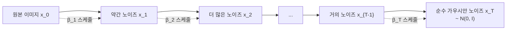
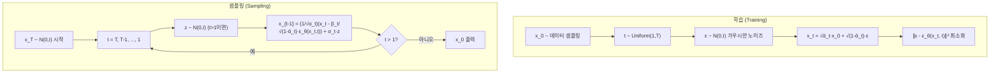
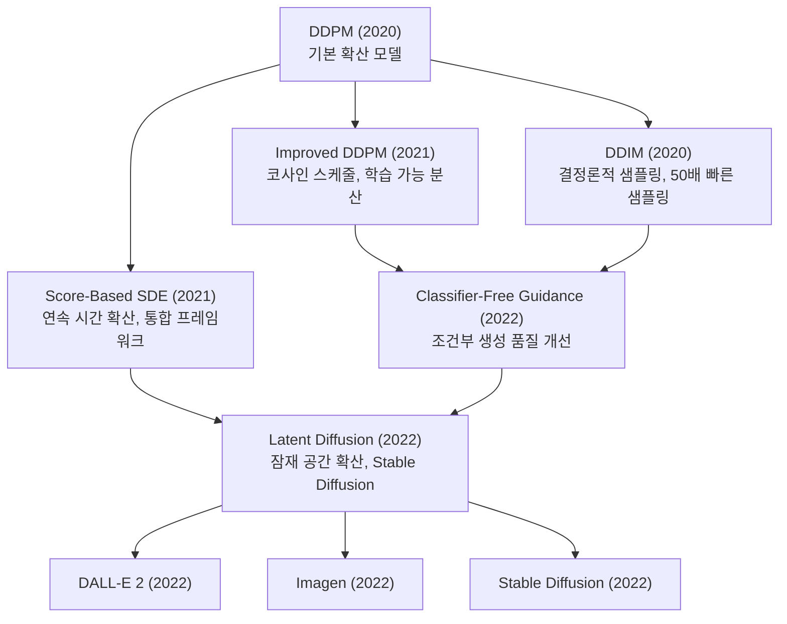

# DDPM: 노이즈 제거 확산 확률 모델

## 메타데이터

| 항목 | 내용 |
|------|------|
| 제목 | Denoising Diffusion Probabilistic Models |
| 저자 | Jonathan Ho, Ajay Jain, Pieter Abbeel |
| 소속 | UC Berkeley |
| 발표 연도 | 2020 |
| 학회 | NeurIPS 2020 |
| arXiv | [2006.11239](https://arxiv.org/abs/2006.11239) |

## 핵심 기여

- **노이즈 예측(noise prediction)** 파라미터화: 원본 이미지 복원 대신 추가된 노이즈를 예측하는 방식이 훨씬 효과적임을 발견. 이후 모든 확산 모델의 표준이 됨
- 마르코프 연쇄(Markov chain) 프레임워크로 확산 과정과 역확산 과정을 수학적으로 엄밀히 정의
- 변분 하한(variational lower bound, ELBO) 단순화로 안정적이고 학습 가능한 목적 함수 유도
- FID(Frechet Inception Distance) 3.17 on CIFAR-10 - 당시 생성 모델 SOTA 달성
- **확산 모델의 부상**: GAN 이후 가장 중요한 생성 모델 패러다임의 시작

## 배경 및 문제 정의

### 생성 모델의 흐름

2020년 이전 이미지 생성 연구는 크게 세 방향이었다:

1. **GAN(Generative Adversarial Network)**: 고품질 이미지 생성 가능하나 학습 불안정, 모드 붕괴 문제
2. **VAE(Variational Autoencoder)**: 학습 안정적이나 생성 품질이 GAN보다 낮음 (흐릿한 이미지)
3. **정규화 흐름(Normalizing Flow)**: 수학적으로 엄밀하나 아키텍처 제약이 많고 계산 비용 높음

DDPM은 이 세 가지와 다른 새로운 접근법을 제시한다: 데이터를 점진적으로 노이즈로 만드는 **확산 과정(forward process)**을 정의하고, 이를 거꾸로 되돌리는 **역확산 과정(reverse process)**을 학습한다.

### 물리적 직관

잉크 한 방울이 물에 퍼지는 과정을 생각해보자. 처음에는 잉크의 형태가 보이지만 시간이 지나면 완전히 균일한 분포가 된다. 이 과정은 점진적이고 각 단계가 이전 상태에만 의존하는 마르코프 과정이다.

DDPM은 이미지에 노이즈를 점진적으로 추가하는 것을 이 "잉크 퍼짐"으로 비유한다. 그리고 "시간을 거꾸로 되감아" 노이즈에서 이미지를 복원하는 과정을 신경망으로 학습한다.

## 방법

### 확산 과정 (Forward Process)



원본 이미지 $x_0$에 $T$번의 작은 노이즈 추가 단계를 거쳐 순수 가우시안 노이즈 $x_T$로 변환한다. 각 단계는 조건부 가우시안:

$$q(x_t | x_{t-1}) = \mathcal{N}(x_t; \sqrt{1 - \beta_t} x_{t-1}, \beta_t \mathbf{I})$$

$\beta_t \in (0, 1)$는 노이즈 스케줄(noise schedule)로, 각 단계에서 추가하는 노이즈 양을 제어한다.

**핵심 특성**: 임의의 시간 $t$에서의 $x_t$를 원본 $x_0$에서 직접 샘플링 가능:

$$q(x_t | x_0) = \mathcal{N}(x_t; \sqrt{\bar{\alpha}_t} x_0, (1 - \bar{\alpha}_t) \mathbf{I})$$

여기서 $\alpha_t = 1 - \beta_t$, $\bar{\alpha}_t = \prod_{s=1}^{t} \alpha_s$. 이를 이용해 $x_t$를 닫힌 형태로 표현:

$$x_t = \sqrt{\bar{\alpha}_t} x_0 + \sqrt{1 - \bar{\alpha}_t} \epsilon, \quad \epsilon \sim \mathcal{N}(0, \mathbf{I})$$

이 수식은 훈련 시 임의의 $t$에서 노이즈가 추가된 이미지를 한 번에 생성할 수 있게 해준다.

### 역확산 과정 (Reverse Process)

노이즈에서 이미지를 복원하는 과정을 학습한다:

$$p_\theta(x_{t-1} | x_t) = \mathcal{N}(x_{t-1}; \mu_\theta(x_t, t), \Sigma_\theta(x_t, t))$$

역확산의 진짜 분포 $q(x_{t-1} | x_t, x_0)$는 계산 불가능하지만, $x_0$가 주어지면 가우시안이다:

$$q(x_{t-1} | x_t, x_0) = \mathcal{N}(x_{t-1}; \tilde{\mu}_t(x_t, x_0), \tilde{\beta}_t \mathbf{I})$$

$$\tilde{\mu}_t(x_t, x_0) = \frac{\sqrt{\bar{\alpha}_{t-1}} \beta_t}{1 - \bar{\alpha}_t} x_0 + \frac{\sqrt{\alpha_t}(1 - \bar{\alpha}_{t-1})}{1 - \bar{\alpha}_t} x_t$$

$$\tilde{\beta}_t = \frac{1 - \bar{\alpha}_{t-1}}{1 - \bar{\alpha}_t} \beta_t$$

### 학습 목적 함수 단순화 (핵심 기여)

ELBO(Evidence Lower BOund)를 전개하면 다음과 같은 단순화된 손실 함수를 얻는다:

$$\mathcal{L}_{\text{simple}} = \mathbb{E}_{t, x_0, \epsilon} \left[ \left\| \epsilon - \epsilon_\theta(x_t, t) \right\|^2 \right]$$

여기서:
- $t \sim \text{Uniform}(1, T)$
- $x_0 \sim q(x_0)$ (실제 데이터 분포)
- $\epsilon \sim \mathcal{N}(0, \mathbf{I})$
- $\epsilon_\theta(x_t, t)$는 시간 $t$에서의 노이즈를 예측하는 신경망

이 손실은 매우 단순하다: 실제 추가된 노이즈와 신경망이 예측한 노이즈의 MSE. 원본 이미지나 중간 표현을 예측하는 것보다 노이즈를 예측하는 것이 훨씬 효과적임을 실험으로 확인했다.

### 학습 및 샘플링 알고리즘



**학습 알고리즘**:
1. 실제 이미지 $x_0$ 샘플링
2. 무작위 시간 $t$ 선택
3. 가우시안 노이즈 $\epsilon$ 샘플링
4. 직접 계산된 $x_t = \sqrt{\bar{\alpha}_t} x_0 + \sqrt{1-\bar{\alpha}_t}\epsilon$ 생성
5. $\|\epsilon - \epsilon_\theta(x_t, t)\|^2$ 최소화

**샘플링 알고리즘** ($T$번 반복):
1. 순수 노이즈 $x_T \sim \mathcal{N}(0, \mathbf{I})$ 시작
2. $t = T, T-1, \ldots, 1$에 대해:
   $$x_{t-1} = \frac{1}{\sqrt{\alpha_t}} \left( x_t - \frac{\beta_t}{\sqrt{1-\bar{\alpha}_t}} \epsilon_\theta(x_t, t) \right) + \sigma_t z$$
3. $t = 1$에서 얻은 $x_0$가 생성된 이미지

### 신경망 아키텍처 (U-Net)

노이즈 예측 신경망 $\epsilon_\theta$는 **U-Net** 구조를 사용한다:
- 인코더-디코더 구조로 입력과 동일한 크기의 출력 생성
- 스킵 연결(skip connection)로 고해상도 정보 전달
- **시간 임베딩(time embedding)**: 사인 위치 임베딩 → MLP로 $t$를 임베딩하여 각 residual block에 주입
- 셀프 어텐션(self-attention) 블록: 낮은 해상도 레벨에 추가

### 노이즈 스케줄

DDPM은 선형 노이즈 스케줄을 사용한다:

$$\beta_1 = 10^{-4}, \quad \beta_T = 0.02, \quad \text{선형 보간}$$

$T = 1000$ 단계를 사용한다. Improved DDPM(후속 연구)에서는 코사인 스케줄로 개선됐다.

## 실험 및 결과

### 이미지 생성 품질 (FID)

| 방법 | CIFAR-10 FID | LSUN-Bedroom FID |
|------|------------|-----------------|
| GAN (BigGAN) | 14.73 | 6.02 |
| VAE (NVAE) | 23.5 | - |
| 정규화 흐름 (Glow) | 46.9 | - |
| 에너지 기반 모델 (NCSN) | 25.3 | - |
| **DDPM** | **3.17** | **3.72** |

CIFAR-10에서 FID 3.17로 당시 모든 생성 모델을 크게 앞선 SOTA를 달성했다.

### 노이즈 예측 vs 이미지 예측 파라미터화

| 예측 목표 | CIFAR-10 FID |
|---------|------------|
| $x_0$ 직접 예측 | 13.9 |
| $\mu_\theta$ (평균) 예측 | 8.0 |
| **$\epsilon$ (노이즈) 예측** | **3.17** |

노이즈 예측이 다른 파라미터화보다 훨씬 우수했다. 이 발견이 이후 모든 확산 모델의 표준 설계가 됐다.

### 분산($\Sigma$) 설정의 영향

| 역분산 설정 | CIFAR-10 FID |
|----------|------------|
| 학습 불가 $\tilde{\beta}_t \mathbf{I}$ | 13.99 |
| 학습 불가 $\beta_t \mathbf{I}$ | 3.17 |
| 학습 가능 (Improved DDPM) | 2.94 |

고정된 $\beta_t \mathbf{I}$으로도 충분히 좋은 결과가 나왔다.

### 샘플 품질 vs 다양성

DDPM은 GAN과 달리 **모드 붕괴(mode collapse)** 없이 다양하고 고품질인 샘플을 생성한다. 리콜(recall) 메트릭에서 GAN보다 훨씬 우수한 커버리지를 보였다.

## 한계 및 후속 연구

### 한계점

1. **느린 샘플링**: $T = 1000$ 역확산 단계가 필요 → GAN 대비 수천 배 느린 샘플링. 실용적 장벽
2. **픽셀 공간에서 계산**: 고해상도 이미지에서 계산량이 제곱으로 증가
3. **조건부 생성 지원 미비**: 기본 DDPM은 레이블 조건 생성이나 텍스트 조건 생성을 지원하지 않음
4. **이론적 비효율**: 정방향 과정의 $T = 1000$ 단계가 필요한 반면, 실제 중요한 단계는 훨씬 적을 수 있음

### 후속 연구 계보



- **[[ddim-paper]]**: 결정론적 역확산으로 50~100배 빠른 샘플링 달성
- **Improved DDPM (Nichol & Dhariwal 2021)**: 코사인 스케줄, 학습 가능한 분산, 로그우도 개선
- **Classifier-Free Guidance (Ho & Salimans 2021)**: 클래시파이어 없이 조건부 생성 품질 향상
- **Latent Diffusion (LDM, Rombach et al. 2022)**: 잠재 공간(latent space)에서 확산 수행으로 계산량 대폭 감소 → Stable Diffusion의 기반
- **Imagen, DALL-E 2 (2022)**: 대규모 텍스트-이미지 생성 시스템

### DDPM의 역사적 의의

DDPM 이후 확산 모델은 생성 AI의 핵심 기술이 됐다. 이미지 생성(Stable Diffusion, Midjourney, DALL-E 3), 비디오 생성(Sora), 오디오 생성, 단백질 구조 예측(RFDiffusion) 등 다양한 도메인에서 확산 모델이 주류가 됐다.

## 실무 적용 관점

### 확산 모델의 실용적 이해

DDPM을 이해하면 이후 모든 확산 모델의 기본 원리를 파악할 수 있다:

1. **노이즈 예측 $\epsilon_\theta$**: 모든 후속 확산 모델의 핵심 구성요소
2. **U-Net 기반 노이즈 예측기**: 시간 임베딩이 있는 U-Net이 표준 아키텍처
3. **분류기 없는 안내(Classifier-Free Guidance)**: 조건부 생성에서 필수 기법
4. **잠재 공간 확산(LDM)**: 실용적 고해상도 생성을 위한 핵심 개선

### 간단한 DDPM 구현

```python
import torch
import torch.nn as nn
import numpy as np

class GaussianDiffusion:
    def __init__(self, T=1000, beta_start=1e-4, beta_end=0.02):
        self.T = T
        
        # 선형 노이즈 스케줄
        self.betas = torch.linspace(beta_start, beta_end, T)
        self.alphas = 1 - self.betas
        self.alpha_bars = torch.cumprod(self.alphas, dim=0)
        
    def q_sample(self, x0, t, noise=None):
        """순방향 확산: x_0에서 x_t 직접 계산"""
        if noise is None:
            noise = torch.randn_like(x0)
        
        sqrt_alpha_bar = self.alpha_bars[t].sqrt()
        sqrt_one_minus_alpha_bar = (1 - self.alpha_bars[t]).sqrt()
        
        # 배치 처리를 위한 브로드캐스팅
        while sqrt_alpha_bar.dim() < x0.dim():
            sqrt_alpha_bar = sqrt_alpha_bar.unsqueeze(-1)
            sqrt_one_minus_alpha_bar = sqrt_one_minus_alpha_bar.unsqueeze(-1)
        
        return sqrt_alpha_bar * x0 + sqrt_one_minus_alpha_bar * noise, noise
    
    def compute_loss(self, model, x0):
        """학습 손실 계산"""
        batch_size = x0.shape[0]
        
        # 무작위 시간 샘플링
        t = torch.randint(0, self.T, (batch_size,), device=x0.device)
        
        # 노이즈 추가
        xt, noise = self.q_sample(x0, t)
        
        # 노이즈 예측
        predicted_noise = model(xt, t)
        
        # MSE 손실
        return nn.functional.mse_loss(predicted_noise, noise)
    
    @torch.no_grad()
    def p_sample(self, model, xt, t):
        """단일 역확산 단계: x_t → x_{t-1}"""
        beta_t = self.betas[t]
        alpha_t = self.alphas[t]
        alpha_bar_t = self.alpha_bars[t]
        
        # 노이즈 예측
        eps = model(xt, torch.tensor([t]))
        
        # x_{t-1} 평균 계산
        coeff = beta_t / (1 - alpha_bar_t).sqrt()
        mean = (xt - coeff * eps) / alpha_t.sqrt()
        
        # 분산 추가 (t > 0인 경우만)
        if t > 0:
            noise = torch.randn_like(xt)
            sigma = beta_t.sqrt()
            return mean + sigma * noise
        return mean
    
    @torch.no_grad()
    def sample(self, model, shape):
        """전체 샘플링 과정: x_T → x_0"""
        xt = torch.randn(shape)
        
        for t in reversed(range(self.T)):
            xt = self.p_sample(model, xt, t)
        
        return xt
```

### U-Net 시간 임베딩

```python
class TimeEmbedding(nn.Module):
    """사인 함수 기반 시간 임베딩 (Transformer 위치 임베딩과 동일)"""
    def __init__(self, dim):
        super().__init__()
        self.dim = dim
        self.proj = nn.Sequential(
            nn.Linear(dim, dim * 4),
            nn.SiLU(),
            nn.Linear(dim * 4, dim * 4)
        )
    
    def forward(self, t):
        half_dim = self.dim // 2
        emb = torch.log(torch.tensor(10000.0)) / (half_dim - 1)
        emb = torch.exp(torch.arange(half_dim) * -emb)
        emb = t[:, None] * emb[None, :]
        emb = torch.cat([emb.sin(), emb.cos()], dim=-1)
        return self.proj(emb)
```

### Hugging Face Diffusers 라이브러리 활용

실무에서는 DDPM을 직접 구현하기보다 Diffusers 라이브러리를 활용한다:

```python
from diffusers import DDPMPipeline, DDPMScheduler, UNet2DModel

# 사전학습된 DDPM 모델 로드
pipeline = DDPMPipeline.from_pretrained("google/ddpm-cifar10-32")

# 이미지 생성
images = pipeline(batch_size=4, num_inference_steps=1000).images

# 커스텀 학습을 위한 스케줄러 및 모델 설정
noise_scheduler = DDPMScheduler(num_train_timesteps=1000)
model = UNet2DModel(
    sample_size=64,       # 이미지 크기
    in_channels=3,        # RGB
    out_channels=3,       # RGB 노이즈 예측
    layers_per_block=2,
    block_out_channels=(128, 128, 256, 256, 512, 512),
    down_block_types=(
        "DownBlock2D", "DownBlock2D", "DownBlock2D",
        "AttnDownBlock2D", "AttnDownBlock2D", "AttnDownBlock2D"
    ),
    up_block_types=(
        "AttnUpBlock2D", "AttnUpBlock2D", "AttnUpBlock2D",
        "UpBlock2D", "UpBlock2D", "UpBlock2D"
    ),
)
```

## 관련 문서

- [[ddim-paper]] - 결정론적 샘플링으로 DDPM의 느린 샘플링 문제 해결
- [[diffusion-models]] - 확산 모델 개념 및 전체 계보 설명
- [[score-based-models]] - 스코어 매칭 관점에서 확산 모델 해석
- [[dalle-3-architecture]] - DDPM 기반 대규모 텍스트-이미지 생성
- [[imagen-text-to-image]] - Classifier-Free Guidance + 캐스케이드 확산
- [[controlnet-conditioning]] - 확산 모델의 조건부 생성 제어
