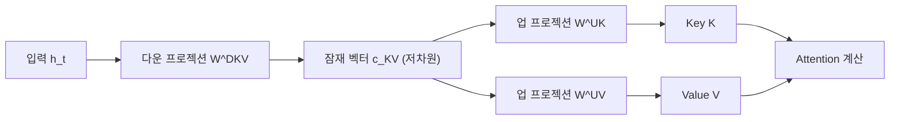
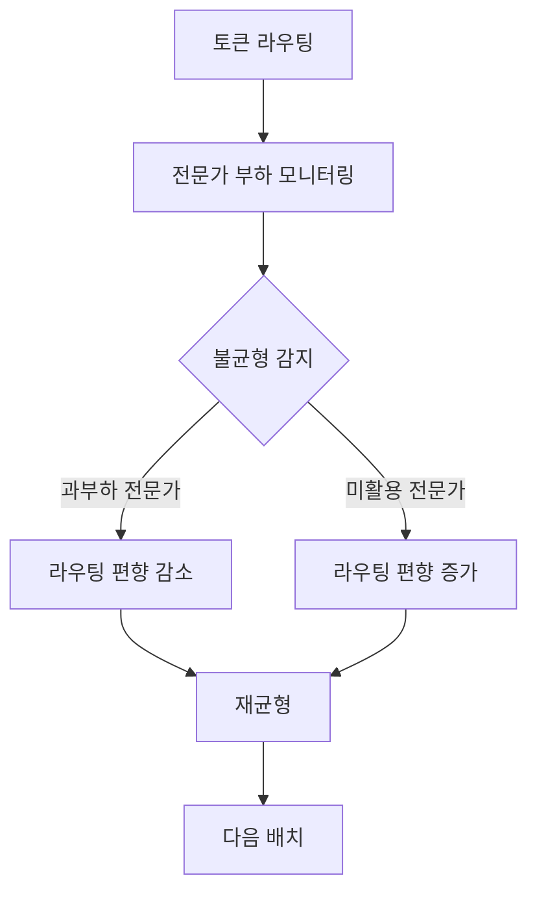

# DeepSeek-V3 기술 보고서 (DeepSeek AI, 2024)

## 핵심 기여

DeepSeek AI가 2024년 12월 공개한 DeepSeek-V3는 671B 총 파라미터(활성 37B)의 MoE 모델로, **GPT-4o 및 Claude 3.5 Sonnet과 대등한 성능을 오픈 웨이트로 달성**한 동시에 학습 비용을 약 278만 달러 H800 GPU 비용으로 극도로 절감한 것이 핵심 기여다.

세 가지 기술 혁신이 돋보인다: (1) [[multi-head-latent-attention]](MLA) - KV 캐시를 대폭 압축하는 잠재 어텐션, (2) 보조 손실 없는 부하분산 - 전문가 로드 불균형을 손실 함수 없이 해결, (3) [[multi-token-prediction]](MTP) - 다음 여러 토큰을 동시 예측해 학습 효율 향상. 이 조합으로 "저비용 고성능"의 새로운 기준을 세웠다.

## 방법

### Multi-Head Latent Attention (MLA)

기존 Multi-Head Attention(MHA)의 KV 캐시 메모리 문제를 잠재 압축으로 해결한다:

KV 캐시에 전체 K, V를 저장하는 대신 압축된 잠재 벡터 $c_{KV}$만 저장한다. 캐시 크기가 기존 대비 최대 **93.3% 감소**하여 긴 컨텍스트 추론이 대폭 효율화된다.

수식으로는:
$$[k_t^C; v_t^C] = W^{DKV} h_t, \quad k_t^H = W^{UK} k_t^C, \quad v_t^H = W^{UV} v_t^C$$

여기서 $k_t^C$는 KV 캐시에 저장되는 압축 표현이다.

### 보조 손실 없는 부하분산 (Auxiliary-Loss-Free Load Balancing)

[[mixtral-paper]] 등 기존 MoE 모델은 전문가 부하 균형을 위해 별도의 보조 손실을 추가하는데, 이는 주 손실과 충돌하며 성능을 저하시킬 수 있다. DeepSeek-V3는 **편향(bias) 기반 동적 조정**으로 이 문제를 해결했다:

보조 손실 없이 부하를 균형 잡음으로써 모델 품질과 학습 안정성 모두를 개선했다.

### Multi-Token Prediction (MTP)

표준 언어 모델링은 다음 1개 토큰만 예측한다. DeepSeek-V3는 **추가 예측 헤드를 통해 다음 D개 토큰을 병렬로 예측**:

$$\mathcal{L}_{MTP} = -\sum_{k=1}^{D} \lambda_k \sum_t \log P(x_{t+k} | x_{<t})$$

추론 시에는 추가 MTP 헤드를 스펙큘레이티브 디코딩(Speculative Decoding)처럼 활용하여 처리량을 높일 수 있다.

### FP8 혼합 정밀도 학습

DeepSeek-V3는 **FP8 연산을 사전학습에 최초로 성공적으로 적용**한 모델 중 하나다:

- FP8 행렬곱 + BF16 축적(accumulation) 조합
- 수치 안정성을 위한 타일 기반(tile-quantized) 양자화
- 14.8조 토큰 학습 전 과정에서 수치 불안정 없음 확인

### 모델 구성

| 항목 | 값 |
|------|----|
| 총 파라미터 | 671B |
| 활성 파라미터 (토큰당) | 37B |
| 전문가 수 (레이어당) | 256개 |
| 활성 전문가 | 8개 (top-8) |
| 공유 전문가 | 1개 (항상 활성) |
| 어휘 크기 | 128K |
| 컨텍스트 길이 | 128K 토큰 |
| 사전학습 토큰 | 14.8조 |

## 결과

### 벤치마크 성능

| 벤치마크 | DeepSeek-V3 | GPT-4o | Claude 3.5 Sonnet |
|----------|------------|--------|-------------------|
| MMLU | 88.5% | 88.7% | 88.7% |
| HumanEval | 92.0% | 90.2% | 92.0% |
| MATH-500 | 90.2% | 76.6% | 78.3% |
| AIME 2024 | 39.2% | 9.3% | 16.0% |
| LiveCodeBench | 40.5% | 32.9% | 36.3% |

특히 **수학 및 코드 벤치마크에서 GPT-4o를 큰 폭으로 앞선다**.

### 학습 비용

- H800 GPU 2,048개로 약 2개월 학습
- 총 GPU 시간: ~2.788M H800 시간
- 시장 가격 기준 약 550만 달러 (실제 DeepSeek 내부 비용은 약 278만 달러)
- GPT-4 추정 학습 비용(수천만~수억 달러)의 수십 분의 일

## 한계

- **추론 인프라 요구**: 671B 파라미터 전체를 메모리에 적재해야 하므로 대규모 클러스터가 필요하다. H100 80GB 기준 최소 8대 이상.
- **MLA 추론 라이브러리 지원**: MLA 최적화를 지원하는 추론 프레임워크가 제한적이다. 커뮤니티에서 빠르게 추가되고 있으나 초기 배포 시 병목이 될 수 있다.
- **학습 인프라 종속**: FP8 학습은 H800/H100 수준의 최신 GPU에서만 효율적이다.
- **안전성 정렬 투명성**: 중국 기업이라는 배경에서 안전 정렬 방식과 검열 정책이 독점 모델과 다를 수 있다는 우려가 있다.

## 실무 관점

DeepSeek-V3는 AI 개발 비용에 대한 가정을 뒤흔들었다:

- **"저비용 고성능" 패러다임**: 수억 달러 GPU 클러스터 없이도 GPT-4급 모델이 가능함을 증명. 이는 AI 스타트업과 학술 연구에 전략적 함의가 크다.
- **MLA 채택 가속**: MLA는 KV 캐시 메모리 절감이 중요한 긴 컨텍스트 서비스에서 핵심 기술로 부상했다.
- **DeepSeek-R1 기반**: V3를 기반 모델로 삼아 강화학습을 적용한 DeepSeek-R1이 추론 벤치마크에서 o1 수준의 성능을 달성했다.
- **오픈 웨이트의 의미**: Apache 2.0 라이선스로 공개되어, 상업적 파인튜닝과 배포가 자유롭다.

## 관련 문서

- [[multi-head-latent-attention]] - MLA의 원리와 KV 캐시 압축 메커니즘 상세
- [[multi-token-prediction]] - MTP 학습 방법과 추론 시 스펙큘레이티브 디코딩 연계
- [[mixtral-paper]] - DeepSeek-V3가 개선한 MoE 부하분산 문제를 먼저 드러낸 모델
- [[chinchilla-scaling-paper]] - DeepSeek-V3의 14.8T 토큰 학습이 따른 컴퓨팅 최적 원칙
