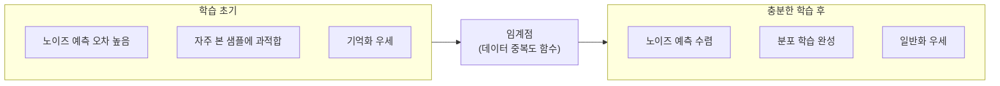

# 확산 모델의 기억화와 일반화 전환 메커니즘 (NeurIPS 2025)

## 핵심 기여

NeurIPS 2025에 게재된 이 논문은 **확산 모델(diffusion model)이 학습 데이터를 암기(memorization)하는 상태에서 진정한 일반화(generalization)로 전환되는 임계점(phase transition)을 이론과 실험 양면으로 규명**했다. 모델이 언제 훈련 이미지를 그대로 복제하고, 언제 새로운 이미지를 합성하는지를 예측하는 프레임워크를 제시하며, 저작권 침해 위험과 생성 다양성 사이의 긴장 관계를 분석하는 도구를 제공했다.

## 방법

### 기억화 vs. 일반화 정의

논문은 기억화를 정량적으로 정의한다:

- **기억화(Memorization)**: 모델이 생성한 샘플이 훈련 데이터의 특정 이미지와 $\epsilon$ 거리 이하로 근접한 경우
- **일반화(Generalization)**: 생성 샘플이 훈련 분포를 따르지만 특정 훈련 이미지로 환원되지 않는 경우

### 전환 타이밍 분석

핵심 발견은 기억화 경향이 **학습 초기**에 강하게 나타났다가 충분한 데이터 다양성이 보장되면 일반화로 전환된다는 것:

### 임계 조건 도출

기억화-일반화 전환이 발생하는 임계 조건을 데이터셋 특성으로 정식화:

- **중복 인수(duplication factor)** $r$: 데이터셋에서 동일 이미지가 반복되는 비율
- 중복 인수가 임계값 $r^*$ 이하이면 일반화 체계 진입. $r^*$는 모델 용량과 훈련 스텝 수의 함수
- 컨디셔닝(텍스트 프롬프트) 강도가 높을수록 기억화 위험 증가 — 동일 프롬프트에 매핑되는 이미지가 적을수록 특정 이미지를 암기하기 쉬움

### 실험 설정

- CIFAR-10, CelebA, LAION 서브셋에서 DDPM/LDM 계열 모델 학습
- 데이터 중복 비율을 체계적으로 조절해 임계점 측정
- 기억화 검출: 학습 세트 근접 이웃 검색으로 측정

## 결과

- 데이터 중복 비율 $r > 50$회(동일 이미지 50회 이상 반복) 이상에서 기억화가 지배적
- 일반화로의 전환은 연속적이지 않고 급격한 상전이(sharp phase transition) 형태로 나타남
- 텍스트-이미지 모델(Stable Diffusion 계열)에서 특정 예술가 스타일의 프롬프트가 기억화를 강하게 유발하는 조건 확인
- 모델 크기가 커질수록 같은 데이터에서 기억화보다 일반화가 빠르게 달성됨 (용량 증가의 역설적 안전성)

## 한계

- 이미지 생성 도메인에서의 발견이 텍스트, 오디오 등 다른 모달리티에 직접 전이되는지는 추가 연구 필요
- 임계 조건이 데이터 중복 외에 훈련 목적함수, 아키텍처 등 다른 요인에 따라 어떻게 변하는지 완전히 규명되지 않음
- 실제 대규모 데이터셋(LAION-5B 수준)에서의 중복 추정은 계산 비용이 높아 근사값 사용

## 실무 적용 관점

- **저작권 및 프라이버시 리스크 관리**: 학습 데이터의 중복 비율을 임계값 이하로 관리하는 것이 기억화 위험 통제의 핵심 레버. 데이터 파이프라인에서 중복 제거(deduplication)가 안전성과 품질 모두에 유리
- **프롬프트 설계**: 매우 좁은 조건(특정 인물, 특정 작품 스타일)으로 반복 생성 시 기억화 출력이 나올 위험이 높음. 다양한 표현 방식으로 프롬프트 변형 권장
- **모델 용량 선택**: 소형 모델보다 대형 모델이 오히려 기억화가 덜 발생하는 역설적 관계는 모델 크기 선택 시 고려
- [[memorization-in-llms]] 관점과 연결해 언어 모델의 기억화 문제와 비교 분석 시 유용한 대조 사례

## 관련 문서

- [[diffusion-models]]
- [[memorization-in-llms]]
- [[model-collapse-paper]]
- [[stable-diffusion]]
- [[data-deduplication-minhash|data-deduplication]]
