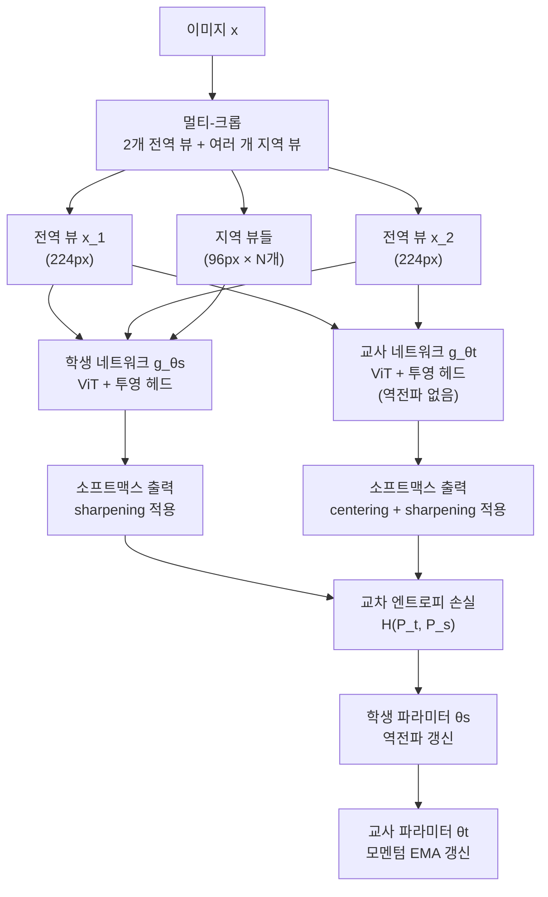
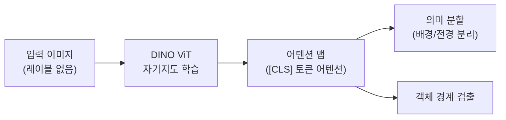

# DINO: 자기 증류로 학습하는 비전 트랜스포머의 놀라운 특성

## 메타데이터

| 항목 | 내용 |
|------|------|
| 제목 | Emerging Properties in Self-Supervised Vision Transformers |
| 저자 | Mathilde Caron, Hugo Touvron, Ishan Misra, Herve Jegou, Julien Mairal, Piotr Bojanowski, Armand Joulin |
| 소속 | Facebook AI Research (FAIR), Inria |
| 발표 연도 | 2021 |
| 학회 | ICCV 2021 |
| arXiv | [2104.14294](https://arxiv.org/abs/2104.14294) |

## 핵심 기여

- **자기 증류(self-distillation)** + ViT(Vision Transformer) 조합에서 레이블 없이 의미론적 분할(semantic segmentation)에 가까운 특성이 *자연 발생(emergent)* 함을 발견
- 레이블 없이 학습한 ViT의 어텐션 맵이 이미지 내 객체 경계를 자동으로 구분하는 놀라운 특성 실증
- **센터링(centering)과 샤프닝(sharpening)** 조합으로 모드 붕괴(mode collapse)를 음성 샘플 없이 안정적으로 방지
- 멀티-크롭(multi-crop) 전략으로 효율적인 다중 뷰 학습
- ViT 특성이 CNN 특성과 질적으로 다르며, 자기지도 학습에서 ViT의 강점이 더 극명히 드러남을 보임

## 배경 및 문제 정의

NLP에서 BERT와 GPT 계열의 자기지도 학습(self-supervised learning)은 레이블 없이 강력한 표현을 학습한다. 비전에서도 같은 원리가 작동할까? 특히 [[transformer-architecture]]를 비전에 도입한 ViT(Vision Transformer)에서 자기지도 학습은 어떤 특성을 보일까?

### 동기: ViT의 자기지도 학습

ViT는 이미지를 패치 시퀀스로 처리하며, [CLS] 토큰이 전체 이미지 표현을 집약한다. BERT처럼 자기지도 방식으로 학습하면 어떤 표현이 나올까?

CNN 기반 방법(SimCLR, MoCo, BYOL)에서 배운 경험을 ViT에 적용하되, ViT만의 강점을 극대화하는 방법이 필요했다.

### DINO의 이름

DINO = **Di**stillation with **N**o labels의 약자. 레이블 없이 자기 자신을 교사로 삼는 지식 증류(knowledge distillation) 방식이다.

## 방법

### 전체 파이프라인



DINO는 같은 이미지의 다른 뷰에서 학생이 교사의 출력 분포를 예측하도록 학습한다. 교사와 학생은 같은 아키텍처이지만 교사는 학생의 EMA로만 갱신된다.

### 자기 증류 원리

DINO는 교사-학생 증류(teacher-student distillation)를 자기 자신에 적용한다. 차이점:
- 교사 모델 = 학생 모델의 지수 이동 평균(EMA)
- 레이블이 없으므로 교사의 소프트 확률(soft probability)이 학습 신호

학생은 교사의 출력 분포를 최소화하는 교차 엔트로피를 최적화한다:

$$\min_{\theta_s} H(P_t(x), P_s(x'))$$

여기서 $x$는 전역 뷰, $x'$는 전역 또는 지역 뷰, $P_t$와 $P_s$는 교사와 학생의 출력 확률이다.

### 소프트맥스 출력과 온도

각 뷰 $x$에 대한 확률 분포:

$$P(x)^{(i)} = \frac{\exp(g_\theta(x)^{(i)} / \tau)}{\sum_k \exp(g_\theta(x)^{(k)} / \tau)}$$

- 학생 온도 $\tau_s = 0.1$ (날카로운 분포 → 명확한 예측)
- 교사 온도 $\tau_t = 0.04$ (더 날카로운 분포 → 강한 학습 신호)

교사의 낮은 온도가 더 확신 있는 분포를 만들어 학생에게 명확한 목표를 제공한다.

### 붕괴 방지: 센터링 + 샤프닝

음성 샘플 없이 붕괴를 방지하기 위해 두 가지 메커니즘을 사용한다:

**1. 센터링(Centering)**: 교사 출력에서 이동 평균 $c$를 뺀다:
$$g_t(x) \leftarrow g_t(x) - c$$
$$c \leftarrow mc + (1-m) \frac{1}{B} \sum_{i=1}^B g_{\theta_t}(x^{(i)})$$

센터링은 하나의 차원이 지배하는 붕괴를 방지하지만, 균일 분포로의 붕괴를 유발할 수 있다.

**2. 샤프닝(Sharpening)**: 낮은 온도 $\tau_t$로 날카로운 분포를 만든다. 균일 분포 붕괴를 방지한다.

이 두 메커니즘은 서로 상반된 붕괴 유형을 방지하므로 조합했을 때 안정적인 학습이 가능하다.

### 멀티-크롭 전략

효율적인 학습을 위해:
- **전역 뷰**: 이미지의 큰 부분 ($\geq 50\%$, 224px), 2개
- **지역 뷰**: 이미지의 작은 부분 ($< 50\%$, 96px), 6~8개

학생은 모든 뷰(전역+지역)를 처리하고, 교사는 전역 뷰만 처리한다. "전역에서 지역 예측" 방식으로 지역 뷰에서도 전역적 맥락을 학습.

### ViT 헤드 구조

투영 헤드는 3층 MLP + L2 정규화 + 가중치 정규화된 FC 레이어로 구성된다. ViT의 [CLS] 토큰 출력이 헤드의 입력이 되며, 최종 출력의 차원 $K = 65536$이다 (소프트맥스 클래스 수).

## 실험 및 결과

### ImageNet 선형 평가 및 k-NN 분류

| 방법 | 아키텍처 | 선형 평가 | k-NN |
|------|---------|---------|------|
| SimCLR v2 | ResNet-50 | 71.7% | - |
| MoCo v3 | ViT-S/16 | 73.2% | - |
| BYOL | ResNet-50 | 74.3% | - |
| DINO | ViT-S/16 | 77.0% | 74.5% |
| DINO | ViT-B/16 | 78.2% | 76.1% |
| DINO | ResNet-50 | 75.3% | 67.5% |

ViT-B/16에서 78.2%로 당시 자기지도 SOTA를 달성했다. 특히 k-NN 분류(k-nearest neighbor)에서도 강한 성능을 보여 표현의 품질이 높음을 증명했다.

### 어텐션 맵의 놀라운 특성 (Emergent Properties)

DINO의 가장 놀라운 발견은 레이블 없이 학습한 ViT의 어텐션이 의미론적 세그멘테이션을 수행한다는 점이다:



ViT의 [CLS] 토큰이 어텐션하는 헤드들이 자연스럽게 이미지의 의미 있는 영역(전경 객체, 배경 분리)에 집중하게 된다. 레이블이나 세그멘테이션 학습 없이 발생하는 emergent property다.

이 현상은 CNN 기반 DINO에서는 나타나지 않고 ViT에서만 명확하게 관찰된다. ViT의 전역 어텐션 메커니즘이 이런 의미론적 특성을 자연스럽게 포착하는 것으로 해석된다.

### 비디오 객체 분할 (DAVIS)

레이블 없이 학습한 DINO 특성으로 비디오 객체 분할(Video Object Segmentation):

| 방법 | $\mathcal{J}\&\mathcal{F}_m$ |
|------|------------------------------|
| CorrFlow (지도학습) | 50.3% |
| TimeCycle (자기지도) | 48.7% |
| DINO (ViT-S/8) | 61.9% |
| DINO (ViT-B/8) | 64.5% |

지도학습 방법도 능가하는 놀라운 결과다. 레이블 없이 배운 표현이 시간적 일관성까지 포착한 것을 의미한다.

### 이미지 검색 (Image Retrieval)

옥스포드(Oxford)와 파리(Paris) 데이터셋에서 DINO 특성 직접 사용:

| 방법 | Oxford Medium | Paris Medium |
|------|--------------|-------------|
| DOLG (지도학습) | 79.6% | 86.3% |
| DINO (ViT-B/16) | 64.9% | 80.6% |
| DINO (ViT-B/8) | 70.1% | 83.1% |

지도학습 방법에는 못 미치지만, 레이블 없이 학습한 방법으로는 매우 강력한 성능이다.

## 한계 및 후속 연구

### 한계점

1. **높은 계산 비용**: ViT-B 이상의 모델에서 멀티-크롭 전략과 함께 사용하면 매우 큰 연산 자원 필요
2. **배치 정규화 필요 논란**: BYOL과 유사하게, 배치 통계에 내재적으로 의존할 수 있음
3. **큰 패치에서 성능 저하**: ViT-S/16보다 ViT-S/8(더 작은 패치)이 세그멘테이션에서 훨씬 좋은데, 작은 패치는 계산량이 크게 증가
4. **센터링 하이퍼파라미터 민감도**: 모멘텀 $m$과 온도 $\tau_t$가 학습 안정성에 크게 영향

### 후속 연구

- **DINOv2 (Oquab et al. 2023)**: 더 큰 데이터(LVD-142M), 더 강력한 학습 절차, ViT-g/14로 당시 모든 자기지도 방법을 압도하는 표현 품질 달성
- **iBot**: DINO 프레임워크에 마스킹 기반 이미지 모델링 추가
- **EVA**: DINO 방식의 사전학습 + 대규모 모델 확장

### 역사적 의의

DINO는 자기지도 학습이 단순히 분류 성능만이 아니라 **시각적 이해의 새로운 차원**을 열 수 있음을 보여줬다. 레이블 없이 학습한 표현에서 세그멘테이션 능력이 emergent로 나타난다는 발견은 "자기지도 학습이 진정한 시각 이해를 가르칠 수 있는가"에 대한 긍정적 답변이다.

## 실무 적용 관점

### DINOv2를 활용한 실무 파이프라인

현업에서는 DINO v1보다 DINOv2 사전학습 모델을 바로 활용하는 것이 일반적이다:

```python
import torch

# DINOv2 사전학습 모델 로드 (torch.hub 또는 HuggingFace)
model = torch.hub.load('facebookresearch/dinov2', 'dinov2_vitb14')
model.eval()

def extract_features(image_tensor):
    """이미지에서 DINO 특성 추출"""
    with torch.no_grad():
        features = model(image_tensor)
    return features  # [B, 768] for ViT-B

def extract_attention_maps(image_tensor):
    """어텐션 맵 추출 (세그멘테이션 힌트)"""
    with torch.no_grad():
        # 마지막 레이어의 어텐션을 [CLS] 토큰 기준으로 추출
        outputs = model.get_intermediate_layers(
            image_tensor, n=1, return_class_token=True
        )
    return outputs
```

### 어텐션 맵 기반 약지도 세그멘테이션

```python
def segment_with_dino_attention(image, model, threshold=0.6):
    """DINO 어텐션으로 약지도 세그멘테이션"""
    # 어텐션 맵 추출
    with torch.no_grad():
        attn = model.get_last_selfattention(image.unsqueeze(0))
    
    # [CLS] 토큰의 어텐션 (헤드 평균)
    # [1, num_heads, num_patches+1, num_patches+1]
    cls_attn = attn[0, :, 0, 1:]  # [num_heads, num_patches]
    cls_attn = cls_attn.mean(0)   # 헤드 평균 [num_patches]
    
    # 패치 어텐션을 2D 맵으로 복원
    h = w = int(cls_attn.shape[0] ** 0.5)
    attn_map = cls_attn.reshape(h, w)
    
    # 임계값으로 이진 마스크 생성
    mask = attn_map > attn_map.quantile(threshold)
    return mask
```

### 언제 DINO를 선택하는가

| 태스크 | 권장 이유 |
|--------|-----------|
| 이미지 검색/클러스터링 | 고품질 k-NN 표현, 파인튜닝 없이 바로 사용 가능 |
| 약지도 세그멘테이션 | 어텐션 맵이 의미론적 경계 자동 제공 |
| 도메인 적응 | 레이블 없는 타겟 도메인에서 자기지도 사전학습 |
| 비디오 이해 | 시간적 일관성 포착 능력 |

## 관련 문서

- [[byol-original-paper]] - 음성 샘플 없는 자기지도 학습, DINO의 직접적 선행 연구
- [[moco-original-paper]] - 모멘텀 인코더 개념의 원류
- [[simclr-original-paper]] - 대조 학습 기반 자기지도 학습 비교 기준
- [[mae-original-paper]] - 마스킹 기반 ViT 자기지도 학습, DINO와 다른 패러다임
- [[transformer-architecture]] - ViT의 기반이 되는 Transformer 아키텍처
- [[dino-self-distillation]] - DINO 방법론 개념 상세 설명
