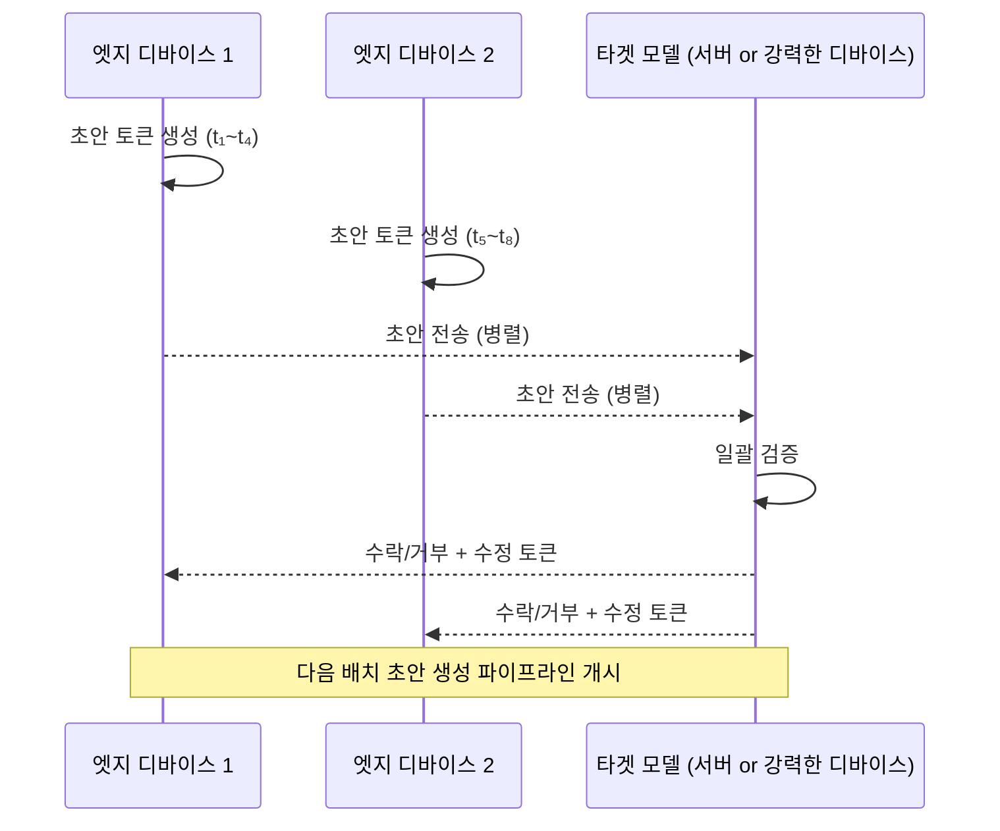

# DiP-SD: 분산 파이프라인 스펙 디코딩으로 엣지 LLM 추론 17.89배 가속

## 논문 메타데이터

| 항목 | 내용 |
|------|------|
| arXiv ID | 2604.20919 |
| 저자 | Yaodan Xu, Sheng Zhou, Zhisheng Niu |
| 연도 | 2026 |
| 분야 | 추론 최적화 / 엣지 AI |

## 핵심 기여

엣지 환경의 LLM 추론 가속을 위해 두 가지 기법을 결합한 DiP-SD(Distributed Pipeline Speculative Decoding)를 제안한다:

1. **분산 초안 생성(Device-level Distributed Drafting)**: 여러 엣지 디바이스가 협력해 초안 토큰을 병렬 생성
2. **단계별 파이프라이닝(Phase-level Pipelining)**: 초안 생성과 검증 단계를 파이프라인으로 중첩 실행

결과적으로 Qwen 모델에서 자기회귀 디코딩(autoregressive decoding) 대비 **처리량 17.89배** 향상을 달성한다.

## 배경: 엣지 [[speculative-decoding|스펙 디코딩(speculative decoding)]]의 도전

[[speculative-decoding]] 기법은 작은 초안 모델(draft model)이 여러 토큰을 미리 생성하고, 큰 타겟 모델이 한번에 검증하는 방식이다. 클라우드 환경에서는 효과적이지만 엣지에서는:

- 단일 디바이스의 메모리·컴퓨트 제약으로 초안 모델도 로드하기 어려움
- 초안 생성과 검증이 순차적으로 실행되면 파이프라인 효율 저하
- 여러 디바이스가 있어도 협력 프로토콜 부재

## 방법

### 분산 초안 생성
- 여러 엣지 디바이스가 각자 담당 토큰 구간을 병렬 생성
- 배치 결정(각 디바이스에 몇 토큰 할당)을 공동 최적화

### 단계별 파이프라이닝
- 초안 생성 완료를 기다리지 않고, 이전 배치 검증과 다음 배치 초안 생성을 중첩
- 유휴 시간(idle time) 최소화

### 초안 토큰 길이 최적화
- 배치 결정과 초안 토큰 길이를 공동 최적화(joint optimization)
- 검증 수락률과 생성 속도의 트레이드오프를 고려

## 실험 결과

| 비교 대상 | 처리량 배율 |
|----------|------------|
| 자기회귀 디코딩 | 17.89x |
| 기존 스펙 디코딩 (단일 디바이스) | 유의미한 차이 |

- Qwen 계열 모델에서 검증
- 엣지 환경(제한된 컴퓨트, 분산 디바이스) 기준

## 한계

- 여러 엣지 디바이스 간 통신 레이턴시가 성능에 영향을 줌
- 초안 모델과 타겟 모델 간 도메인 정합도가 수락률에 영향
- 디바이스 이종성(heterogeneous devices) 상황에서의 최적화 복잡도

## 실무 적용 관점

IoT 엣지 클러스터나 스마트폰 협력 추론 시나리오에서 DiP-SD 아이디어를 활용하면 단일 디바이스 추론 대비 대폭 개선된 처리량을 얻을 수 있다. 특히 **여러 디바이스를 보유한 온프레미스 추론 환경**에서 클라우드 의존도를 줄이는 데 적합하다. [[alloc-moe-inference]]와 함께 적용하면 MoE 모델의 엣지 배포 효율을 더욱 높일 수 있다.

## 관련 문서

- [[speculative-decoding]] - 스펙 디코딩 일반 개념
- [[alloc-moe-inference]] - MoE 예산 인식 추론 가속 (2604.08133)
- [[kv-cache-optimization]] - KV 캐시 최적화
